# The Book Of PainterEngine  

## Introduction  

Welcome to the first lesson of PainterEngine. Before we begin, you might not fully understand what PainterEngine is about. Perhaps you have seen it mentioned online and know that it could be a graphics library or a game engine. You may have come across topics like acoustics, cryptography, neural networks, digital signal processing, compilers, virtual machines, or even an FPGA-based GPU IP core that are built upon it. This might lead you to think that PainterEngine is a mix of various libraries.  

All of the above are correct, but fundamentally, I prefer to describe PainterEngine as an application framework. Its ultimate purpose at inception was to address the hassle of third-party (even standard) library dependencies in software development, simplifying platform portability and reducing compilation difficulties as much as possible.  

As you will see, compiling PainterEngine does not trap you in dependency issues. It can run on almost all platforms that provide a C language compilation environment. It does not depend on an operating system or file system, making it suitable for running in bare-metal MCU environments. Even the official PainterEngine website is built using PainterEngine itself.  

PainterEngine adheres to a minimalist design principle and uses C language as its primary development language. Its built-in scripting engine is also highly compatible with C syntax, with minor abstraction and generalization of C's types, further lowering the barrier to entry. C, being a historically significant language, is now a fundamental course in most engineering-related majors. It has maintained strong competitiveness and widespread recognition in computer programming and development, becoming a de facto standard supported by nearly all hardware platforms. C strikes a delicate balance between learning and development costs, allowing you to grasp the language in a short time. With PainterEngine, you can deploy your programs across platforms and experience the true artistry of programming.  

PainterEngine has undergone nearly a decade of development. For a long time, it was not formally promoted as a public library, primarily because many of its interfaces and functions were unstable during iterations. We needed extensive practical experience to ensure the interfaces were reasonable and user-friendly, distinguishing between those that are "truly useful and convenient" and those that merely appear impressive but lack real utility. Consequently, for many years, PainterEngine lacked detailed and stable documentation. However, after years of iteration, we have refined its stable, user-friendly, and easy-to-learn designs, allowing us to finally present this document to you.  

Lastly, I do not wish to make the introduction overly lengthy. It is time to dive into the subject. In the first lesson of PainterEngine, we will start with setting up its environment. If you have any questions or discover bugs, feel free to ask on the PainterEngine forum or directly send an email to matrixcascade@gmail.com, and I will respond to you as soon as possible.  


## 1. A Simplest PainterEngine Program

Before setting up the development environment, let us write the simplest PainterEngine program. Create a new file named `main.c` (the filename can be arbitrary), and input the following code:

```c
#include "PainterEngine.h"
int main()
{
    PainterEngine_Initialize(800,480);
    return 1;
}
```

This is a very basic PainterEngine program. To explain briefly, in the first line, we use `#include` to include the header file of PainterEngine. In the `main` function, we use `PainterEngine_Initialize` to initialize PainterEngine. The function `PainterEngine_Initialize` takes two parameters, which represent the width and height of the window (or screen). After running the program, you should see a result similar to this:


Of course, we have not yet used PainterEngine to draw anything on the window, so what you see is a blank screen. It is important to note that in PainterEngine's framework, the program does not immediately terminate after the `main` function returns. In fact, in `PainterEngine.h`, the `main` function is replaced by `px_main`. The actual `main` function is implemented in `px_main.c`. However, as a user, you do not need to worry about this for now—just remember that the program continues running normally even after the `main` function returns.

If you wish to exit the program, you can call the `exit` function from C manually. However, in many scenarios with PainterEngine, this is not necessary. For example, in embedded microcontroller systems, web applications, or driver programs, the concept of exiting is rarely needed. Even on Android and iOS platforms, most of the time, you do not need to design an exit feature in your program.

## 2. Compiling a PainterEngine Program

### Compiling with PainterEngine Make

If you want to compile a PainterEngine project file, the simplest method is to use PainterEngine Make. This is a compilation tool that you can download from **PainterEngine.com**. You will find the download button at the bottom of the homepage:


After extracting the files, run `PainterEngine make.exe`, and you will see the following interface:


Next, select the platform you need to compile for and then choose the C source file we created earlier:

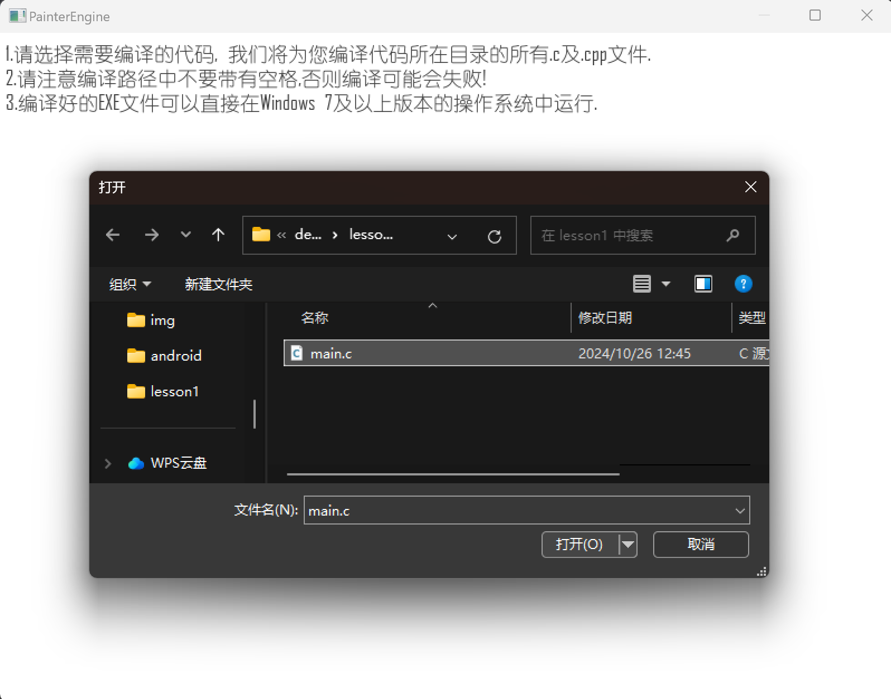

Finally, just wait for the compilation process to complete:

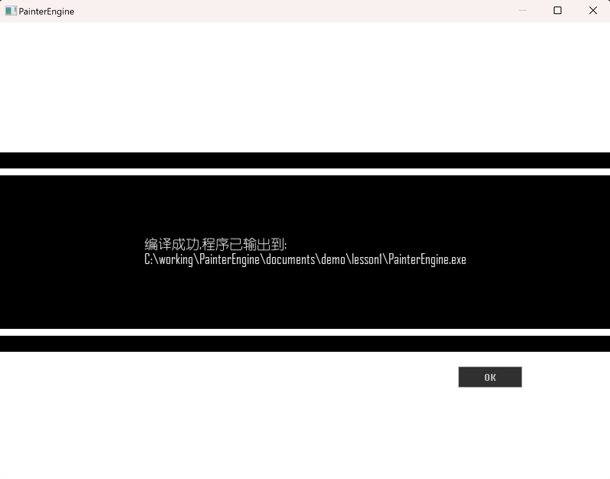

### Compiling with Visual Studio Code

To compile using Visual Studio Code, you need to ensure that the C language development environment for Visual Studio Code is properly installed. We will skip this step, as there are already plenty of tutorials available online for this.

Next, go to PainterEngine and download the source code for PainterEngine:

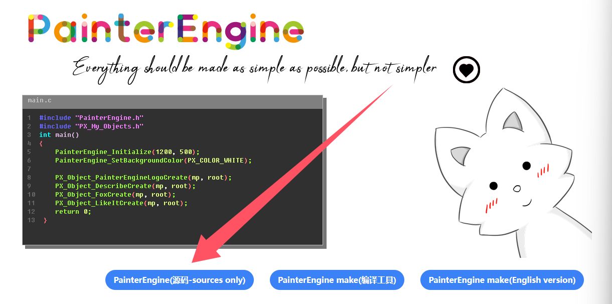

Extract the downloaded source code to a directory on your computer. Then, you need to note the location of this directory and create a new environment variable in Windows called `PainterEnginePath`, assigning it the path of the PainterEngine library directory:

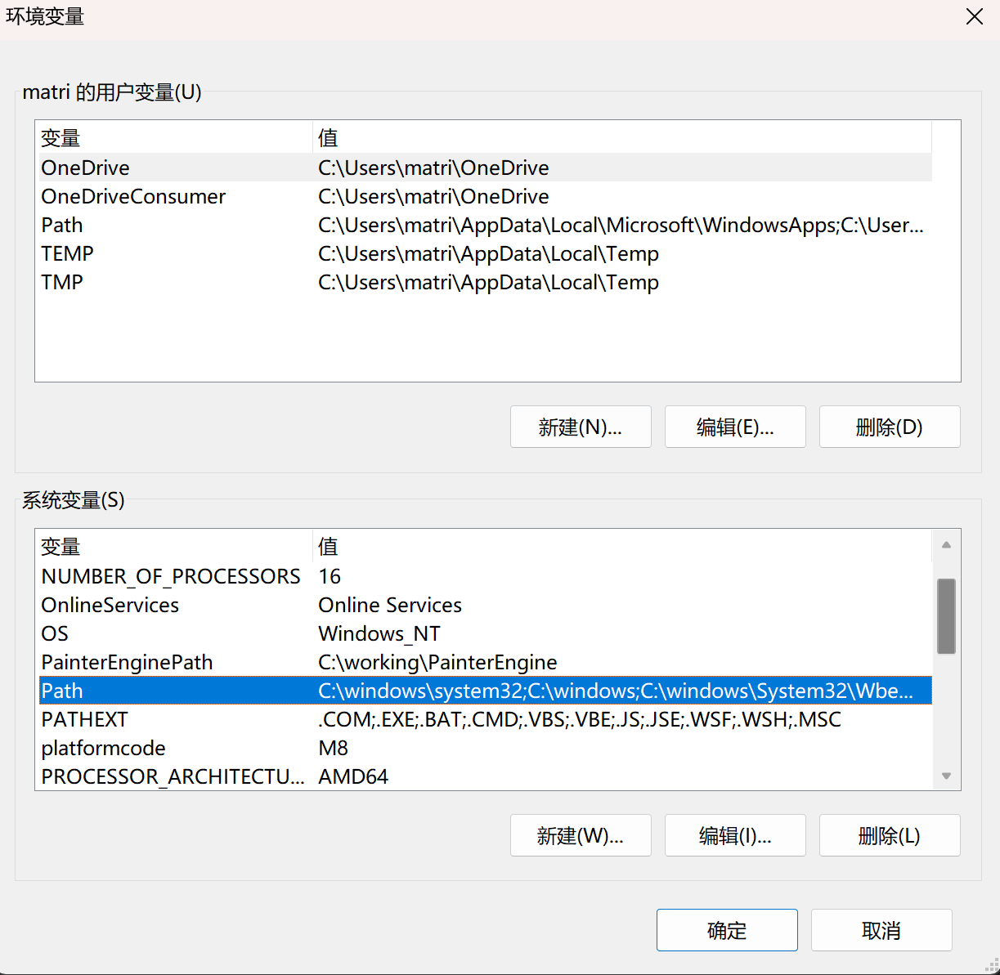


Copy the `PainterEngine/Platform/.vscode` directory to a location next to the source code files:


Next, open the `main.c` file using Visual Studio Code, and you can proceed to compile and run it:


### Compiling with Visual Studio

Of course, if you need the full IDE development experience, it is still recommended to use Visual Studio for development and compilation. To develop PainterEngine using Visual Studio, you need to open Visual Studio and create an empty project:


After creating the project, I strongly recommend that you create a new filter:

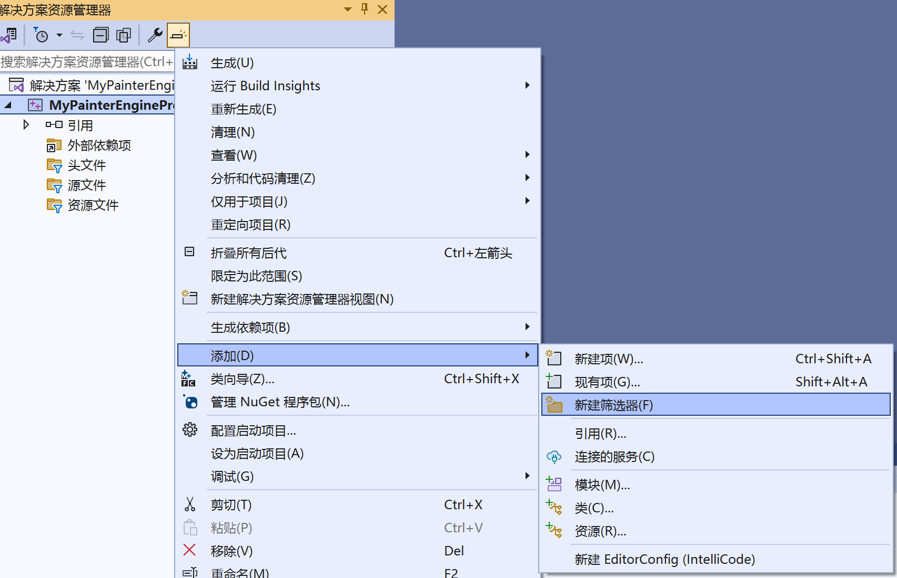

Then add all the files from the `core`, `kernel`, `runtime`, and `platform/windows` directories under the PainterEngine directory to this filter:


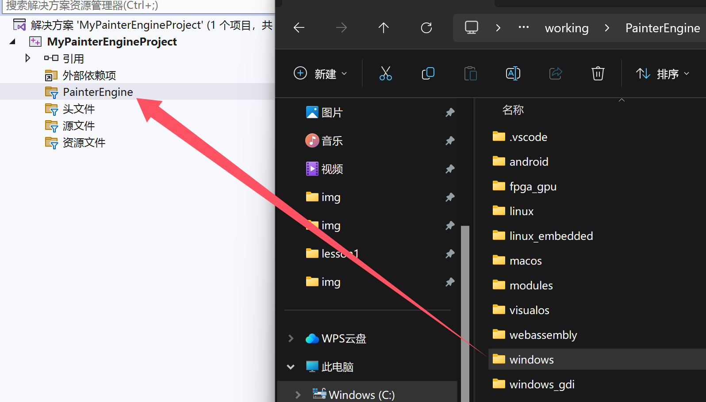

Then add the `main.c` file we created earlier to the project as well:

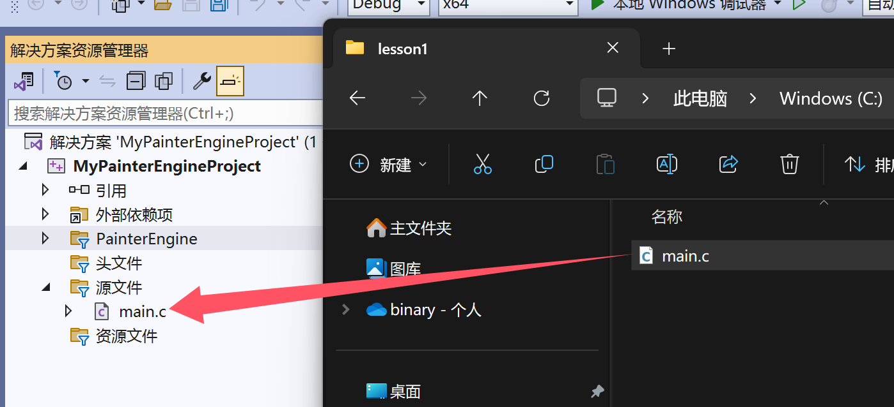

Open `Project` → `Properties` → `VC++ Directories`, and include the directory where PainterEngine is located:


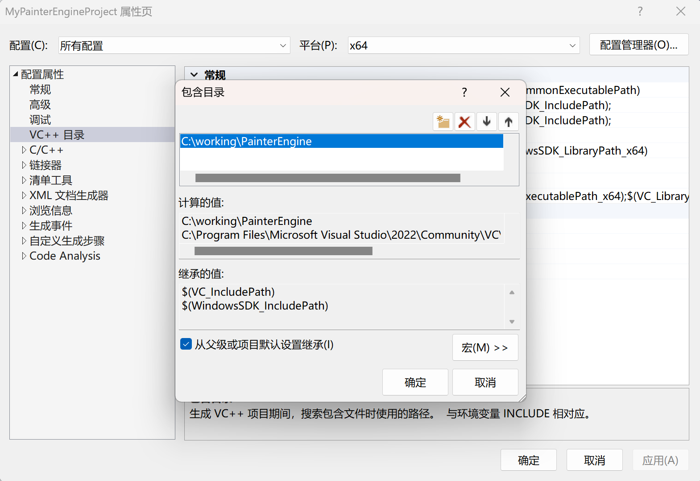

Be sure to check whether the configuration matches the current configuration of Visual Studio, as this is a common point of error:


Finally, you can compile, run, and debug:


## 3. PainterEngine Lesson 1: Displaying the Text "Hello PainterEngine"

As you can see, PainterEngine is a graphical application framework. However, following tradition, our first lesson is still about how to display text using PainterEngine. In most cases, it is more accurate to say "draw text" rather than "output text." Drawing text with PainterEngine is very straightforward. Refer to the code below:

```c
#include "PainterEngine.h"
int main()
{
    PainterEngine_Initialize(800,480);
//PainterEngine_DrawText
//参数1：x坐标
//参数2：y坐标
//参数3：文本内容
//参数4：对齐方式
//参数5：颜色
    PainterEngine_DrawText(400, 240, "Hello PainterEngine", PX_ALIGN_CENTER, PX_COLOR(255, 255, 0, 0));
    return 1;
}
```

We will focus on the `PainterEngine_DrawText` function, which is a text-drawing function. It takes five parameters. When you run the program, you will see the following result:


The function is quite easy to understand, but let us explain the meaning of the `alignment` and `color` parameters in detail, as these two concepts will be frequently mentioned in later tutorials:

The `alignment` parameter specifies how the content is aligned when drawn on the screen. PainterEngine supports the following alignment formats:

```c
typedef enum
{
	PX_ALIGN_LEFTTOP = 7,//左上角对齐
	PX_ALIGN_MIDTOP = 8,//中上对齐
	PX_ALIGN_RIGHTTOP = 9,//右上角对齐
	PX_ALIGN_LEFTMID = 4,//左中对齐
	PX_ALIGN_CENTER = 5,//居中对齐
	PX_ALIGN_RIGHTMID = 6,//右中对齐
	PX_ALIGN_LEFTBOTTOM = 1,//左下角对齐
	PX_ALIGN_MIDBOTTOM = 2,//中底对齐
	PX_ALIGN_RIGHTBOTTOM = 3,//右下角对齐
}PX_ALIGN;
```

The alignment enumeration is designed in a way that corresponds to the numeric keypad. You can directly reference your numeric keypad, as the alignment styles align with the values of the keys.

The `color format`, on the other hand, is defined as a structure called `px_color`. This structure consists of 4 bytes with four member variables: `a`, `r`, `g`, and `b`, representing the alpha (transparency), red, green, and blue channels of the color, respectively. Each component has a value range of 0-255. For example, for the red channel, the higher the value, the redder the color.

In the example code above, we drew a red text `Hello PainterEngine`. Now, let us try using Chinese characters by modifying the code to the following format:

```c
#include "PainterEngine.h"
int main()
{
    PainterEngine_Initialize(800,480);
//PainterEngine_DrawText
//参数1：x坐标
//参数2：y坐标
//参数3：文本内容
//参数4：对齐方式
//参数5：颜色
    PainterEngine_DrawText(400, 240, "你好PainterEngine", PX_ALIGN_CENTER, PX_COLOR(255, 255, 0, 0));
    return 1;
}
```

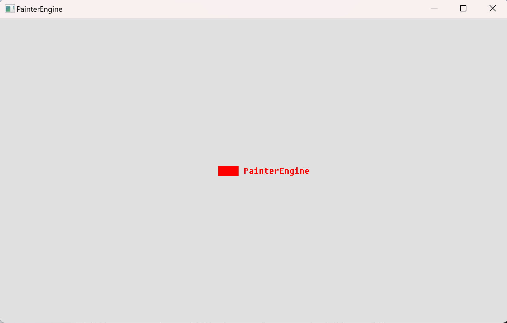

However, Chinese characters cannot be displayed correctly because PainterEngine only includes English fonts by default. So, what should we do if we want to support Chinese?

This is still not difficult. To achieve this, we first need to prepare a TTF font file. For example, here I have prepared a "YouYuan" font. All we need to do is load this font into the program:

```c
#include "PainterEngine.h"
int main()
{
    PainterEngine_Initialize(800,480);
    PainterEngine_LoadFontModule("assets/font.ttf", PX_FONTMODULE_CODEPAGE_GBK, 24);
    PainterEngine_DrawText(400, 240, "你好 PainterEngine", PX_ALIGN_CENTER, PX_COLOR(255, 255, 0, 0));
    return 1;
}
```


The first parameter of the `PainterEngine_LoadFontModule` function is the path to the TTF font file, with the relative path being relative to the location of the executable file. The second parameter specifies the character set. By default, Visual Studio uses the GBK character set. If you are using Visual Studio Code, which defaults to UTF-8 encoding, the second parameter should be set to `PX_FONTMODULE_CODEPAGE_GBK`. The last parameter specifies the font size.

## 4. Drawing Geometric Shapes with PainterEngine

In addition to drawing text, PainterEngine can directly draw the following types of geometric shapes:

`px_void PainterEngine_DrawLine(px_int x1, px_int y1, px_int x2, px_int y2, px_int linewidth, px_color color);` 
This function is used to draw a line segment.

- **x1, y1**: The starting coordinates of the line segment.  
- **x2, y2**: The ending coordinates of the line segment.  
- **linewidth**: The width of the line segment.  
- **color**: The color of the line segment.  

```c
#include "PainterEngine.h"
int main()
{
    PainterEngine_Initialize(800,480);
    // 设置起点和终点坐标
    px_int x1 = 50;
    px_int y1 = 50;
    px_int x2 = 200;
    px_int y2 = 200;

    // 设置线宽和颜色
    px_int linewidth = 5;
    px_color color = PX_COLOR(255, 0, 0, 255); // 红色

    // 绘制线段
    PainterEngine_DrawLine(x1, y1, x2, y2, linewidth, color);
    return 1;
}
```


`px_void PainterEngine_DrawRect(px_int x, px_int y, px_int width, px_int height, px_color color);`  
This function is used to draw a rectangle.

- **x, y**: The coordinates of the top-left corner of the rectangle.  
- **width**: The width of the rectangle.  
- **height**: The height of the rectangle.  
- **color**: The color of the rectangle.  

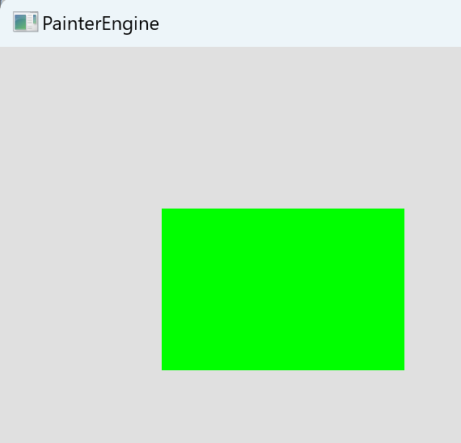

```c
#include "PainterEngine.h"
int main()
{
    PainterEngine_Initialize(800,480);
    // 设置矩形的左上角坐标
    px_int x = 100;
    px_int y = 100;

    // 设置矩形的宽度和高度
    px_int width = 150;
    px_int height = 100;

    // 设置矩形的颜色
    px_color color = PX_COLOR(255, 0, 255,0 ); // 绿色

    // 绘制矩形
    PainterEngine_DrawRect(x, y, width, height, color);
    return 1;
}
```

The `px_void PainterEngine_DrawCircle(px_int x, px_int y, px_int radius, px_int linewidth, px_color color);` function is used to draw a circular ring.

* `x, y`: The coordinates of the circle's center.  
* `radius`: The radius of the circle.  
* `linewidth`: The width of the circle's line.  
* `color`: The color of the circle.  

```c
#include "PainterEngine.h"
int main()
{
    PainterEngine_Initialize(800,480);
    // 设置圆心的坐标
    px_int x = 200;
    px_int y = 200;
    // 设置圆的半径
    px_int radius = 50;
    // 设置圆的线宽
    px_int linewidth = 5;
    // 设置圆的颜色
    px_color color = PX_COLOR(255, 0, 0, 255); // 蓝色
    // 绘制圆形
    PainterEngine_DrawCircle(x, y, radius, linewidth, color);
    return 1;
}
```


The `px_void PainterEngine_DrawSolidCircle(px_int x, px_int y, px_int radius, px_color color);` function is used to draw a solid circle.

* `x, y`: The coordinates of the circle's center.  
* `radius`: The radius of the circle.  
* `color`: The color of the circle.  

```c
#include "PainterEngine.h"
int main()
{
    PainterEngine_Initialize(800, 480);

    // 设置圆心的坐标
    px_int x = 100;
    px_int y = 100;

    // 设置圆的半径
    px_int radius = 50;

    // 设置圆的颜色
    px_color color = PX_COLOR(255, 255, 0, 255); 

    // 绘制实心圆
    PainterEngine_DrawSolidCircle(x, y, radius, color);
    return 1;
}
```


The `px_void PainterEngine_DrawSector(px_int x, px_int y, px_int inside_radius, px_int outside_radius, px_int start_angle, px_int end_angle, px_color color);` function is used to draw a sector.

Parameter description:  

* `x, y`: The coordinates of the center of the sector.  
* `inside_radius`: The inner radius of the sector.  
* `outside_radius`: The outer radius of the sector.  
* `start_angle`: The starting angle of the sector (in degrees, supports negative angles).  
* `end_angle`: The ending angle of the sector (in degrees, supports negative angles).  
* `color`: The color of the sector.  

```c
#include "PainterEngine.h"
int main()
{
    PainterEngine_Initialize(800, 480);
    // 设置扇形的圆心坐标
    px_int x = 100;
    px_int y = 100;
    // 设置扇形的半径
    px_int inside_radius = 50;
    px_int outside_radius = 100;
    // 设置扇形的起始角度和结束角度
    px_int start_angle = 0;
    px_int end_angle = 135;
    // 设置扇形的颜色
    px_color color = PX_COLOR(255, 255, 0, 0); // 红色
    // 绘制扇形
    PainterEngine_DrawSector(x, y, inside_radius, outside_radius, start_angle, end_angle, color);
    return 1;
}
```


The `px_void PainterEngine_DrawPixel(px_int x, px_int y, px_color color);` function is used to draw a single pixel.

* `x, y`: The coordinates of the pixel.  
* `color`: The color of the pixel.  

This function simply draws one pixel, so no example image is provided.  

## 5. Using PainterEngine to Draw Images  

Using PainterEngine to draw images is still straightforward, but before drawing an image, we need to load the image first.  

PainterEngine can directly load images from files. It natively supports four static image formats: PNG, JPG, BMP, and TRAW. To store the loaded image, we need to use a structure called a texture.  

In PainterEngine, textures are described using the `px_texture` structure. Therefore, to load a texture, we need the `PX_LoadTextureFromFile` function, which is a three-parameter function for loading image files.  

1. **First parameter:** The memory pool. This will be explained in more detail in later sections. By default, PainterEngine provides two default memory pools: `mp` and `mp_static`. The first is typically used for elements that require frequent allocation and deallocation, while the latter is used for storing static resources. Since images are generally static resources, you can simply specify `mp_static` here.  

2. **Second parameter:** A pointer to the texture structure. After the image is successfully loaded, this structure will be initialized and used to store image data.  

3. **Third parameter:** The file path of the image.  

After successfully loading the file, we use the `PainterEngine_DrawTexture` function to draw it. This is a four-parameter function:  

* **First parameter:** The pointer to the texture structure we loaded earlier.  
* **Second and third parameters:** The x and y coordinates where the image will be drawn.  
* **Fourth parameter:** The alignment mode, as previously mentioned.  

Refer to the following code example:  

```c
#include "PainterEngine.h"
px_texture mytexture;//纹理
int main()
{
    PainterEngine_Initialize(512, 512);
    if(!PX_LoadTextureFromFile(mp_static,&mytexture,"assets/demo.png"))
	{
        //加载纹理失败
		return 0;
	}
    PainterEngine_DrawTexture(&mytexture, 0, 0, PX_ALIGN_LEFTTOP);
    
    return 1;
}

```


## 6. PainterEngine Memory Pool Management Mechanism  

Since PainterEngine is independent of both the operating system and standard libraries, it requires its own memory management system separate from the system and standard libraries. To achieve this, PainterEngine implements an internal memory management system using memory pools as a dynamic memory management system.  

The implementation of the PainterEngine memory pool is equally straightforward. To use memory, you must first prepare a block of available memory space to serve as the memory pool's managed space. For instance, in the code below, we can define a large global array in C language and use the space of this array as the memory pool's allocation space:  

```c
#include "PainterEngine.h"
unsigned char my_memory_cache[1024 * 1024];
int main()
{
    px_memorypool mp;
    px_void* myalloc;
    mp=PX_MemorypoolCreate(my_memory_cache, sizeof(my_memory_cache));//创建内存池
    myalloc=MP_Malloc(&mp, 1024);//在内存池中分配1024字节
    return 1;
}
```

It is important to note that **_the space available for allocation within the memory pool will be slightly smaller than the total space assigned to the memory pool. If the allocated space exceeds the memory pool's capacity, it will result in a crash._**

```c
#include "PainterEngine.h"
unsigned char my_memory_cache[1024 * 1024];
int main()
{
    px_memorypool mp;
    px_void* myalloc;
    mp=PX_MemorypoolCreate(my_memory_cache, sizeof(my_memory_cache));//创建内存池
    myalloc=MP_Malloc(&mp, 1024*1024);//在内存池中分配1024*1024字节，但内存池实际容量小于分配给内存池容量,因此这里内存不足，这里将会进入中断
    return 1;
}
```

If you want to avoid a crash caused by insufficient memory pool capacity, you can use the following two approaches:  

1. You can set an error callback to handle memory pool errors yourself:  

```c
#include "PainterEngine.h"
unsigned char my_memory_cache[1024 * 1024];

PX_MEMORYPOOL_ERROR_FUNCTION(my_memory_cache_error)
{
	switch (error)
	{
	case PX_MEMORYPOOL_ERROR_OUTOFMEMORY:
		printf("内存访问错误\n");
		break;
	case PX_MEMORYPOOL_ERROR_INVALID_ACCESS:
		printf("无法访问内存\n");
		break;
	case PX_MEMORYPOOL_ERROR_INVALID_ADDRESS:
		printf("无效的内存地址(UAF or double free)\n");
		break;
	default:
		break;
	}
}
int main()
{
    px_memorypool mp;
    px_void* myalloc;
    mp=PX_MemorypoolCreate(my_memory_cache, sizeof(my_memory_cache));//创建内存池
	MP_ErrorCatch(&mp, my_memory_cache_error,0);//设置错误回调
    myalloc=MP_Malloc(&mp, 1024*1024);//在内存池中分配1024*1024字节
    return 1;
}
```

2. Alternatively, you can disable the memory pool's error exception handling. In this case, if the memory pool cannot allocate enough memory, it will simply return `NULL`:  

```c
#include "PainterEngine.h"
unsigned char my_memory_cache[1024 * 1024];

int main()
{
    px_memorypool mp;
    px_void* myalloc;
    mp=PX_MemorypoolCreate(my_memory_cache, sizeof(my_memory_cache));//创建内存池
	MP_NoCatchError(&mp, PX_TRUE);//设置内存池不捕获错误
    myalloc=MP_Malloc(&mp, 1024*1024);//在内存池中分配1024*1024字节,但内存池不捕获错误，所以会直接返回NULL
    return 1;
}
```

In PainterEngine, there are two system default memory pools: `mp` and `mp_static`. You can open the `PainterEngine_Application.h` file to find the definitions of these two memory pools. However, the most important part to focus on is the following code:  

```c
#define PX_APPLICATION_NAME "PainterEngine"
#define PX_APPLICATION_MEMORYPOOL_STATIC_SIZE (1024*1024*64)
#define PX_APPLICATION_MEMORYPOOL_DYNAMIC_SIZE (1024*1024*32)
#define PX_APPLICATION_MEMORYPOOL_SPACE_SIZE (1024*1024*16)
```

These are the directly related configuration macros for the two memory pools. `PX_APPLICATION_MEMORYPOOL_STATIC_SIZE` specifies the memory allocation size for the `mp_static` memory pool, while `PX_APPLICATION_MEMORYPOOL_DYNAMIC_SIZE` specifies the memory allocation size for the `mp` memory pool. `PX_APPLICATION_MEMORYPOOL_SPACE_SIZE` represents other system resources. At the start of the PainterEngine program, at least the cumulative memory defined by these three macros is occupied. All subsequent memory allocations revolve around these memory pools. If you find that the memory is insufficient when running PainterEngine, you can manually expand the size of the memory pools. Of course, if you want to save memory, you can manually reduce their sizes.

## 7. Using PainterEngine to Create GUI Buttons

In this chapter, we will encounter PainterEngine components for the first time. Now, we will use PainterEngine to create a classic GUI component—a button.

In PainterEngine, all components are described by the `PX_Object` structure, and the creation of a component always returns a pointer of type `PX_Object *`.

However, in this chapter, we do not need to consider complexities. We only need to create a button. In PainterEngine, the most commonly used button type is `PX_Object_PushButton`.

```c
#include "PainterEngine.h"
int main()
{
    PX_Object* myButtonObject;
    PainterEngine_Initialize(800, 480);
    PainterEngine_LoadFontModule("assets/font.ttf",PX_FONTMODULE_CODEPAGE_GBK,20);
    myButtonObject=PX_Object_PushButtonCreate(mp,root,300,200,200,80,"我是一个按钮", PainterEngine_GetFontModule());
    return 1;
}
```


Now, let us take a detailed look at the `PX_Object_PushButtonCreate` function. 

The first parameter is a memory pool. As mentioned earlier, PainterEngine has two default system memory pools. In this case, using either `mp` or `mp_static` works fine. However, considering that the interface design might involve allocating and destroying objects, it is better to use the `mp` memory pool.

The second parameter, `root`, is the root object in PainterEngine. We will discuss the object management mechanism in PainterEngine later. For now, you just need to understand that providing `root` here means **_creating a button object as a child object of the root object_**. This allows the button to be linked to the system object tree, enabling event response and rendering.

Next are the `x`, `y`, `width`, and `height` parameters, which specify the position, width, and height of the button.

The last parameter is a font pointer, which is the TTF font file we loaded earlier. Without it, the button cannot display Chinese characters. Of course, you can choose other fonts to achieve different styles.

## 8. PainterEngine Object Transmission Mechanism

In the previous chapter, we briefly introduced the root object, `root`. In this chapter, we will learn about the object management mechanism in PainterEngine.

As mentioned earlier, all components in PainterEngine are described by the `PX_Object` structure. PainterEngine's objects exist in the form of a tree structure:


Each `PX_Object` is a node in the tree, and can have its own children (possibly more than one) and its own parent (only one). At the same time, each `PX_Object` has the following four basic functions:

`Create`: object creation function, or object initialisation function, in PainterEngine it is usually `PX_Object_xxxxxCreate`, where `xxxxx` is the name of the object, such as the `PushButton` in the previous section, `Create` function is usually the object and connects itself to the object tree.

`Update`: the physical information of the object is basically updated in this function, which generally deals with the physical information of the object, such as position, size, speed, etc. It is commonly used for objects in game design, and is less common in GUI objects, which is designed to be differentiated from the `Render` function, which is the drawing function, because in the game server side, for example, the object doesn't need to be drawn, and drawing is a very important part of game design. because in game servers, for example, objects don't need to be drawn, and drawing is very performance-intensive.

`Render`: the drawing of the object is basically done in this function, which is used in the drawing function of `PX_Object` to render the image data to the screen, of course, in some cases, the physics information is also done in this function, because the physics information of the object doesn't affect the actual running result of the game, for example, some special effects and particle effects, and most of the GUI components are almost only used by the `Render` function. Most GUI components also use the `Render` function almost exclusively.

`Free`: the release of the object is basically done in this function, e.g. if a texture is loaded in `Create`, or memory is requested, it should be released in this function.

The above `Update`, `Render`, and `Free` functions have a pass-through property, which means:

* If an object node executes `Update`, then all its children will also execute `Update` * If an object node executes `Update`, then all its children will also execute `Update`.
* If an object node executes `Render`, all its children execute `Render`. * If an object node executes `Update`, all its children execute `Update`.
* If an object node does `Free`, then all its children do `Free`, and if the parent is deleted, its children are deleted, and iterates until all children rooted at that node are deleted.

So, if we created the button in the previous section and attached it to the `root` node, we don't need to manually execute the `Update`, `Render`, and `Free` functions ourselves (they're already written in `PX_Object_PushButton.c`), because the root node, `root`, is automatically updated, rendered, and freed. and released automatically, we just need to take care of `Create`.

Of course, if you wish to delete the object, you can just call `PX_ObjectDelayDelete` or `PX_ObjectDelete`:

```c
#include "PainterEngine.h"
int main()
{
    PX_Object* myButtonObject;
    PainterEngine_Initialize(800, 480);
    PainterEngine_LoadFontModule("assets/font.ttf",PX_FONTMODULE_CODEPAGE_GBK,20);
    myButtonObject=PX_Object_PushButtonCreate(mp,root,300,200,200,80,"我是一个按钮", PainterEngine_GetFontModule());
    PX_ObjectDelayDelete(myButtonObject);//删除对象
    return 1;
}
```

The functionality and parameters of these two functions are the same. However, `PX_ObjectDelayDelete` executes the deletion only after the update and rendering are complete, whereas `PX_ObjectDelete` performs the deletion immediately. I recommend using `PX_ObjectDelayDelete` to avoid situations where an object is deleted immediately while other objects still reference its data, which could lead to accessing invalid memory.

## 9. PainterEngine Messaging Mechanism

Now, although we have created a button, we cannot yet respond to it. To respond to button events, we need to bind the button control to a message. Please refer to the following code:

```c
#include "PainterEngine.h"

PX_OBJECT_EVENT_FUNCTION(OnButtonClick)
{
    PX_Object_PushButtonSetText(pObject,"我被点击了");
}

int main()
{
    PX_Object* myButtonObject;
    PainterEngine_Initialize(800, 480);
    PainterEngine_LoadFontModule("assets/font.ttf",PX_FONTMODULE_CODEPAGE_GBK,20);
    myButtonObject=PX_Object_PushButtonCreate(mp,root,300,200,200,80,"我是一个按钮", PainterEngine_GetFontModule());
    PX_ObjectRegisterEvent(myButtonObject,PX_OBJECT_EVENT_EXECUTE,OnButtonClick,0);
    
    return 1;
}
```

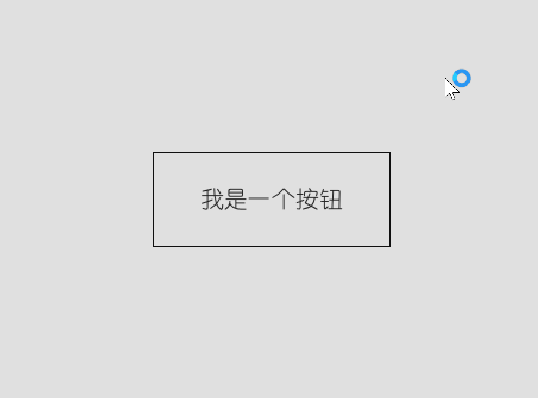

Among them, ``PX_OBJECT_EVENT_FUNCTION`` is a macro, because the event response function is a fixed format, so it is highly recommended that you use the macro to declare it, its definition prototype is as follows.

``c
#define PX_OBJECT_EVENT_FUNCTION(name) px_void name(PX_Object *pObject,PX_Object_Event e,px_void * ptr)
``

As you can see, this callback function has three parameters, the first is a pointer to the object of the response time, because the button click was triggered, so this pointer points to the button object; the second parameter is the type of event `e`, which is the type of the triggered event; the last parameter is the pointer passed by the user, which is in the registration of the time response function `PX_ObjectRegisterEvent` is triggered. ObjectRegisterEvent` is called.

The event types are the following.

```c
#define PX_OBJECT_EVENT_ANY					0 //任意事件
#define PX_OBJECT_EVENT_CURSORMOVE			1 //鼠标移动
#define PX_OBJECT_EVENT_CURSORUP			2 //鼠标左键弹起或触摸屏弹起
#define PX_OBJECT_EVENT_CURSORRDOWN			3 //鼠标右键按下
#define PX_OBJECT_EVENT_CURSORDOWN			4 //鼠标左键按下或触摸屏按下
#define PX_OBJECT_EVENT_CURSORRUP			5 //鼠标右键弹起
#define PX_OBJECT_EVENT_CURSOROVER			6 //鼠标进入范围
#define PX_OBJECT_EVENT_CURSOROUT			7 //鼠标离开范围
#define PX_OBJECT_EVENT_CURSORWHEEL         8 //鼠标滚轮
#define PX_OBJECT_EVENT_CURSORCLICK			9 //鼠标左键点击
#define PX_OBJECT_EVENT_CURSORDRAG			10 //鼠标拖拽
#define PX_OBJECT_EVENT_STRING				11 //字符串事件(输入法输入)
#define PX_OBJECT_EVENT_EXECUTE				12 //执行事件,不同组件有不同的执行方式
#define PX_OBJECT_EVENT_VALUECHANGED		13 //值改变事件,例如滑动条的值改变,或者文本框的值改变,或者列表框的选中项改变
#define PX_OBJECT_EVENT_DRAGFILE			14 //拖拽文件
#define PX_OBJECT_EVENT_KEYDOWN				15 //键盘按下
#define PX_OBJECT_EVENT_KEYUP				16 //键盘弹起
#define PX_OBJECT_EVENT_IMPACT				17 //碰撞事件
#define PX_OBJECT_EVENT_SCALE               18 //缩放事件
#define PX_OBJECT_EVENT_WINDOWRESIZE        19 //窗口大小改变
#define PX_OBJECT_EVENT_ONFOCUS				20 //获得焦点
#define PX_OBJECT_EVENT_LOSTFOCUS           21 //失去焦点
#define PX_OBJECT_EVENT_CANCEL				22 //取消事件
#define PX_OBJECT_EVENT_CLOSE				23 //关闭事件
#define PX_OBJECT_EVENT_CURSORMUP			24 //鼠标中键弹起
#define PX_OBJECT_EVENT_CURSORMDOWN			25 //鼠标中键按下
#define PX_OBJECT_EVENT_REQUESTDATA			26 //请求数据
#define PX_OBJECT_EVENT_OPEN				27 //打开事件
#define PX_OBJECT_EVENT_SAVE				28 //保存事件
#define PX_OBJECT_EVENT_TIMEOUT				29 //超时事件
#define PX_OBJECT_EVENT_DAMAGE				30 //伤害事件
```

Not all of the above events will be responded to by any component, such as `PX_OBJECT_EVENT_EXECUTE` in the above example, it is the event that will be triggered when a button is clicked, or the event that will be triggered when the enter is pressed in a text box, but some of them, such as scrollbars and progressbars, will not be triggered by this event. This means that some events are exclusive.

But events like those with `CURSOR` or `KEY` are events that all components attached to the `root` node will receive (but not necessarily respond to). Note that `CURSOR` events, like mouse or touchscreen events, are not triggered only when the mouse or touchscreen is moved into the component's location and range; whenever such an event is delivered to the `root` node, it is passed on to all of its children, layer by layer. If you want to implement something similar to the `only on mouse click' in buttons, you will have to implement the scope judgement yourself.

You can use the

```c
px_float PX_Object_Event_GetCursorX(PX_Object_Event e);//获取cursor事件的x坐标
px_float PX_Object_Event_GetCursorY(PX_Object_Event e);//获取cursor事件的y坐标
px_float PX_Object_Event_GetCursorZ(PX_Object_Event e);//获取cursor事件的z坐标,一般用于鼠标中键滚轮
```

to get something like ‘where is the mouse now’ in the `cursor` event.

Let's go back to the source code `OnButtonClick` and do something very simple, change the content of the button text with `PX_Object_PushButtonSetText`.

Finally we come to the `PX_ObjectRegisterEvent` function, which is used to bind an event to a C function. The first parameter is a pointer to the button component we created earlier, the second parameter is the type of event we want to bind, in this case `PX_OBJECT_EVENT_EXECUTE` is the event triggered when the button is clicked, and the third parameter is the event triggered when the button is clicked, and the third parameter is the event triggered when the button is clicked. Here, `PX_OBJECT_EVENT_EXECUTE` is the event triggered when the button is clicked, and the third argument is the user pointer, which will be passed to the callback function, or if you don't want to use it, you can just fill in `PX_NULL`.

## 10. Small example of a digital photo album with PainterEngine

Now, let's kick off the first step in the componentised development of PainterEngine with a small example. In this routine, I'll develop a digital photo album using buttons and picture frames components. You can find the art resources for this article in `documents/logo`.

```c
#include "PainterEngine.h"

PX_Object* Previous, * Next, * Image;
px_texture my_texture[10];//存放图片的数组
px_int index = 0;//当前图片的索引

PX_OBJECT_EVENT_FUNCTION(OnButtonPreClick)
{
    index--;
	if(index < 0)
	{
		index = 9;
	}
	PX_Object_ImageSetTexture(Image, &my_texture[index]);//设置图片
}

PX_OBJECT_EVENT_FUNCTION(OnButtonNextClick)
{
	index++;
	if(index > 9)
	{
		index = 0;
	}
	PX_Object_ImageSetTexture(Image, &my_texture[index]);
}

int main()
{
    px_int i;
    PainterEngine_Initialize(512, 560);//初始化
    for(i=0;i<10;i++)
	{
        px_char path[256];
        PX_sprintf1(path,256, "assets/%1.png", PX_STRINGFORMAT_INT(i+1));
		if(!PX_LoadTextureFromFile(mp_static, &my_texture[i],path))//加载图片
		{
            //加载失败
            printf("加载失败");
			return 0;
		}
	}
    PainterEngine_LoadFontModule("assets/font.ttf", PX_FONTMODULE_CODEPAGE_GBK, 20);//加载字体
    Image = PX_Object_ImageCreate(mp, root, 0, 0, 512, 512, 0);//创建图片对象
    Previous= PX_Object_PushButtonCreate(mp, root, 0, 512, 256, 48, "上一张",PainterEngine_GetFontModule());//创建按钮对象
    Next = PX_Object_PushButtonCreate(mp, root, 256, 512, 256, 48, "下一张", PainterEngine_GetFontModule());//创建按钮对象
	PX_ObjectRegisterEvent(Previous, PX_OBJECT_EVENT_EXECUTE, OnButtonPreClick, PX_NULL);//注册按钮事件
	PX_ObjectRegisterEvent(Next, PX_OBJECT_EVENT_EXECUTE, OnButtonNextClick, PX_NULL);//注册按钮事件
    return 1;
}
```

In the above code, `OnButtonPreClick` and `OnButtonNextClick` are the callback functions for the previous and next buttons respectively, and we use the `PX_Object_ImageSetTexture` function to switch the image box.

In the `main` function, we load the ttf font first, then we create an image component with `PX_Object_ImageCreate`, then we create 2 buttons and bind the event callback function with `PX_ObjectRegisterEvent`. Finally, let's take a look at the result:

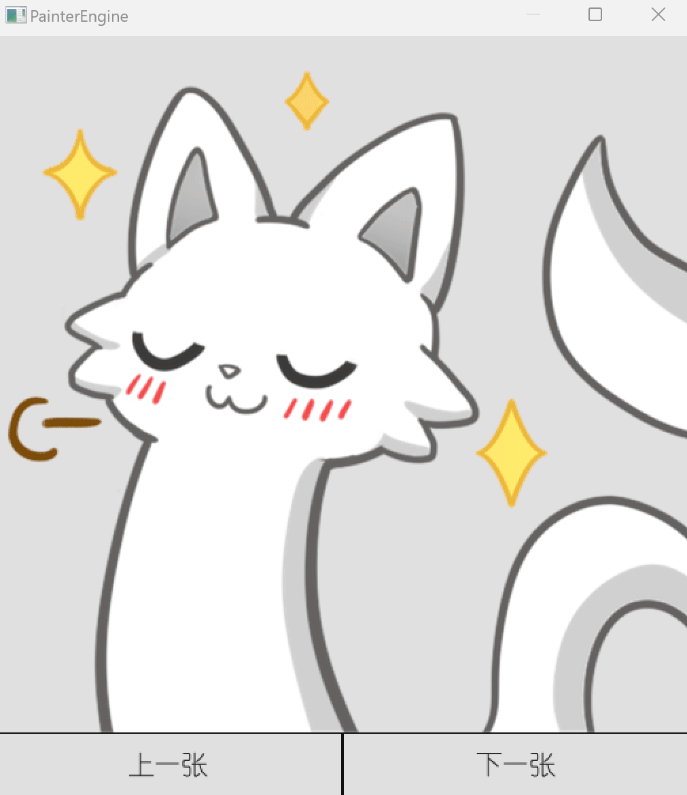

## 11. More common PainterEngine components

You can find the built-in components of PainterEngine in the `PainterEngine/kernel` file, all the component names start with `PX_Object_XXXXX`, here, I list some of the commonly used components and the sample code for you:

* Textbox.

```c
#include "PainterEngine.h"
PX_OBJECT_EVENT_FUNCTION(PX_Object_EditOnTextChanged)
{
	//文本改变后后这里会被执行
}

int main()
{
	PX_Object* pObject;
	PainterEngine_Initialize(600, 400);
	//创建文本框
	pObject=PX_Object_EditCreate(mp,root,200,180,200,40,0);
	//注册编辑框文本改变事件
	PX_ObjectRegisterEvent(pObject,PX_OBJECT_EVENT_VALUECHANGED, PX_Object_EditOnTextChanged,PX_NULL);
	return 0;
}
```


* List Box:

```c
#include "PainterEngine.h"

PX_OBJECT_RENDER_FUNCTION(PX_Object_OnMyListItemRender)
{
	px_float objx,objy,objWidth,objHeight;
	PX_Object_ListItem *pItem=PX_Object_GetListItem(pObject);
	PX_OBJECT_INHERIT_CODE(pObject,objx, objy, objWidth, objHeight);
	//绘制出其文本
	PX_FontModuleDrawText(psurface, 0, (px_int)objx + 3, (px_int)objy + 3, PX_ALIGN_LEFTTOP, (const px_char *)pItem->pdata, PX_COLOR_WHITE);
}


PX_OBJECT_LIST_ITEM_CREATE_FUNCTION(PX_Object_OnMyListItemCreate)
{
	//绑定ListItem的渲染函数
	ItemObject->Func_ObjectRender[0]=PX_Object_OnMyListItemRender;
	return PX_TRUE;
}

PX_OBJECT_EVENT_FUNCTION(PX_Object_ListOnSelectChanged)
{
	//当选中项改变时
	return;
}

int main()
{
	PX_Object* pObject;
	PainterEngine_Initialize(600, 400);

	//创建list
	pObject = PX_Object_ListCreate(mp,root,100,100,400,200,24,PX_Object_OnMyListItemCreate,0);
	PX_Object_ListAdd(pObject, "Item1");
	PX_Object_ListAdd(pObject, "Item2");
	PX_Object_ListAdd(pObject, "Item3");
	PX_Object_ListAdd(pObject, "Item4");
	PX_Object_ListAdd(pObject, "Item5");
	PX_ObjectRegisterEvent(pObject, PX_OBJECT_EVENT_VALUECHANGED, PX_Object_ListOnSelectChanged, 0);
	return 0;
}
```

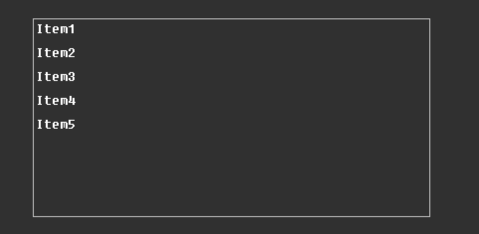

* Slider:

```c
#include "PainterEngine.h"

PX_OBJECT_EVENT_FUNCTION(SliderChanged)
{
	//垂直滑动条值改变后执行这里的代码
	return;
}

int main()
{
	PX_Object* pObject;
	PainterEngine_Initialize(600, 400);
	//水平滑动条
	PX_Object_SliderBarCreate(mp, root, 200, 50, 200,24,PX_OBJECT_SLIDERBAR_TYPE_HORIZONTAL,PX_OBJECT_SLIDERBAR_STYLE_BOX);
	//垂直滑动条
	pObject=PX_Object_SliderBarCreate(mp, root, 200, 100, 24, 200, PX_OBJECT_SLIDERBAR_TYPE_VERTICAL, PX_OBJECT_SLIDERBAR_STYLE_BOX);
	PX_ObjectRegisterEvent(pObject, PX_OBJECT_EVENT_VALUECHANGED, SliderChanged, 0);
	return 0;
}
```

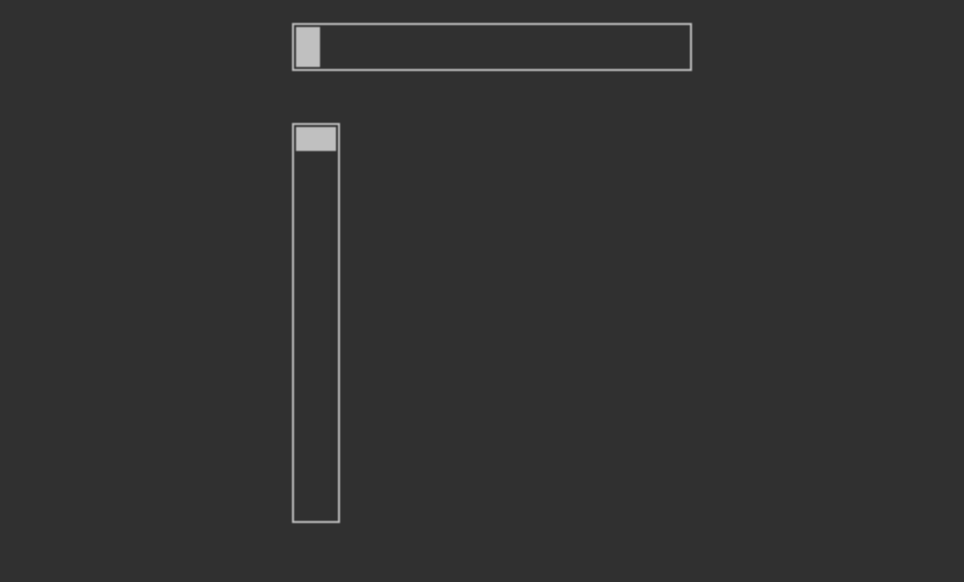

* Dropdown box:

```c
#include "PainterEngine.h"

int main()
{
	PX_Object* pObject;
	PainterEngine_Initialize(600, 400);
	pObject = PX_Object_SelectBarCreate(mp, root, 200, 150, 200,24,0);
	PX_Object_SelectBarAddItem(pObject, "Item1");
	PX_Object_SelectBarAddItem(pObject, "Item2");
	PX_Object_SelectBarAddItem(pObject, "Item3");
	PX_Object_SelectBarAddItem(pObject, "Item4");
	PX_Object_SelectBarAddItem(pObject, "Item5");
	return 0;
}
```

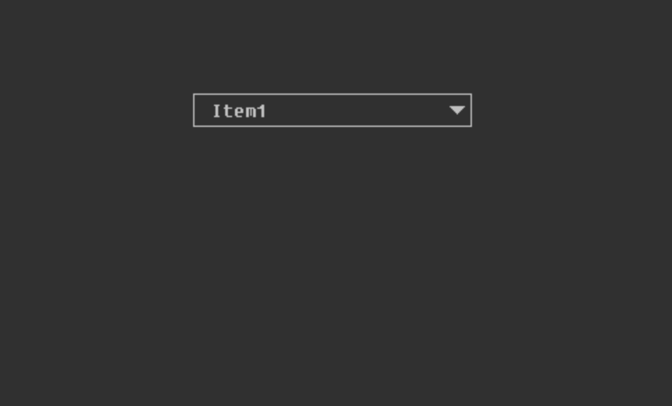

* Oscilloscope:

```c
#include "PainterEngine.h"

//必须是生存域内有效可访问的数据,这里定义为全局变量
px_double data_x[100];
px_double data_y[100];

int main()
{
	PX_Object_OscilloscopeData data;
	PX_Object* pObject;

	px_int i;
	PainterEngine_Initialize(600, 600);
	
	//初始化一个测试数据
	for (i = 0; i < 100; i++)
	{
		data_x[i] = i;
		data_y[i] = i+PX_randRange(-10,10);
	}
	
	pObject = PX_Object_OscilloscopeCreate(mp, root, 0, 0, 600, 600, 0);

	//设置水平坐标最小值最大值
	PX_Object_OscilloscopeSetHorizontalMin(pObject, 0);
	PX_Object_OscilloscopeSetHorizontalMax(pObject, 100);

	//设置垂直坐标(左边)最小值最大值0-100
	PX_Object_OscilloscopeSetLeftVerticalMin(pObject, 0);
	PX_Object_OscilloscopeSetLeftVerticalMax(pObject, 100);

	//数据类型
	data.Color=PX_COLOR(255,192,255,128);//数据颜色
	data.ID = 0;
	data.linewidth = 3;//数据线宽
	data.Map = PX_OBJECT_OSCILLOSCOPE_OSCILLOSCOPEDATA_MAP_LEFT;//数据映射到左边垂直坐标
	data.MapHorizontalArray = data_x;//数据水平坐标
	data.MapVerticalArray = data_y;//数据垂直坐标
	data.Size = 100;//数据大小
	data.Visibled = PX_TRUE;//数据可见
	data.Normalization = 1;//数据归一化系数为1
	
	//添加数据
	PX_Object_OscilloscopeAddData(pObject, data);
	return 0;
}
```


Because there are too many, I can't list all of them for you, if you want to know exactly how to use a component and what a component does, you can visit PainterEngine's [Component Marketplace](https://market.painterengine.com/), there you can find PainterEngine's Component Marketplace (), where you can find descriptions and sample code for PainterEngine's built-in components and third-party components.

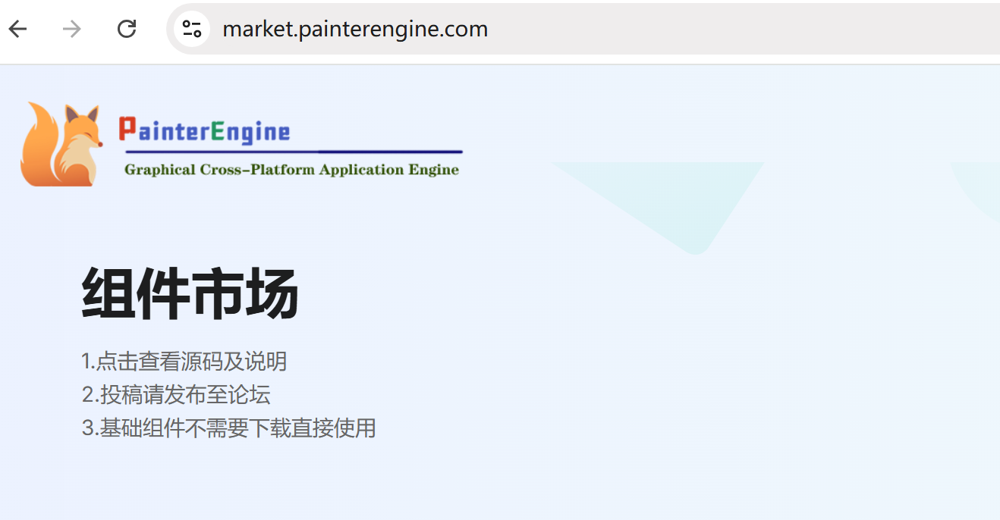

## 12. Implementing your own PainterEngine components

PainterEngine encourages a component-based development architecture. That is, whether it is a game, a GUI interaction, or even a program function, we can develop it as a component.

Component development is kind of like Class in C++, each component has to implement its own `Create`, `Update`, `Render`, `Free` functions. For the above four functions, you can refer to the section [Object Passing Mechanism in Front](#8painterengine - Object Passing Mechanism).

To demonstrate this, let's implement a ‘controlled drag and rotate image component’, i.e. we can drag the image with the mouse to the position in the interface and rotate it with the middle mouse button.

In order to implement this feature, let's go through the steps step by step. Firstly, in order to create a component, we need a structure to describe our component. We need to draw a picture, so we need a `px_texture` type. At the same time, we need to rotate the image, so it also has a `rotation` to describe the angle of rotation:

```c
#include "PainterEngine.h"
typedef struct
{
	px_texture image;
	px_int rotation;
}PX_Object_MyObject;

px_int main()
{
	PainterEngine_Initialize(800, 480);
	return PX_TRUE;
}
```

After that, we need to define our `Create`, `Update`, `Render`, and `Free` functions, where `Update`, `Render`, and `Free` have corresponding formats, and all of them have a macro to simplify our definition process:

```c
#define PX_OBJECT_RENDER_FUNCTION(name) px_void name(px_surface *psurface,PX_Object *pObject,px_int idesc,px_dword elapsed)
#define PX_OBJECT_UPDATE_FUNCTION(name) px_void name(PX_Object *pObject,px_int idesc,px_dword elapsed)
#define PX_OBJECT_FREE_FUNCTION(name) px_void name(PX_Object *pObject,px_int idesc)
```

So, in the main function, we can define our functions like this:

```c
#include "PainterEngine.h"
typedef struct
{
	px_texture image;
	px_int rotation;
}PX_Object_MyObject;

PX_OBJECT_UPDATE_FUNCTION(MyObjectUpdate)
{
}

PX_OBJECT_RENDER_FUNCTION(MyObjectRender)
{
	PX_Object_MyObject *pMyObject=PX_ObjectGetDesc(PX_Object_MyObject,pObject);
	PX_TextureRenderEx(psurface, &pMyObject->image, (px_int)pObject->x, (px_int)pObject->y, PX_ALIGN_CENTER,0,1, pMyObject->rotation);
}

PX_OBJECT_FREE_FUNCTION(MyObjectFree)
{
	PX_Object_MyObject *pMyObject=PX_ObjectGetDesc(PX_Object_MyObject,pObject);
	PX_TextureFree(&pMyObject->image);
}

px_int main()
{
	PainterEngine_Initialize(800, 480);
	return PX_TRUE;
}
```

Among them, because we do not need to update some physical information, so `MyObjectUpdate` function we can not write anything, in the `MyObjectRender` we just need to draw the picture out can be, here we first use the `PX_ObjectGetDesc` function to get our defined structure pointer, its first parameter is the structure type, the second parameter is the `pObject` pointer, then we just use the `PX_TextureRenderEx` function to draw the picture out, then we just need to use the `PX_TextureRenderEx` function to draw the picture out. The first parameter is the type of the structure, the second parameter is the `pObject` pointer passed in by the function, and then we just need to use the `PX_TextureRenderEx` function to render the picture.

As an aside, the `PX_TextureRenderEx` function is used to render a texture on a specified surface and provides extended options for alignment, blending, scaling and rotation. Among them:

  * `psurface`: a pointer to the surface on which to render the texture.
  * `resTexture`: pointer to the texture resource to render.
  * `x`: the x coordinate at which to draw the texture on the surface.
  * `y`: y coordinate of the texture to draw on the surface.
  * `refPoint`: reference point for alignment (e.g. centre, top left corner, etc.).
  * `blend`: pointer to the blend options structure (can be `NULL` if no blending is needed).
  * `scale`: the scale factor of the texture (1.0 means no scale).
  * `Angle`: the rotation angle of the texture, in degrees.

Finally, it's time to write the function that creates the new object, here we need to use the `PX_ObjectCreateEx` function, the `PX_ObjectCreateEx` function is used to create an extended object and initialise its properties and callback functions. Its parameters are described as follows.

* `mp`: pointer to a memory pool to allocate the memory required by the object.
* `Parent`: pointer to the parent object, or `NULL` if there is no parent.
* `x`: the initial position of the object on the x-axis.
* `y`: the initial position of the object on the y-axis.
* `z`: the initial position of the object on the z-axis, the z-coordinate affects its rendering order.
* `Width`: the width of the object.
* `Height`: the height of the object.
* `Lenght`: the length of the object, for 2D objects, it can be 0. * `type`: the length of the object.
* `type`: the type of the object.
* `Func_ObjectUpdate`: pointer to the object update function.
* `Func_ObjectRender`: pointer to the object render function.
* `Func_ObjectFree`: pointer to the object free function.
* `desc`: pointer to the object description data. You can set it to 0, which will fill the data of this object type with 0 when it is created.
* `size`: the size of the description data, that is, the size of the type of object structure you defined. The object creation function will request a section of memory space in the memory pool and use it to store your object structure.

After creating an empty object, we use `PX_ObjectGetDescIndex` to get the object structure pointer out of the object, this is a three-parameter function, the first parameter is the type of the object structure, and the second parameter is the type of the `PX_Object *` pointer, because a `PX_Object` can be combined with multiple object structures. We'll describe this combination of structures later in the tutorial, but for now we just need to know that after calling the `PX_ObjectCreateEx` function, the first object structure stored is at index zero.

After taking the pointer out of the structure, we do a series of initialisations on it, such as loading the image and initialising the rotation angle, and finally we create the object in the `main` function:

```c
#include "PainterEngine.h"
typedef struct
{
	px_texture image;
	px_int rotation;
}PX_Object_MyObject;

PX_OBJECT_UPDATE_FUNCTION(MyObjectUpdate)
{
}

PX_OBJECT_RENDER_FUNCTION(MyObjectRender)
{
	PX_Object_MyObject *pMyObject=PX_ObjectGetDesc(PX_Object_MyObject,pObject);
	PX_TextureRenderEx(psurface, &pMyObject->image, (px_int)pObject->x, (px_int)pObject->y, PX_ALIGN_CENTER,0,1, pMyObject->rotation);//渲染图片
}

PX_OBJECT_FREE_FUNCTION(MyObjectFree)
{
	PX_Object_MyObject *pMyObject=PX_ObjectGetDesc(PX_Object_MyObject,pObject);
	PX_TextureFree(&pMyObject->image);//释放图片
}

PX_Object* PX_Object_MyObjectCreate(px_memorypool* mp, PX_Object* parent, px_float x, px_float y)
{
	PX_Object *pObject=PX_ObjectCreateEx(mp,parent,x,y,0,128,128,0,0, MyObjectUpdate, MyObjectRender, MyObjectFree,0,sizeof(PX_Object_MyObject));//创建一个空的自定义对象
	PX_Object_MyObject* pMyObject = PX_ObjectGetDescIndex(PX_Object_MyObject, pObject,0);//取得自定义对象数据
	pMyObject->rotation = 0;
	if(!PX_LoadTextureFromFile(mp,&pMyObject->image, "assets/test.png"))//加载图片
	{
		PX_ObjectDelete(pObject);//加载失败则删除对象
		return PX_NULL;
	}
	return pObject;
}

px_int main()
{
	PainterEngine_Initialize(800, 480);
	PX_Object_MyObjectCreate(mp,root,400,240);//创建一个自定义对象
	return PX_TRUE;
}
```

Then it runs like this.


But it doesn't end there, how do we get our component to rotate in response to the middle mouse button? Remember our object passing mechanism from [PushButton](#8painterengine-object passing mechanism)? Now, we also want our component to respond to the middle mouse button, so we register it with a callback function for the `PX_OBJECT_EVENT_CURSORWHEEL` event, with the following code.

```c
#include "PainterEngine.h"
typedef struct
{
	px_texture image;
	px_float rotation;
}PX_Object_MyObject;

PX_OBJECT_UPDATE_FUNCTION(MyObjectUpdate)
{
}

PX_OBJECT_RENDER_FUNCTION(MyObjectRender)
{
	PX_Object_MyObject *pMyObject=PX_ObjectGetDesc(PX_Object_MyObject,pObject);
	PX_TextureRenderEx(psurface, &pMyObject->image, (px_int)pObject->x, (px_int)pObject->y, PX_ALIGN_CENTER,0,1, pMyObject->rotation);//渲染图片
}

PX_OBJECT_FREE_FUNCTION(MyObjectFree)
{
	PX_Object_MyObject *pMyObject=PX_ObjectGetDesc(PX_Object_MyObject,pObject);
	PX_TextureFree(&pMyObject->image);//释放图片
}

PX_OBJECT_EVENT_FUNCTION(MyObjectOnCursorWheel)
{
	PX_Object_MyObject *pMyObject=PX_ObjectGetDescIndex(PX_Object_MyObject,pObject,0);
	if(PX_ObjectIsCursorInRegion(pObject,e))//Object是鼠标位置是否选中当前组件，e是事件
		pMyObject->rotation += (px_float)PX_Object_Event_GetCursorZ(e)/10;
}

PX_Object* PX_Object_MyObjectCreate(px_memorypool* mp, PX_Object* parent, px_float x, px_float y)
{
	PX_Object *pObject=PX_ObjectCreateEx(mp,parent,x,y,0,128,128,0,0, MyObjectUpdate, MyObjectRender, MyObjectFree,0,sizeof(PX_Object_MyObject));//创建一个空的自定义对象
	PX_Object_MyObject* pMyObject = PX_ObjectGetDescIndex(PX_Object_MyObject, pObject,0);//取得自定义对象数据
	pMyObject->rotation = 0;
	if(!PX_LoadTextureFromFile(mp,&pMyObject->image, "assets/test.png"))//加载图片
	{
		PX_ObjectDelete(pObject);//加载失败则删除对象
		return PX_NULL;
	}
	PX_ObjectRegisterEvent(pObject,PX_OBJECT_EVENT_CURSORWHEEL,MyObjectOnCursorWheel,0);//注册鼠标滚轮事件
	return pObject;
}

px_int main()
{
	PainterEngine_Initialize(800, 480);
	PX_Object_MyObjectCreate(mp,root,400,240);//创建一个自定义对象
	return PX_TRUE;
}
```

The results are as follows.


If you think the quality of the rotated image is not good, there are a lot of jaggies, it's because `PX_TextureRenderEx` rotates the image by sampling the original image directly. If you want a high quality rotation, you can replace the original function with the `PX_TextureRenderRotation` function.

```c
PX_OBJECT_RENDER_FUNCTION(MyObjectRender)
{
	PX_Object_MyObject *pMyObject=PX_ObjectGetDesc(PX_Object_MyObject,pObject);
	PX_TextureRenderRotation(psurface, &pMyObject->image, (px_int)pObject->x, (px_int)pObject->y, PX_ALIGN_CENTER,0, pMyObject->rotation);//渲染图片
}

```


So, how do we achieve the drag effect? To achieve the drag effect, we need to add `float` type variables `x`, `y`, used to record the position of the image when the mouse selects it, at the same time, we add a `bool` type variable `bselect`, which indicates whether the current icon is selected or not. When the mouse clicks on our icon, we can listen to the `PX_OBJECT_EVENT_CURSORDRAG` event, which is generated when the mouse is dragged on the screen, and we move our component by the offset of the coordinates. Finally, no matter the mouse non-dragging movement or the left mouse button lift, will be cancelled our component selection state, in the corresponding handler function to cancel the selection state can be.

```c
#include "PainterEngine.h"
typedef struct
{
	px_float last_cursorx, last_cursory;
	px_bool bselect;
	px_texture image;
	px_float rotation;
}PX_Object_MyObject;

PX_OBJECT_UPDATE_FUNCTION(MyObjectUpdate)
{
}

PX_OBJECT_RENDER_FUNCTION(MyObjectRender)
{
	PX_Object_MyObject *pMyObject=PX_ObjectGetDesc(PX_Object_MyObject,pObject);
	PX_TextureRenderRotation(psurface, &pMyObject->image, (px_int)pObject->x, (px_int)pObject->y, PX_ALIGN_CENTER,0, (px_int)pMyObject->rotation);//渲染图片
}

PX_OBJECT_FREE_FUNCTION(MyObjectFree)
{
	PX_Object_MyObject *pMyObject=PX_ObjectGetDesc(PX_Object_MyObject,pObject);
	PX_TextureFree(&pMyObject->image);//释放图片
}

PX_OBJECT_EVENT_FUNCTION(MyObjectOnCursorWheel)
{
	PX_Object_MyObject *pMyObject=PX_ObjectGetDescIndex(PX_Object_MyObject,pObject,0);
	if(PX_ObjectIsCursorInRegionAlign(pObject,e,PX_ALIGN_CENTER))//Object是鼠标位置是否选中当前组件，e是事件
		pMyObject->rotation += (px_float)PX_Object_Event_GetCursorZ(e)/10;
}

PX_OBJECT_EVENT_FUNCTION(MyObjectOnCursorDown)
{
	PX_Object_MyObject* pMyObject = PX_ObjectGetDescIndex(PX_Object_MyObject, pObject, 0);
	if (PX_ObjectIsCursorInRegionAlign(pObject, e, PX_ALIGN_CENTER))//Object是鼠标位置是否选中当前组件，e是事件
	{
		pMyObject->bselect = PX_TRUE;
		pMyObject->last_cursorx = PX_Object_Event_GetCursorX(e);
		pMyObject->last_cursory = PX_Object_Event_GetCursorY(e);
	}
}

PX_OBJECT_EVENT_FUNCTION(MyObjectOnCursorRelease)
{
	PX_Object_MyObject* pMyObject = PX_ObjectGetDescIndex(PX_Object_MyObject, pObject, 0);
	pMyObject->bselect = PX_FALSE;
}

PX_OBJECT_EVENT_FUNCTION(MyObjectOnCursorDrag)
{
	PX_Object_MyObject* pMyObject = PX_ObjectGetDescIndex(PX_Object_MyObject, pObject, 0);
	if (pMyObject->bselect)
	{
		pObject->x += PX_Object_Event_GetCursorX(e) - pMyObject->last_cursorx;
		pObject->y += PX_Object_Event_GetCursorY(e) - pMyObject->last_cursory;
	}
	pMyObject->last_cursorx = PX_Object_Event_GetCursorX(e);
	pMyObject->last_cursory = PX_Object_Event_GetCursorY(e);
}

PX_Object* PX_Object_MyObjectCreate(px_memorypool* mp, PX_Object* parent, px_float x, px_float y)
{
	PX_Object *pObject=PX_ObjectCreateEx(mp,parent,x,y,0,128,128,0,0, MyObjectUpdate, MyObjectRender, MyObjectFree,0,sizeof(PX_Object_MyObject));//创建一个空的自定义对象
	PX_Object_MyObject* pMyObject = PX_ObjectGetDescIndex(PX_Object_MyObject, pObject,0);//取得自定义对象数据
	pMyObject->rotation = 0;
	if(!PX_LoadTextureFromFile(mp,&pMyObject->image, "assets/test.png"))//加载图片
	{
		PX_ObjectDelete(pObject);//加载失败则删除对象
		return PX_NULL;
	}
	PX_ObjectRegisterEvent(pObject,PX_OBJECT_EVENT_CURSORWHEEL,MyObjectOnCursorWheel,0);//注册鼠标滚轮事件
	PX_ObjectRegisterEvent(pObject,PX_OBJECT_EVENT_CURSORDRAG,MyObjectOnCursorDrag,0);//注册鼠标拖拽事件
	PX_ObjectRegisterEvent(pObject,PX_OBJECT_EVENT_CURSORDOWN,MyObjectOnCursorDown,0);//注册鼠标按下事件
	PX_ObjectRegisterEvent(pObject,PX_OBJECT_EVENT_CURSORUP,MyObjectOnCursorRelease,0);//注册鼠标释放事件
	PX_ObjectRegisterEvent(pObject, PX_OBJECT_EVENT_CURSORMOVE, MyObjectOnCursorRelease, 0);//注册鼠标释放事件
	return pObject;
}

px_int main()
{
	PainterEngine_Initialize(800, 480);
	PX_Object_MyObjectCreate(mp,root,400,240);//创建一个自定义对象
	return PX_TRUE;
}
```


Of course, you can call `PX_Object_MyObjectCreate` multiple times to create multiple component objects, which all function the same way:


## 13. Combined Component Design

PainterEngine's components allow to have multiple component types at the same time, for example, when we combine a PictureBox component with a Button, we get a Combo Component PictureButton.

Refer to the following code:

```c
#include "PainterEngine.h"
px_texture tex1, tex2;
PX_Object* image;

PX_OBJECT_EVENT_FUNCTION(ButtonEvent)
{
	PX_Object_Image *pImage=PX_Object_GetImage(pObject);//取得Image对象数据
	PX_Object_Button *pButton=PX_Object_GetButton(pObject);//取得Button对象数据
	if (pImage->pTexture==&tex1)
	{
		PX_Object_ImageSetTexture(pObject,&tex2);
	}
	else
	{
		PX_Object_ImageSetTexture(pObject,&tex1);
	}
}

px_int main()
{
	PainterEngine_Initialize(800, 480);
	if(!PX_LoadTextureFromFile(mp_static,&tex1,"assets/1.png")) return 0;//加载纹理1
	if(!PX_LoadTextureFromFile(mp_static,&tex2,"assets/2.png")) return 0;//加载纹理2
	image=PX_Object_ImageCreate(mp,root,300,140,200,200,&tex1);//创建Image对象
	PX_Object_ButtonAttachObject(image, 1, PX_COLOR(64, 255, 255, 255), PX_COLOR(96, 255, 255, 255));//将一个Button对象类型组合到Image对象上
	PX_ObjectRegisterEvent(image,PX_OBJECT_EVENT_EXECUTE,ButtonEvent,0);//这里实际上是注册Button对象的事件
	return 1;
}
```

We create an Image image box type, and then put a Button object type on it, so we get a picture button:


So, how do we design our own composable objects? Going back to our chapter 12, we will now design the ‘Drag and Drop’ functionality as a composable component.

First of all, we still define a component object structure, for drag and drop functionality, we need the x, y coordinates of the mouse press, and a bool type to record whether it is selected or not, then we need to register the `CURSOR` events, which we have already written about in the previous section, and lastly, we create an object structure with the `PX_ObjectCreateDesc` function. to create an object structure and attach it to our object.

``PX_ObjectCreateDesc`` is an object structure creation function, which is defined with the following prototype:

```c
px_void* PX_ObjectCreateDesc(PX_Object* pObject, px_int idesc, px_int type, Function_ObjectUpdate Func_ObjectUpdate, Function_ObjectRender Func_ObjectRender, Function_ObjectFree Func_ObjectFree, px_void* pDesc, px_int descSize)
```

The first parameter is the object to be Attached, the second parameter is the index of the object to be Attached to. Remember the object data index we mentioned before, using `PX_ObjectCreateEx` defaults to index 0, so if we want to attach to an object, we should choose 1, of course if 1 is also occupied, it is 2, and so on. The third parameter is the object type, when we use `PX_ObjectGetDescByType`, we can get the corresponding pointer from the object type, and then the familiar `Update`, `Render`, `Free` triple, and the last parameter gives the structure description and structure size. See the following code.

```c
#include "PainterEngine.h"
typedef struct
{
	px_float last_cursorx, last_cursory;
	px_bool bselect;
}PX_Object_Drag;


PX_OBJECT_EVENT_FUNCTION(PX_Object_DragOnCursorDown)
{
	PX_Object_Drag* pPX_Object_Drag = PX_ObjectGetDescByType(pObject, PX_OBJECT_TYPE_DRAG);
	if (PX_ObjectIsCursorInRegionAlign(pObject, e, PX_ALIGN_LEFTTOP))
	{
		pPX_Object_Drag->bselect = PX_TRUE;
		pPX_Object_Drag->last_cursorx = PX_Object_Event_GetCursorX(e);
		pPX_Object_Drag->last_cursory = PX_Object_Event_GetCursorY(e);
	}
}

PX_OBJECT_EVENT_FUNCTION(PX_Object_DragOnCursorRelease)
{
	PX_Object_Drag* pPX_Object_Drag = PX_ObjectGetDescByType(pObject, PX_OBJECT_TYPE_DRAG);
	pPX_Object_Drag->bselect = PX_FALSE;
}

PX_OBJECT_EVENT_FUNCTION(PX_Object_DragOnCursorDrag)
{
	PX_Object_Drag* pPX_Object_Drag = PX_ObjectGetDescByType(pObject, PX_OBJECT_TYPE_DRAG);
	if (pPX_Object_Drag->bselect)
	{
		pObject->x += PX_Object_Event_GetCursorX(e) - pPX_Object_Drag->last_cursorx;
		pObject->y += PX_Object_Event_GetCursorY(e) - pPX_Object_Drag->last_cursory;
	}
	pPX_Object_Drag->last_cursorx = PX_Object_Event_GetCursorX(e);
	pPX_Object_Drag->last_cursory = PX_Object_Event_GetCursorY(e);
}


PX_Object* PX_Object_DragAttachObject(PX_Object* pObject, px_int attachIndex)
{
	PX_Object_Drag* pDesc;


	PX_ASSERTIF(pObject == PX_NULL);
	PX_ASSERTIF(attachIndex < 0 || attachIndex >= PX_COUNTOF(pObject->pObjectDesc));
	PX_ASSERTIF(pObject->pObjectDesc[attachIndex] != PX_NULL);
	pDesc = (PX_Object_Drag*)PX_ObjectCreateDesc(pObject, attachIndex, PX_OBJECT_TYPE_DRAG, 0, 0, 0, 0, sizeof(PX_Object_Drag));
	PX_ASSERTIF(pDesc == PX_NULL);
	PX_ObjectRegisterEvent(pObject, PX_OBJECT_EVENT_CURSORDRAG, PX_Object_DragOnCursorDrag, 0);
	PX_ObjectRegisterEvent(pObject, PX_OBJECT_EVENT_CURSORDOWN, PX_Object_DragOnCursorDown, 0);
	PX_ObjectRegisterEvent(pObject, PX_OBJECT_EVENT_CURSORUP, PX_Object_DragOnCursorRelease, 0);
	PX_ObjectRegisterEvent(pObject, PX_OBJECT_EVENT_CURSORMOVE, PX_Object_DragOnCursorRelease, 0);
	return pObject;
}

px_texture tex1;
PX_Object* image;

px_int main()
{
	PainterEngine_Initialize(800, 480);
	if(!PX_LoadTextureFromFile(mp_static,&tex1,"assets/1.png")) return 0;//加载纹理1
	image=PX_Object_ImageCreate(mp,root,300,140,200,200,&tex1);//创建Image对象
	PX_Object_DragAttachObject(image, 1);//将一个Drag对象类型组合到Image对象上
	return 1;
}
```

The running result is as follows:


## 14. Particle Systems

PainterEngine provides an implementation of a particle system, and the following is a sample particle system application:

```c
#include "PainterEngine.h"

PX_OBJECT_EVENT_FUNCTION(MyClick)
{
	px_float x = PX_Object_Event_GetCursorX(e);
	px_float y = PX_Object_Event_GetCursorY(e);

	PX_Object_Explosion05Create(mp, root, x, y, 10, 20);
}

px_int main()
{
	PainterEngine_Initialize(800, 600);
	PX_ObjectRegisterEvent(root, PX_OBJECT_EVENT_CURSORDOWN, MyClick, PX_NULL);
	return 0;
}
```


This is an implementation of a particle system wrapped in components, while the other provides more detailed configuration of the particle system parameters.

```c
#include "PainterEngine.h"
px_texture texture;

int main()
{
	PX_Object* pObject;
	PX_ParticalLauncher_InitializeInfo ParticalInfo;
	PainterEngine_Initialize(600, 400);
	PX_LoadTextureFromFile(mp_static, &texture, "assets/star.traw");

	PX_ParticalLauncherInitializeDefaultInfo(&ParticalInfo);
	ParticalInfo.deviation_rangAngle = 360;
	ParticalInfo.deviation_velocity_max = 50;
	ParticalInfo.deviation_velocity_min = -50;
	ParticalInfo.direction = PX_POINT(0, -1, 0);
	ParticalInfo.generateDuration = 100;
	ParticalInfo.launchCount = -1;
	ParticalInfo.maxCount = 100;
	ParticalInfo.position = PX_POINT(0, 0, 0);
	ParticalInfo.tex = &texture;
	ParticalInfo.velocity = 100;
	ParticalInfo.alive = 5000;
	ParticalInfo.rotation = 180;
	ParticalInfo.deviation_rotation = 180;
	ParticalInfo.atomsize = 0.7f;
	ParticalInfo.deviation_atomsize_max = 0.7f;
	ParticalInfo.deviation_atomsize_min = -0.5f;
	ParticalInfo.alpha = 0.8f;
	ParticalInfo.deviation_alpha = 0.3f;
	ParticalInfo.deviation_hdrR = 0.5f;
	ParticalInfo.deviation_hdrG = 0.5f;
	ParticalInfo.deviation_hdrB = 0.5f;
	ParticalInfo.alphaincrease = -0.2f;

	pObject=PX_Object_ParticalCreate(mp,root,300,200,ParticalInfo);
	return 0;
}
```

Below is an explanation of the main functions and processes of this code:

1. `#include ‘PainterEngine.h’`: Introduces the PainterEngine header file in order to use the engine's functionality.

2. `px_texture texture;`: declares a variable named `texture` to store texture information.

3. `int main()`: entry point for the main function.

4. `PX_Object* pObject;`: Declare a pointer to a `PX_Object` type named `pObject`, which will be used to create the particle system object.

5. `PX_ParticalLauncher_InitializeInfo ParticalInfo;`: declares a struct variable named `ParticalInfo` that will be used to configure the initialisation information for the particle launcher.

6. `PainterEngine_Initialize(600, 400);`: Initialise the PainterEngine and set the window width to 600 pixels and height to 400 pixels.

7. `PX_LoadTextureFromFile(mp_static, &texture, ‘assets/star.draw’);`: load texture from file, store texture data in `texture` variable. Texture file path is `assets/star.traw`.

8. `PX_ParticalLauncherInitializeDefaultInfo(&ParticalInfo);`: Initialise the `ParticalInfo` structure, set some default particle emitter properties.

9. Specific configurations are made for each property of `ParticalInfo`, including particle position, speed, lifetime, size, rotation, etc. These properties determine the appearance and rotation of the particles. These properties determine the appearance and behaviour of the particles.

10. `pObject=PX_Object_ParticalCreate(mp,root,300,200,ParticalInfo);`: Creates a particle system object with the configured `ParticalInfo` and stores it in `pObject`. This particle system object will emit particles at position (300, 200) in the window.

The `PX_ParticalLauncher_InitializeInfo` is used to configure the initialisation information of the particle launcher, i.e. when creating a particle system, this structure can be populated to specify the properties and behaviour of the particle system. The following is a description of each member of this structure:

1. `px_void *userptr;`: a pointer to any type of data that can be used to store user-defined data.

2. `px_texture *tex;`: a pointer to texture data that can be used to specify a texture image for the particle.

3. `px_point position;`: a point containing x, y, and z coordinates representing the initial position of the particle system.

4. `px_float deviation_position_distanceRange;`: a floating point number that specifies the range of the particle's position offset.

5. `px_point direction;`: a point containing x, y, and z coordinates indicating the initial direction of motion of the particle.

6. `px_float deviation_rangAngle;`: a floating point number that specifies the range (angle) of the particle's initial motion direction offset.

7. `px_float velocity;`: a floating point number specifying the initial velocity of the particle.

8. `px_float deviation_velocity_max;`: a floating point number indicating the maximum deviation value of the particle velocity.

9. `px_float deviation_velocity_min;`: a floating point number representing the minimum offset value of the particle velocity.

10. `px_float atomsize;`: a floating point number representing the initial size of the particle.

11. `px_float deviation_atomsize_max;`: a floating point number representing the maximum offset value for the particle size.

12. `px_float deviation_atomsize_min;`: a floating point number representing the minimum offset value for the particle size.

13. `px_float rotation;`: a floating point number representing the initial rotation angle of the particle.

14. `px_float deviation_rotation;`: a floating point number representing the offset range of the particle rotation angle.

15. `px_float alpha;`: a floating point number indicating the initial transparency of the particle.

16. `px_float deviation_alpha;`: a float number representing the offset range of the transparency of the particle.

17. `px_float hdrR;`: a floating point number representing the initial red channel value of the particle.

18. `px_float deviation_hdrR;`: a float representing the offset range of the particle's red channel value.

19. `px_float hdrG;`: a float representing the initial green channel value of the particle.

20. `px_float deviation_hdrG;`: a float representing the offset range of the particle's green channel value.

21. `px_float hdrB;`: a float representing the initial blue channel value of the particle.

22. `px_float deviation_hdrB;`: a floating point number representing the offset range of the particle's blue channel value.

23. `px_float sizeincrease;`: a floating point number indicating the rate of increase of the particle size.

24. `px_float alphaincrease;`: a floating point number indicating the rate of increase of the transparency of the particle.

25. `px_point a;`: a point containing x, y, and z coordinates for custom attributes.

26. `px_float ak;`: a floating point number, used for custom attributes.

27. `px_int alive;`: an integer indicating how long the particle will be alive (in milliseconds).

28. `px_int generateDuration;`: an integer representing the generation period (in milliseconds) of the particle emitter.

29. `px_int maxCount;`: an integer indicating the maximum number of particles in the particle system.

30. `px_int launchCount;`: an integer indicating the number of launches of the particle system.

31. `PX_ParticalLauncher_CreateAtom Create_func;`: a function pointer specifying a custom particle creation function.

32. `PX_ParticalLauncher_UpdateAtom Update_func;`: a function pointer to specify a custom particle update function.

This structure allows you to flexibly configure various properties of the particle system to meet the needs of different scenes and effects. By adjusting these properties, you can control the behaviour of the particles in terms of their appearance, trajectory, lifecycle, and so on.


## 15.Playing Music with PainterEngine

PainterEngine has built-in native support for music in wav and mp3 formats, and the code to play music with PainterEngine is very simple:

```c
#include "PainterEngine.h"

PX_SoundData sounddata;//定义音乐格式
int main()
{
	PX_Object* pObject;
	PainterEngine_Initialize(600, 400);
	PainterEngine_InitializeAudio();//初始化混音器及音乐设备
	if (!PX_LoadSoundFromFile(mp_static, &sounddata, "assets/bliss.wav"))return PX_FALSE;//加载音乐,支持wav及mp3格式
	PX_SoundPlayAdd(soundplay, PX_SoundCreate(&sounddata, PX_TRUE));//播放音乐
	pObject = PX_Object_SoundViewCreate(mp,root,0,0,600,400,soundplay);//音乐频谱可视化组件,可选
	return 0;
}
```


The `PX_LoadSoundFromFile` function loads music from a file and decodes it into `sounddata` type. The `PX_SoundCreate` function creates a playback instance with `sounddata`, the second parameter indicates whether the instance is looped or not, and the `PX_SoundPlayAdd` function feeds the playback instance into the mixer to complete the music playback.

## 16. PainterEngine live2D animation system

PainterEngine has a built-in class live2D animation system which can load live2d animation, the reference code is as below:

```c
#include "PainterEngine.h"

PX_LiveFramework liveframework;
PX_Object* pObject;

PX_OBJECT_EVENT_FUNCTION(onClick)
{
	PX_Object_Live2DPlayAnimationRandom(pObject);
}

int main()
{
	
	PX_IO_Data iodata;
	PainterEngine_Initialize(600, 600);
	//加载模型数据
	iodata = PX_LoadFileToIOData("assets/release.live");
	if (iodata.size == 0)return PX_FALSE;
	PX_LiveFrameworkImport(mp_static, &liveframework, iodata.buffer, iodata.size);
	PX_FreeIOData(&iodata);
	//创建Live2D对象
	pObject = PX_Object_Live2DCreate(mp,root,300,300,&liveframework);
	PX_ObjectRegisterEvent(pObject, PX_OBJECT_EVENT_CURSORDOWN, onClick, PX_NULL);

	return 0;
}

```

The following are descriptions of functions related to the Live2D model viewer:

`PX_Object_Live2DCreate`

```c
PX_Object* PX_Object_Live2DCreate(px_memorypool* mp, PX_Object* Parent, px_int x, px_int y, PX_LiveFramework *pLiveFramework);
```

- **Description**: Creates a Live2D model viewer object for displaying and interacting with Live2D models in a graphical interface.
- **Parameters**:
  - `mp`: Pointer to the memory pool used for memory allocation.
  - `Parent`: Parent object, under which the Live2D model viewer object will be created as a child.
  - `x`, `y`: Position coordinates of the Live2D model viewer object.
  - `pLiveFramework`: Pointer to the Live2D framework, which includes model data, textures, and other related information.
- **Return Value**: A pointer to the created Live2D model viewer object.

`PX_Object_Live2DPlayAnimation`

```c
px_void PX_Object_Live2DPlayAnimation(PX_Object *pObject, px_char *name);
```

- **Description**: Plays a Live2D model animation by its specified name.
- **Parameters**:
  - `pObject`: Pointer to the Live2D model viewer object.
  - `name`: The name of the animation to play.
- **Return Value**: None.

`PX_Object_Live2DPlayAnimationRandom`

```c
px_void PX_Object_Live2DPlayAnimationRandom(PX_Object* pObject);
```

- **Description**: Plays a random animation of the Live2D model.
- **Parameters**:
  - `pObject`: Pointer to the Live2D model viewer object.
- **Return Value**: None.

`PX_Object_Live2DPlayAnimationIndex`

```c
px_void PX_Object_Live2DPlayAnimationIndex(PX_Object* pObject, px_int index);
```

- **Description**: Plays a Live2D model animation at the specified index.
- **Parameters**:
  - `pObject`: Pointer to the Live2D model viewer object.
  - `index`: The index of the animation to play.
- **Return Value**: None.

These functions are used to create, configure, and manage Live2D model viewer objects for displaying and interacting with Live2D models in a graphical user interface. You can use these functions to play animations of the Live2D model, including by name, randomly, or by a specified index.


## 17. PainterEngine Script Engine

PainterEngine includes a platform-independent script engine system with integrated features for compiling, running, and debugging. It allows you to easily implement parallel scheduling functionality on top of the scripting system. The design of PainterEngine Script closely aligns with C language while extending and simplifying certain types.

For example, the scripting language supports four types: `int`, `float`, `string`, and `memory`. The `int` type is a 32-bit signed integer, and `float` is a floating-point type, both consistent with C language types. The `string` type is similar to C++'s `string`, allowing string concatenation using the `+` operator and using `strlen` to get the string length. The `memory` type is a binary data storage type that also supports concatenation using the `+` operator.

To call C language functions in the script, you should use the `PX_VM_HOST_FUNCTION` macro to define and declare them. Like component callback functions, the `PX_VM_HOST_FUNCTION` macro is defined as follows:

```c
#define PX_VM_HOST_FUNCTION(name) px_bool name(PX_VM *Ins, px_void *userptr)
```

Below is a simple script example to demonstrate how to use the PainterEngine script engine:

```c
const px_char shellcode[] = "\
#name \"main\"\n\
host void print(string s);\n\
host void sleep(int ms);\n\
int main()\n\
{\n\
 int i,j;\n\
 for(i = 1; i <= 9; i++)\n\
 {\n\
  for(j = 1; j <= i; j++)\n\
   {\n\
     print(string(i) + \" * \" + string(j) + \" = \" + string(i * j));\n\
     sleep(1000);\n\
   }\n\
 }\n\
}";

PX_VM_HOST_FUNCTION(host_print)
{
	if (PX_VM_HOSTPARAM(Ins, 0).type == PX_VARIABLE_TYPE_STRING)
	{
		PainterEngine_Print(PX_VM_HOSTPARAM(Ins, 0)._string.buffer);
	}
	return PX_TRUE;
}

PX_VM_HOST_FUNCTION(host_sleep)
{
	if (PX_VM_HOSTPARAM(Ins, 0).type == PX_VARIABLE_TYPE_INT)
	{
		PX_VM_Sleep(Ins,PX_VM_HOSTPARAM(Ins, 0)._int);
	}
	return PX_TRUE;
}
```

In this example, the `shellcode` array contains a program to output the multiplication table, which calls two `host` functions (functions provided to the script by C are called "host calls"). The `host` functions are `print` and `sleep`. Below, two `host` functions are defined. The `PX_VM_HOSTPARAM` macro is used to retrieve parameters passed from the script. Here, you must check whether the parameter types match the expected rules. The `host_print` function outputs a string in PainterEngine, and the `host_sleep` function delays execution for a specified time.

PainterEngine Script is a compiled script. You need to compile the above code into binary form and then pass it to the virtual machine for execution. The following code demonstrates this process:

```c
PX_VM vm;
PX_OBJECT_UPDATE_FUNCTION(VMUpdate)
{
	PX_VMRun(&vm, 0xffff, elapsed); // Run the virtual machine
}

px_int main()
{
	PX_Compiler compiler;
	px_memory bin;
	PainterEngine_Initialize(800, 600);
	PainterEngine_SetBackgroundColor(PX_COLOR_BLACK);
	PX_CompilerInitialize(mp, &compiler); // Initialize the compiler
	PX_CompilerAddSource(&compiler, shellcode); // Add the script code to the compiler
	PX_MemoryInitialize(mp, &bin); // Initialize memory to store compiled binary
	if (!PX_CompilerCompile(&compiler, &bin, 0, "main"))
	{
		// Compilation failed
		return 0;
	}
	PX_CompilerFree(&compiler); // Release the compiler resources
	PX_VMInitialize(&vm, mp, bin.buffer, bin.usedsize); // Initialize the virtual machine
	PX_VMRegisterHostFunction(&vm, "print", host_print, 0); // Register the `print` host function
	PX_VMRegisterHostFunction(&vm, "sleep", host_sleep, 0); // Register the `sleep` host function
	PX_VMBeginThreadFunction(&vm, 0, "main", PX_NULL, 0); // Begin executing the `main` script function
	PX_ObjectSetUpdateFunction(root, VMUpdate, 0); // Set the update function for the root node

	return 0;
}
```

First, we compile the script using the `PX_Compiler`. Then, we register the host calls. The `PX_VMBeginThreadFunction` function allows C code to call script functions. Here, it invokes the `main` function to start executing the script. Finally, the `Update` function is bound to the root node to continuously update the virtual machine and execute the script.

Now, observe the result of the execution.

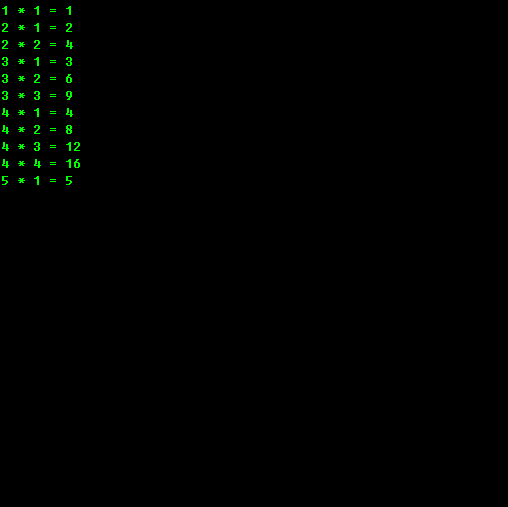

If we want to debug the script, we can also create a symbol mapping table during compilation. This allows us to directly use `PX_Object_DebuggerMap` to debug the script.

```c
px_int main()
{
	PX_Compiler compiler;
	px_memory bin;
	PainterEngine_Initialize(800, 480);
	PX_VMDebuggerMapInitialize(mp,&debugmap);
	PainterEngine_SetBackgroundColor(PX_COLOR_BLACK);
	PX_CompilerInitialize(mp, &compiler);//初始化编译器
	PX_CompilerAddSource(&compiler, shellcode);//编译器中添加代码
	PX_MemoryInitialize(mp, &bin);//初始化内存/用于存储编译后的结果
	if (!PX_CompilerCompile(&compiler, &bin, &debugmap, "main"))
	{
		//编译失败
		return 0;
	}
	PX_CompilerFree(&compiler);//释放编译器
	PX_VMInitialize(&vm,mp,bin.buffer,bin.usedsize);//初始化虚拟机
	PX_VMRegisterHostFunction(&vm, "print", host_print,0);//注册主机函数print
	PX_VMRegisterHostFunction(&vm, "sleep", host_sleep,0);//注册主机函数sleep
	PX_VMBeginThreadFunction(&vm, 0, "main", PX_NULL, 0);//开始运行虚拟机函数
	PX_Object *pDbgObject = PX_Object_AsmDebuggerCreate(mp, root, 0, 0, 800, 480, 0);
	pDbgObject->Visible = PX_TRUE;
	PX_Object_AsmDebuggerAttach(pDbgObject, &debugmap, &vm);
	return 0;
}
```

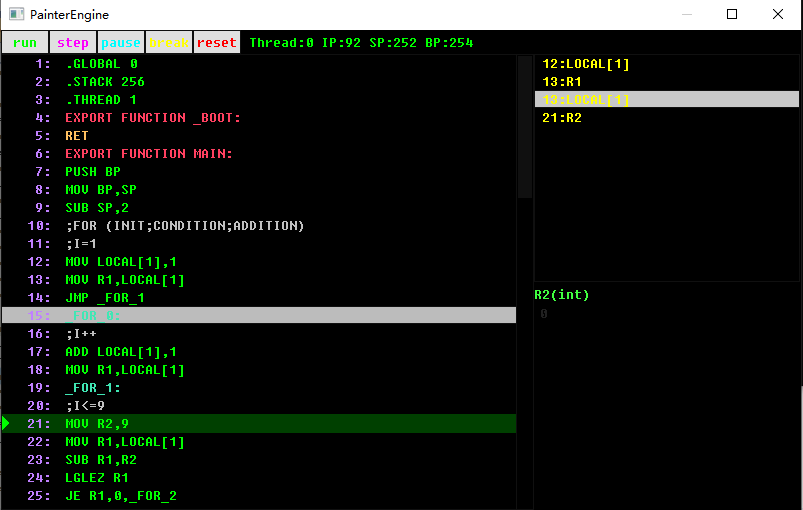

## 18. Using PainterEngine to Quickly Create a Simple Game

To better demonstrate the usage of PainterEngine, I will create a simple game using it. You can find all the source code and original assets related to this game under `documents/demo/game`. Thanks to PainterEngine's cross-platform portability, you can also directly play this online game on [PainterEngine Online Application APP - Whack-a-Mole](https://www.painterengine.com/main/app/documentgame/).

In this game, I will show you how to use PainterEngine's component-based development model to quickly create an app game.

Let us start with the first step of game creation by preparing the required art assets and materials:

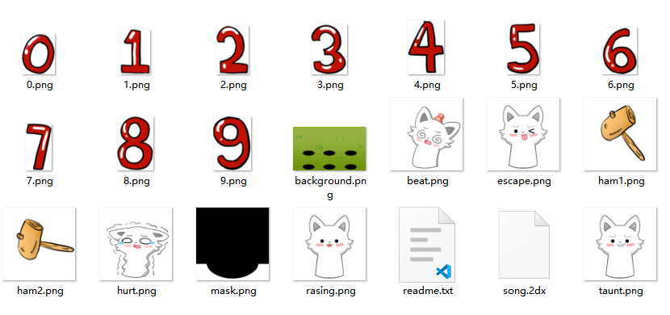

This is a simple game background asset. Now we can begin creating our `main.c` source code file. In PainterEngine, we input the following code:

```c
px_int main()
{
	px_int i;
	PainterEngine_Initialize(800, 480);
	PX_FontModuleInitialize(mp_static,&score_fm);
	PX_FontModuleSetCodepage(&score_fm, PX_FONTMODULE_CODEPAGE_GBK);
	if (!PX_LoadTextureToResource(PainterEngine_GetResourceLibrary(), "assets/rasing.png", "fox_rasing")) return 0;
	if (!PX_LoadTextureToResource(PainterEngine_GetResourceLibrary(), "assets/taunt.png", "fox_taunt")) return 0;
	if (!PX_LoadTextureToResource(PainterEngine_GetResourceLibrary(), "assets/escape.png", "fox_escape")) return 0;
	if (!PX_LoadTextureToResource(PainterEngine_GetResourceLibrary(), "assets/beat.png", "fox_beat")) return 0;
	if (!PX_LoadTextureToResource(PainterEngine_GetResourceLibrary(), "assets/hurt.png", "fox_hurt")) return 0;
	if (!PX_LoadTextureToResource(PainterEngine_GetResourceLibrary(), "assets/mask.png", "fox_mask")) return 0;
	if (!PX_LoadTextureToResource(PainterEngine_GetResourceLibrary(), "assets/background.png", "background")) return 0;
	if (!PX_LoadAnimationToResource(PainterEngine_GetResourceLibrary(), "assets/song.2dx", "song"))return 0;
	PainterEngine_SetBackgroundTexture(PX_ResourceLibraryGetTexture(PainterEngine_GetResourceLibrary(), "background"));
	for (i = 0; i <= 9; i++)
	{
		px_texture tex;
		px_char path[64];
		PX_sprintf1(path,64, "assets/%1.png", PX_STRINGFORMAT_INT(i));
		if (PX_LoadTextureFromFile(mp,&tex,path))
		{
			PX_FontModuleAddNewTextureCharacter(&score_fm, '0' + i, &tex);
		}
		PX_TextureFree(&tex);
	}
}
```

### Initializing the Window and Font Module

At the beginning of the code, we initialize an 800x480 window. Then, we initialize the font module and use the `PX_FontModuleSetCodepage` function to set it to the GBK character set. Following that, we load resources into PainterEngine's resource manager.

### Loading Resources and Setting the Background

PainterEngine includes a built-in resource manager that is initialized during the `PainterEngine_Initialize` function. It uses the `mp_static` memory pool. The resource manager functions like a database, loading assets such as images, audio, and scripts into memory and mapping them to a `key`. Accessing these resources later is done via their `key`. The resource mapping is optimized, so you do not need to worry about performance loss caused by lookup operations.

The `PX_LoadTextureToResource` function is used to load a resource from the file system into the resource manager. The first parameter is a pointer to the resource manager instance. PainterEngine automatically creates this instance during initialization, and you can access it directly using `PainterEngine_GetResourceLibrary`. The second parameter is the file path of the resource to be loaded, and the third parameter is the `key` you want to map to the resource.

In the next step of the code, we use `PX_LoadTextureToResource` to load several images and `PX_LoadAnimationToResource` to load a 2dx animation (refer to the app market for detailed explanations on 2DX animations). Finally, instead of using TTF font files in the game, we loop through `0.png` to `9.png` and insert these textures as images into the font module. This way, when the font module draws numbers, it actually displays the corresponding images.

We also call `PainterEngine_SetBackgroundTexture` to set the PainterEngine interface background. Note the `PX_ResourceLibraryGetTexture` function, which is used to retrieve the texture's data structure pointer using a `key` from the resource manager. After completing these steps, you will see a screen like this:

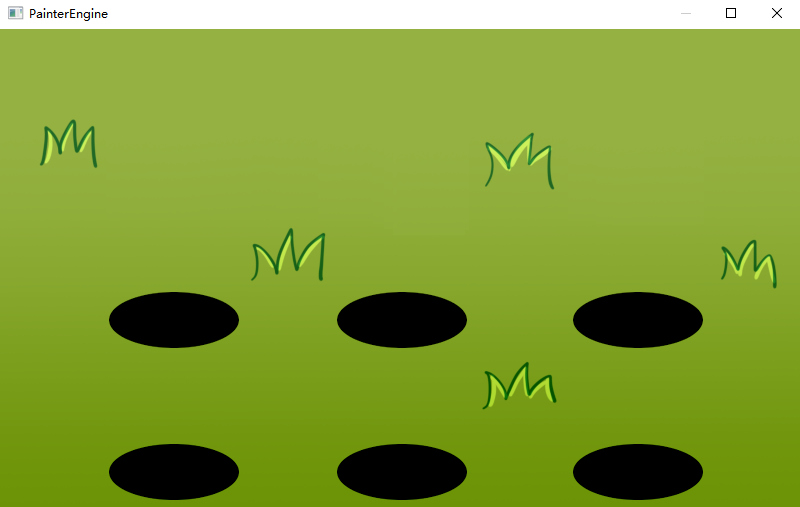

### Designing Game Objects

#### Start Game Button

The first game object we design is the "Start Game" button. This part does not require much code, as PainterEngine has built-in functionality for buttons:

```c
startgame = PX_Object_PushButtonCreate(mp, root, 300, 200, 200, 90, "Start Game", 0);
startgame->Visible = PX_TRUE;
PX_Object_PushButtonSetBackgroundColor(startgame, PX_COLOR(96, 255, 255, 255));
PX_Object_PushButtonSetPushColor(startgame, PX_COLOR(224, 255, 255, 255));
PX_Object_PushButtonSetCursorColor(startgame, PX_COLOR(168, 255, 255, 255));
```

We use a series of functions to change the button's background color, mouse hover color, and mouse pressed color. As a result, you will see this on the screen:


#### Game Mole Object

Next, we create the mole object for the game, which is the most complex object in the game. Below is the detailed code with step-by-step explanations:

```c
typedef enum
{
	PX_OBJECT_FOX_STATE_IDLE,//狐狸还在洞里
	PX_OBJECT_FOX_STATE_RASING,//狐狸正在升起
	PX_OBJECT_FOX_STATE_TAUNT,//狐狸在嘲讽
	PX_OBJECT_FOX_STATE_ESCAPE,//狐狸逃跑
	PX_OBJECT_FOX_STATE_BEAT,//狐狸被打
	PX_OBJECT_FOX_STATE_HURT,//狐狸受伤后逃跑
}PX_OBJECT_FOX_STATE;

typedef struct
{
	PX_OBJECT_FOX_STATE state;//狐狸状态
	px_dword elapsed;//状态持续时间
	px_float texture_render_offset;//纹理渲染偏移
	px_dword gen_rand_time;//生成随机时间
	px_float rasing_down_speed;//升起速度
	px_texture render_target;//渲染目标
	px_texture* pcurrent_display_texture;//当前显示的纹理
	px_texture* ptexture_mask;//遮罩
}PX_Object_Fox;

PX_OBJECT_UPDATE_FUNCTION(PX_Object_FoxOnUpdate)
{
	PX_Object_Fox* pfox=PX_ObjectGetDescByType(pObject,PX_OBJECT_TYPE_FOX);
	switch (pfox->state)
	{
		case PX_OBJECT_FOX_STATE_IDLE:
		{
			if (pfox->gen_rand_time ==0)
			{
				pfox->gen_rand_time = PX_rand() % 3000 + 1000;//狐狸在洞里的时间,时间到了就升起来
			}
			else
			{
				if (pfox->gen_rand_time <elapsed)//时间到了
				{
					//升起
					pfox->state = PX_OBJECT_FOX_STATE_RASING;
					pfox->elapsed = 0;
					pfox->gen_rand_time = 0;
					pfox->texture_render_offset = pObject->Height;
					//改变纹理
					pfox->pcurrent_display_texture= PX_ResourceLibraryGetTexture(PainterEngine_GetResourceLibrary(), "fox_rasing");
				}
				else
				{
					pfox->gen_rand_time -= elapsed;
				}
			}
		}
		break;
		case PX_OBJECT_FOX_STATE_RASING://狐狸升起
		{
			pfox->elapsed += elapsed;
			//升起纹理偏移量
			pfox->texture_render_offset -= pfox->rasing_down_speed * elapsed / 1000;
			if (pfox->texture_render_offset <= 0)
			{
				pfox->texture_render_offset = 0;
				pfox->state = PX_OBJECT_FOX_STATE_TAUNT;//升起后嘲讽
				pfox->elapsed = 0;
			}
		}
		break;
		case PX_OBJECT_FOX_STATE_TAUNT://狐狸嘲讽
		{
			pfox->elapsed += elapsed;
			if (pfox->elapsed>600&& pfox->elapsed <1500)//嘲讽时间
			{
				pfox->pcurrent_display_texture = PX_ResourceLibraryGetTexture(PainterEngine_GetResourceLibrary(), "fox_taunt");//嘲讽纹理
			}
			else if (pfox->elapsed>1500)//嘲讽结束
			{
				pfox->texture_render_offset = 0;
				pfox->state = PX_OBJECT_FOX_STATE_ESCAPE;//逃跑
				pfox->pcurrent_display_texture = PX_ResourceLibraryGetTexture(PainterEngine_GetResourceLibrary(), "fox_escape");//逃跑纹理
				pfox->elapsed = 0;
			}
		}
		break;
		case PX_OBJECT_FOX_STATE_BEAT://狐狸被打
		{
			pfox->elapsed += elapsed;
			if (pfox->elapsed>800)
			{
				pfox->pcurrent_display_texture = PX_ResourceLibraryGetTexture(PainterEngine_GetResourceLibrary(), "fox_hurt");//受伤纹理
				pfox->state = PX_OBJECT_FOX_STATE_ESCAPE;//逃跑
			}
		}
		break;
		case PX_OBJECT_FOX_STATE_ESCAPE:
		{
			pfox->elapsed += elapsed;
			pfox->texture_render_offset+=pfox->rasing_down_speed * elapsed / 1000;
			if (pfox->texture_render_offset >= pObject->Height)
			{
				pfox->texture_render_offset = pObject->Height;
				pfox->state = PX_OBJECT_FOX_STATE_IDLE;//逃跑结束
				pfox->elapsed = 0;//重置时间
				pfox->pcurrent_display_texture = PX_NULL;
			}
		}
		break;
	default:
		break;
	}
}

PX_OBJECT_RENDER_FUNCTION(PX_Object_FoxOnRender)
{
	PX_Object_Fox* pfox = PX_ObjectGetDescByType(pObject, PX_OBJECT_TYPE_FOX);
	px_float x,y,width,height;
	PX_OBJECT_INHERIT_CODE(pObject,x,y,width,height);
	PX_TextureClearAll(&pfox->render_target, PX_COLOR_NONE);//清空渲染目标
	if (pfox->pcurrent_display_texture)
	{
		PX_TextureRender(&pfox->render_target, pfox->pcurrent_display_texture, (px_int)pfox->render_target.width/2, (px_int)pfox->texture_render_offset, PX_ALIGN_MIDTOP, PX_NULL);//渲染狐狸
	}
	PX_TextureRenderMask(psurface, pfox->ptexture_mask, &pfox->render_target, (px_int)x, (px_int)y, PX_ALIGN_MIDBOTTOM, PX_NULL);//以遮罩形式绘制纹理
}


PX_OBJECT_FREE_FUNCTION(PX_Object_FoxFree)
{
	PX_Object_Fox* pfox = PX_ObjectGetDescByType(pObject, PX_OBJECT_TYPE_FOX);
	PX_TextureFree(&pfox->render_target);
}

PX_OBJECT_EVENT_FUNCTION(PX_Object_FoxOnClick)//狐狸被点击
{
	PX_Object_Fox* pfox = PX_ObjectGetDescByType(pObject, PX_OBJECT_TYPE_FOX);
	if (pfox->state == PX_OBJECT_FOX_STATE_TAUNT|| pfox->state == PX_OBJECT_FOX_STATE_RASING)//狐狸嘲讽或者升起时点击有效
	{
		if (PX_ObjectIsCursorInRegionAlign(pObject, e, PX_ALIGN_MIDBOTTOM))//点击有效区域
		{
			px_int x= (px_int)PX_Object_Event_GetCursorX(e);
			px_int y= (px_int)PX_Object_Event_GetCursorY(e);
			x=(px_int)(x-(pObject->x-pObject->Width/2));
			y= (px_int)(y-(pObject->y - pObject->Height));
			if (x>32&&y<128)
			{
				pfox->pcurrent_display_texture = PX_ResourceLibraryGetTexture(PainterEngine_GetResourceLibrary(), "fox_beat");
				pfox->state = PX_OBJECT_FOX_STATE_BEAT;
				pfox->elapsed = 0;
				PX_Object_ScorePanelAddScore(scorePanel, 100);
			}
			
		}
	}
}

PX_OBJECT_EVENT_FUNCTION(PX_Object_FoxOnReset)
{
	PX_Object_Fox* pfox = PX_ObjectGetDescByType(pObject, PX_OBJECT_TYPE_FOX);
	pfox->state = PX_OBJECT_FOX_STATE_IDLE;
	pfox->elapsed = 0;
	pfox->texture_render_offset = pObject->Height;
	pfox->gen_rand_time = 0;
	pfox->pcurrent_display_texture = PX_NULL;

}

PX_Object *PX_Object_FoxCreate(px_memorypool *mp,PX_Object *parent,px_float x,px_float y)
{
	PX_Object_Fox* pfox;
	px_texture *ptexture=PX_ResourceLibraryGetTexture(PainterEngine_GetResourceLibrary(),"fox_rasing");//从资源管理器中获取纹理
	PX_Object* pObject = PX_ObjectCreateEx(mp, parent, x, y, 0, ptexture->width*1.f, ptexture->height*1.f, 0, PX_OBJECT_TYPE_FOX, PX_Object_FoxOnUpdate, PX_Object_FoxOnRender, PX_Object_FoxFree, 0, sizeof(PX_Object_Fox));
	pfox=PX_ObjectGetDescByType(pObject,PX_OBJECT_TYPE_FOX);
	pfox->state= PX_OBJECT_FOX_STATE_IDLE;//狐狸状态
	pfox->rasing_down_speed = 512;//升起速度
	pfox->ptexture_mask = PX_ResourceLibraryGetTexture(PainterEngine_GetResourceLibrary(), "fox_mask");//遮罩
	if(!PX_TextureCreate(mp,&pfox->render_target,ptexture->width,ptexture->height))
	{
		PX_ObjectDelete(pObject);
		return 0;
	}
	PX_ObjectRegisterEvent(pObject,PX_OBJECT_EVENT_CURSORDOWN,PX_Object_FoxOnClick,0);//注册点击事件
	PX_ObjectRegisterEvent(pObject,PX_OBJECT_EVENT_RESET,PX_Object_FoxOnReset,0);//注册重置事件
	return pObject;
}

```

* First is `PX_Object_FoxOnUpdate`, this is the `update` function in the object suite, where we determine the current state of the `Gopher`, whether it's up, taunting, or down. * Then is `PX_Object_FoxOnRender`, this is the function that performs `rendering`, we draw the texture by offset, of course here we call the `Gopher` function.
* Then there's the `PX_Object_FoxOnRender`, which is the function that does the `rendering`, where we draw the texture by offset, and of course we call the `PX_TextureRenderMask` function, which is a rendering function with a texture mask.
* `PX_Object_FoxFree` function, mainly for the temporary rendering of the surface of the free processing, although in this project does not use.
* `PX_Object_FoxOnClick` function, means the current gopher is hit, which is some judgement of the hit range, if it is hit, it should set the state to injured.
* `PX_Object_FoxOnReset` is used to perform a reset, that is, after the game is over, all gophers should be reset, this is a `PX_OBJECT_EVENT_RESET` callback, you can find it in `PX_Object_FoxCreate`.
* And finally the `PX_Object_FoxCreate` function, where we do some initialisation, register event callbacks for the `Gopher`, and finally complete the development of the component.


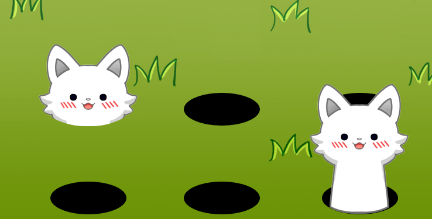


Then, we need to create a `hammer` object to change the style of our mouse. The hammer object has a simple design, it has only 2 textures, one for when the mouse is not pressed and one for when it is pressed. Different states correspond to different textures:

```c
typedef struct
{
	px_texture ham01;//锤子纹理1,没有按下
	px_texture ham02;//锤子纹理2,按下
	px_bool bHit;//是否按下
}PX_Object_Hammer;

PX_OBJECT_RENDER_FUNCTION(PX_Object_HammerRender)//锤子渲染
{
	PX_Object_Hammer* phammer = PX_ObjectGetDescByType(pObject, PX_OBJECT_TYPE_HAMMER);
	px_float x, y, width, height;
	PX_OBJECT_INHERIT_CODE(pObject, x, y, width, height);
	if (phammer->bHit)
	{
		PX_TextureRender(psurface, &phammer->ham02, (px_int)x, (px_int)y, PX_ALIGN_CENTER, PX_NULL);//按下
	}
	else
	{
		PX_TextureRender(psurface, &phammer->ham01, (px_int)x, (px_int)y, PX_ALIGN_CENTER, PX_NULL);//未按下
	}
	
}

PX_OBJECT_FREE_FUNCTION(PX_Object_HammerFree)
{
	PX_Object_Hammer* phammer = PX_ObjectGetDescByType(pObject, PX_OBJECT_TYPE_HAMMER);
	PX_TextureFree(&phammer->ham01);
	PX_TextureFree(&phammer->ham02);
}

PX_OBJECT_EVENT_FUNCTION(PX_Object_HammerOnMove)
{
	pObject->x=PX_Object_Event_GetCursorX(e);//锤子跟随鼠标移动
	pObject->y=PX_Object_Event_GetCursorY(e);
}

PX_OBJECT_EVENT_FUNCTION(PX_Object_HammerOnCursorDown)
{
	PX_Object_Hammer* phammer = PX_ObjectGetDescByType(pObject, PX_OBJECT_TYPE_HAMMER);
	phammer->bHit = PX_TRUE;//按下
}

PX_OBJECT_EVENT_FUNCTION(PX_Object_HammerOnCursorUp)
{
	PX_Object_Hammer* phammer = PX_ObjectGetDescByType(pObject, PX_OBJECT_TYPE_HAMMER);
	phammer->bHit = PX_FALSE;//抬起
}

PX_Object* PX_Object_HammerCreate(px_memorypool* mp, PX_Object* parent)
{
	PX_Object_Hammer* phammer;
	PX_Object* pObject = PX_ObjectCreateEx(mp, parent, 0, 0, 0, 0, 0, 0, PX_OBJECT_TYPE_HAMMER, 0, PX_Object_HammerRender, PX_Object_HammerFree, 0, sizeof(PX_Object_Hammer));
	phammer = PX_ObjectGetDescByType(pObject, PX_OBJECT_TYPE_HAMMER);
	phammer->bHit = PX_FALSE;
	if (!PX_LoadTextureFromFile(mp_static,&phammer->ham01, "assets/ham1.png")) return PX_NULL;
	if (!PX_LoadTextureFromFile(mp_static,&phammer->ham02, "assets/ham2.png")) return PX_NULL;
	PX_ObjectRegisterEvent(pObject, PX_OBJECT_EVENT_CURSORMOVE, PX_Object_HammerOnMove, PX_NULL);//注册移动事件
	PX_ObjectRegisterEvent(pObject, PX_OBJECT_EVENT_CURSORDRAG, PX_Object_HammerOnMove, PX_NULL);//注册拖拽事件
	PX_ObjectRegisterEvent(pObject, PX_OBJECT_EVENT_CURSORDOWN, PX_Object_HammerOnCursorDown, PX_NULL);//注册按下事件
	PX_ObjectRegisterEvent(pObject, PX_OBJECT_EVENT_CURSORDOWN, PX_Object_HammerOnMove, PX_NULL);//注册按下事件
	PX_ObjectRegisterEvent(pObject, PX_OBJECT_EVENT_CURSORUP, PX_Object_HammerOnCursorUp, PX_NULL);//注册抬起事件

	return pObject;
}
```

Finally, there is a countdown box, which is actually a 2dx animation object in the middle (PainterEngine supports gif animation directly, in fact, gif can also be used), and a ring on the outside, the arc of the ring decreases continuously, in order to achieve a `countdown` display effect:

```c
typedef struct
{
	PX_Animation animation;//动画
	px_dword time;//倒计时时间
	px_dword elapsed;//倒计时开始后已经过去的时间
}PX_Object_Clock;


PX_OBJECT_UPDATE_FUNCTION(PX_Object_ClockUpdate)
{
	PX_Object_Clock* clock = PX_ObjectGetDescByType(pObject, PX_OBJECT_TYPE_CLOCK);
	clock->elapsed += elapsed;
	if (clock->elapsed >= clock->time)
	{
		clock->elapsed = 0;
		PX_ObjectPostEvent(game, PX_OBJECT_BUILD_EVENT(PX_OBJECT_EVENT_RESET));//重置狐狸状态,给game对象发送重置事件
		game->Visible = PX_FALSE;
		game->Enabled = PX_FALSE;
		startgame->Visible = PX_TRUE;
		pObject->Visible = PX_FALSE;
		pObject->Enabled = PX_FALSE;
	}

}

PX_OBJECT_RENDER_FUNCTION(PX_Object_ClockRender)
{
	PX_Object_Clock* clock = PX_ObjectGetDescByType(pObject, PX_OBJECT_TYPE_CLOCK);
	PX_AnimationUpdate(&clock->animation, elapsed);//更新动画
	PX_AnimationRender(psurface, &clock->animation, (px_int)pObject->x, (px_int)pObject->y, PX_ALIGN_CENTER, PX_NULL);//绘制动画
	//draw ring
	PX_GeoDrawCircle(psurface, (px_int)pObject->x, (px_int)pObject->y, 38, 8, PX_COLOR_BLACK);//绘制倒计时环边框
	PX_GeoDrawRing(psurface, (px_int)pObject->x, (px_int)pObject->y, 36, 6, PX_COLOR(128,192,255,32), -90, -90 + (px_int)(360 * (1 - clock->elapsed * 1.0f / clock->time)));//绘制倒计时环
}

PX_OBJECT_FREE_FUNCTION(PX_Object_ClockFree)
{
	PX_Object_Clock* clock = PX_ObjectGetDescByType(pObject, PX_OBJECT_TYPE_CLOCK);
	PX_AnimationFree(&clock->animation);
}

px_void PX_Object_ClockBegin(PX_Object* pClock, px_dword time)//开始倒计时
{
	PX_Object_Clock* clock = PX_ObjectGetDescByType(pClock, PX_OBJECT_TYPE_CLOCK);
	clock->time = time;
	pClock->Visible = PX_TRUE;
	pClock->Enabled = PX_TRUE;
}

PX_Object* PX_Object_ClockCreate(px_memorypool* mp, PX_Object* parent, px_float x, px_float y)
{
	PX_Object_Clock* clock;
	PX_Object* pObject = PX_ObjectCreateEx(mp, parent, x, y, 0, 0, 0, 0, PX_OBJECT_TYPE_CLOCK, PX_Object_ClockUpdate, PX_Object_ClockRender, PX_Object_ClockFree, 0, sizeof(PX_Object_Clock));
	clock = PX_ObjectGetDescByType(pObject, PX_OBJECT_TYPE_CLOCK);
	clock->time = 0;
	clock->elapsed = 0;
	if (!PX_AnimationCreate(&clock->animation, PX_ResourceLibraryGetAnimationLibrary(PainterEngine_GetResourceLibrary(), "song")))//从资源管理器中获取动画
	{
		PX_ObjectDelete(pObject);
		return PX_NULL;
	}
	pObject->Enabled = PX_FALSE;
	pObject->Visible = PX_FALSE;
	return pObject;
}
```

### Place objects, complete the game

In the `main` function, we create each of these objects and place them in the game scene to complete the game:

```c
//创建地鼠
game=PX_ObjectCreate(mp, root, 0, 0, 0, 0, 0, 0);
PX_Object_FoxCreate(mp, game, 173, 326);
PX_Object_FoxCreate(mp, game, 401, 326);
PX_Object_FoxCreate(mp, game, 636, 326);
PX_Object_FoxCreate(mp, game, 173, 476);
PX_Object_FoxCreate(mp, game, 401, 476);
PX_Object_FoxCreate(mp, game, 636, 476);
game->Visible=PX_FALSE;
game->Enabled=PX_FALSE;

//创建锤子
PX_Object_HammerCreate(mp, root);
scorePanel = PX_Object_ScorePanelCreate(mp, root, 400, 60, &score_fm, 100);
//创建倒计时框
gameclock=PX_Object_ClockCreate(mp,root,680,60);
```

Here, I put the complete code for the entire game:

```c
#include "PainterEngine.h"

#define PX_OBJECT_TYPE_FOX		24103001
#define PX_OBJECT_TYPE_HAMMER	24103002
#define PX_OBJECT_TYPE_CLOCK	24103003

PX_FontModule score_fm;
PX_Object* scorePanel;
PX_Object* game,*startgame,*gameclock;

typedef enum
{
	PX_OBJECT_FOX_STATE_IDLE,//狐狸还在洞里
	PX_OBJECT_FOX_STATE_RASING,//狐狸正在升起
	PX_OBJECT_FOX_STATE_TAUNT,//狐狸在嘲讽
	PX_OBJECT_FOX_STATE_ESCAPE,//狐狸逃跑
	PX_OBJECT_FOX_STATE_BEAT,//狐狸被打
	PX_OBJECT_FOX_STATE_HURT,//狐狸受伤后逃跑
}PX_OBJECT_FOX_STATE;

typedef struct
{
	PX_OBJECT_FOX_STATE state;//狐狸状态
	px_dword elapsed;//状态持续时间
	px_float texture_render_offset;//纹理渲染偏移
	px_dword gen_rand_time;//生成随机时间
	px_float rasing_down_speed;//升起速度
	px_texture render_target;//渲染目标
	px_texture* pcurrent_display_texture;//当前显示的纹理
	px_texture* ptexture_mask;//遮罩
}PX_Object_Fox;

typedef struct
{
	px_texture ham01;//锤子纹理1,没有按下
	px_texture ham02;//锤子纹理2,按下
	px_bool bHit;//是否按下
}PX_Object_Hammer;

typedef struct
{
	PX_Animation animation;//动画
	px_dword time;//倒计时时间
	px_dword elapsed;//倒计时开始后已经过去的时间
}PX_Object_Clock;


PX_OBJECT_UPDATE_FUNCTION(PX_Object_ClockUpdate)
{
	PX_Object_Clock* clock = PX_ObjectGetDescByType(pObject, PX_OBJECT_TYPE_CLOCK);
	clock->elapsed += elapsed;
	if (clock->elapsed >= clock->time)
	{
		clock->elapsed = 0;
		PX_ObjectPostEvent(game, PX_OBJECT_BUILD_EVENT(PX_OBJECT_EVENT_RESET));//重置狐狸状态,给game对象发送重置事件
		game->Visible = PX_FALSE;
		game->Enabled = PX_FALSE;
		startgame->Visible = PX_TRUE;
		pObject->Visible = PX_FALSE;
		pObject->Enabled = PX_FALSE;
	}

}

PX_OBJECT_RENDER_FUNCTION(PX_Object_ClockRender)
{
	PX_Object_Clock* clock = PX_ObjectGetDescByType(pObject, PX_OBJECT_TYPE_CLOCK);
	PX_AnimationUpdate(&clock->animation, elapsed);//更新动画
	PX_AnimationRender(psurface, &clock->animation, (px_int)pObject->x, (px_int)pObject->y, PX_ALIGN_CENTER, PX_NULL);//绘制动画
	//draw ring
	PX_GeoDrawCircle(psurface, (px_int)pObject->x, (px_int)pObject->y, 38, 8, PX_COLOR_BLACK);//绘制倒计时环边框
	PX_GeoDrawRing(psurface, (px_int)pObject->x, (px_int)pObject->y, 36, 6, PX_COLOR(128,192,255,32), -90, -90 + (px_int)(360 * (1 - clock->elapsed * 1.0f / clock->time)));//绘制倒计时环
}

PX_OBJECT_FREE_FUNCTION(PX_Object_ClockFree)
{
	PX_Object_Clock* clock = PX_ObjectGetDescByType(pObject, PX_OBJECT_TYPE_CLOCK);
	PX_AnimationFree(&clock->animation);
}

px_void PX_Object_ClockBegin(PX_Object* pClock, px_dword time)//开始倒计时
{
	PX_Object_Clock* clock = PX_ObjectGetDescByType(pClock, PX_OBJECT_TYPE_CLOCK);
	clock->time = time;
	pClock->Visible = PX_TRUE;
	pClock->Enabled = PX_TRUE;
}

PX_Object* PX_Object_ClockCreate(px_memorypool* mp, PX_Object* parent, px_float x, px_float y)
{
	PX_Object_Clock* clock;
	PX_Object* pObject = PX_ObjectCreateEx(mp, parent, x, y, 0, 0, 0, 0, PX_OBJECT_TYPE_CLOCK, PX_Object_ClockUpdate, PX_Object_ClockRender, PX_Object_ClockFree, 0, sizeof(PX_Object_Clock));
	clock = PX_ObjectGetDescByType(pObject, PX_OBJECT_TYPE_CLOCK);
	clock->time = 0;
	clock->elapsed = 0;
	if (!PX_AnimationCreate(&clock->animation, PX_ResourceLibraryGetAnimationLibrary(PainterEngine_GetResourceLibrary(), "song")))//从资源管理器中获取动画
	{
		PX_ObjectDelete(pObject);
		return PX_NULL;
	}
	pObject->Enabled = PX_FALSE;
	pObject->Visible = PX_FALSE;
	return pObject;
}

PX_OBJECT_UPDATE_FUNCTION(PX_Object_FoxOnUpdate)
{
	PX_Object_Fox* pfox=PX_ObjectGetDescByType(pObject,PX_OBJECT_TYPE_FOX);
	switch (pfox->state)
	{
		case PX_OBJECT_FOX_STATE_IDLE:
		{
			if (pfox->gen_rand_time ==0)
			{
				pfox->gen_rand_time = PX_rand() % 3000 + 1000;//狐狸在洞里的时间,时间到了就升起来
			}
			else
			{
				if (pfox->gen_rand_time <elapsed)//时间到了
				{
					//升起
					pfox->state = PX_OBJECT_FOX_STATE_RASING;
					pfox->elapsed = 0;
					pfox->gen_rand_time = 0;
					pfox->texture_render_offset = pObject->Height;
					//改变纹理
					pfox->pcurrent_display_texture= PX_ResourceLibraryGetTexture(PainterEngine_GetResourceLibrary(), "fox_rasing");
				}
				else
				{
					pfox->gen_rand_time -= elapsed;
				}
			}
		}
		break;
		case PX_OBJECT_FOX_STATE_RASING://狐狸升起
		{
			pfox->elapsed += elapsed;
			//升起纹理偏移量
			pfox->texture_render_offset -= pfox->rasing_down_speed * elapsed / 1000;
			if (pfox->texture_render_offset <= 0)
			{
				pfox->texture_render_offset = 0;
				pfox->state = PX_OBJECT_FOX_STATE_TAUNT;//升起后嘲讽
				pfox->elapsed = 0;
			}
		}
		break;
		case PX_OBJECT_FOX_STATE_TAUNT://狐狸嘲讽
		{
			pfox->elapsed += elapsed;
			if (pfox->elapsed>600&& pfox->elapsed <1500)//嘲讽时间
			{
				pfox->pcurrent_display_texture = PX_ResourceLibraryGetTexture(PainterEngine_GetResourceLibrary(), "fox_taunt");//嘲讽纹理
			}
			else if (pfox->elapsed>1500)//嘲讽结束
			{
				pfox->texture_render_offset = 0;
				pfox->state = PX_OBJECT_FOX_STATE_ESCAPE;//逃跑
				pfox->pcurrent_display_texture = PX_ResourceLibraryGetTexture(PainterEngine_GetResourceLibrary(), "fox_escape");//逃跑纹理
				pfox->elapsed = 0;
			}
		}
		break;
		case PX_OBJECT_FOX_STATE_BEAT://狐狸被打
		{
			pfox->elapsed += elapsed;
			if (pfox->elapsed>800)
			{
				pfox->pcurrent_display_texture = PX_ResourceLibraryGetTexture(PainterEngine_GetResourceLibrary(), "fox_hurt");//受伤纹理
				pfox->state = PX_OBJECT_FOX_STATE_ESCAPE;//逃跑
			}
		}
		break;
		case PX_OBJECT_FOX_STATE_ESCAPE:
		{
			pfox->elapsed += elapsed;
			pfox->texture_render_offset+=pfox->rasing_down_speed * elapsed / 1000;
			if (pfox->texture_render_offset >= pObject->Height)
			{
				pfox->texture_render_offset = pObject->Height;
				pfox->state = PX_OBJECT_FOX_STATE_IDLE;//逃跑结束
				pfox->elapsed = 0;//重置时间
				pfox->pcurrent_display_texture = PX_NULL;
			}
		}
		break;
	default:
		break;
	}
}

PX_OBJECT_RENDER_FUNCTION(PX_Object_FoxOnRender)
{
	PX_Object_Fox* pfox = PX_ObjectGetDescByType(pObject, PX_OBJECT_TYPE_FOX);
	px_float x,y,width,height;
	PX_OBJECT_INHERIT_CODE(pObject,x,y,width,height);
	PX_TextureClearAll(&pfox->render_target, PX_COLOR_NONE);//清空渲染目标
	if (pfox->pcurrent_display_texture)
	{
		PX_TextureRender(&pfox->render_target, pfox->pcurrent_display_texture, (px_int)pfox->render_target.width/2, (px_int)pfox->texture_render_offset, PX_ALIGN_MIDTOP, PX_NULL);//渲染狐狸
	}
	PX_TextureRenderMask(psurface, pfox->ptexture_mask, &pfox->render_target, (px_int)x, (px_int)y, PX_ALIGN_MIDBOTTOM, PX_NULL);//以遮罩形式绘制纹理
}

PX_OBJECT_FREE_FUNCTION(PX_Object_FoxFree)
{
	PX_Object_Fox* pfox = PX_ObjectGetDescByType(pObject, PX_OBJECT_TYPE_FOX);
	PX_TextureFree(&pfox->render_target);
}

PX_OBJECT_EVENT_FUNCTION(PX_Object_FoxOnClick)//狐狸被点击
{
	PX_Object_Fox* pfox = PX_ObjectGetDescByType(pObject, PX_OBJECT_TYPE_FOX);
	if (pfox->state == PX_OBJECT_FOX_STATE_TAUNT|| pfox->state == PX_OBJECT_FOX_STATE_RASING)//狐狸嘲讽或者升起时点击有效
	{
		if (PX_ObjectIsCursorInRegionAlign(pObject, e, PX_ALIGN_MIDBOTTOM))//点击有效区域
		{
			px_int x= (px_int)PX_Object_Event_GetCursorX(e);
			px_int y= (px_int)PX_Object_Event_GetCursorY(e);
			x=(px_int)(x-(pObject->x-pObject->Width/2));
			y= (px_int)(y-(pObject->y - pObject->Height));
			if (x>32&&y<128)
			{
				pfox->pcurrent_display_texture = PX_ResourceLibraryGetTexture(PainterEngine_GetResourceLibrary(), "fox_beat");
				pfox->state = PX_OBJECT_FOX_STATE_BEAT;
				pfox->elapsed = 0;
				PX_Object_ScorePanelAddScore(scorePanel, 100);
			}
			
		}
	}
}

PX_OBJECT_EVENT_FUNCTION(PX_Object_FoxOnReset)
{
	PX_Object_Fox* pfox = PX_ObjectGetDescByType(pObject, PX_OBJECT_TYPE_FOX);
	pfox->state = PX_OBJECT_FOX_STATE_IDLE;
	pfox->elapsed = 0;
	pfox->texture_render_offset = pObject->Height;
	pfox->gen_rand_time = 0;
	pfox->pcurrent_display_texture = PX_NULL;

}

PX_Object *PX_Object_FoxCreate(px_memorypool *mp,PX_Object *parent,px_float x,px_float y)
{
	PX_Object_Fox* pfox;
	px_texture *ptexture=PX_ResourceLibraryGetTexture(PainterEngine_GetResourceLibrary(),"fox_rasing");//从资源管理器中获取纹理
	PX_Object* pObject = PX_ObjectCreateEx(mp, parent, x, y, 0, ptexture->width*1.f, ptexture->height*1.f, 0, PX_OBJECT_TYPE_FOX, PX_Object_FoxOnUpdate, PX_Object_FoxOnRender, PX_Object_FoxFree, 0, sizeof(PX_Object_Fox));
	pfox=PX_ObjectGetDescByType(pObject,PX_OBJECT_TYPE_FOX);
	pfox->state= PX_OBJECT_FOX_STATE_IDLE;//狐狸状态
	pfox->rasing_down_speed = 512;//升起速度
	pfox->ptexture_mask = PX_ResourceLibraryGetTexture(PainterEngine_GetResourceLibrary(), "fox_mask");//遮罩
	if(!PX_TextureCreate(mp,&pfox->render_target,ptexture->width,ptexture->height))
	{
		PX_ObjectDelete(pObject);
		return 0;
	}
	PX_ObjectRegisterEvent(pObject,PX_OBJECT_EVENT_CURSORDOWN,PX_Object_FoxOnClick,0);//注册点击事件
	PX_ObjectRegisterEvent(pObject,PX_OBJECT_EVENT_RESET,PX_Object_FoxOnReset,0);//注册重置事件
	return pObject;
}

PX_OBJECT_RENDER_FUNCTION(PX_Object_HammerRender)//锤子渲染
{
	PX_Object_Hammer* phammer = PX_ObjectGetDescByType(pObject, PX_OBJECT_TYPE_HAMMER);
	px_float x, y, width, height;
	PX_OBJECT_INHERIT_CODE(pObject, x, y, width, height);
	if (phammer->bHit)
	{
		PX_TextureRender(psurface, &phammer->ham02, (px_int)x, (px_int)y, PX_ALIGN_CENTER, PX_NULL);//按下
	}
	else
	{
		PX_TextureRender(psurface, &phammer->ham01, (px_int)x, (px_int)y, PX_ALIGN_CENTER, PX_NULL);//未按下
	}
	
}

PX_OBJECT_FREE_FUNCTION(PX_Object_HammerFree)
{
	PX_Object_Hammer* phammer = PX_ObjectGetDescByType(pObject, PX_OBJECT_TYPE_HAMMER);
	PX_TextureFree(&phammer->ham01);
	PX_TextureFree(&phammer->ham02);
}

PX_OBJECT_EVENT_FUNCTION(PX_Object_HammerOnMove)
{
	pObject->x=PX_Object_Event_GetCursorX(e);//锤子跟随鼠标移动
	pObject->y=PX_Object_Event_GetCursorY(e);
}

PX_OBJECT_EVENT_FUNCTION(PX_Object_HammerOnCursorDown)
{
	PX_Object_Hammer* phammer = PX_ObjectGetDescByType(pObject, PX_OBJECT_TYPE_HAMMER);
	phammer->bHit = PX_TRUE;//按下
}

PX_OBJECT_EVENT_FUNCTION(PX_Object_HammerOnCursorUp)
{
	PX_Object_Hammer* phammer = PX_ObjectGetDescByType(pObject, PX_OBJECT_TYPE_HAMMER);
	phammer->bHit = PX_FALSE;//抬起
}

PX_Object* PX_Object_HammerCreate(px_memorypool* mp, PX_Object* parent)
{
	PX_Object_Hammer* phammer;
	PX_Object* pObject = PX_ObjectCreateEx(mp, parent, 0, 0, 0, 0, 0, 0, PX_OBJECT_TYPE_HAMMER, 0, PX_Object_HammerRender, PX_Object_HammerFree, 0, sizeof(PX_Object_Hammer));
	phammer = PX_ObjectGetDescByType(pObject, PX_OBJECT_TYPE_HAMMER);
	phammer->bHit = PX_FALSE;
	if (!PX_LoadTextureFromFile(mp_static,&phammer->ham01, "assets/ham1.png")) return PX_NULL;
	if (!PX_LoadTextureFromFile(mp_static,&phammer->ham02, "assets/ham2.png")) return PX_NULL;
	PX_ObjectRegisterEvent(pObject, PX_OBJECT_EVENT_CURSORMOVE, PX_Object_HammerOnMove, PX_NULL);//注册移动事件
	PX_ObjectRegisterEvent(pObject, PX_OBJECT_EVENT_CURSORDRAG, PX_Object_HammerOnMove, PX_NULL);//注册拖拽事件
	PX_ObjectRegisterEvent(pObject, PX_OBJECT_EVENT_CURSORDOWN, PX_Object_HammerOnCursorDown, PX_NULL);//注册按下事件
	PX_ObjectRegisterEvent(pObject, PX_OBJECT_EVENT_CURSORDOWN, PX_Object_HammerOnMove, PX_NULL);//注册按下事件
	PX_ObjectRegisterEvent(pObject, PX_OBJECT_EVENT_CURSORUP, PX_Object_HammerOnCursorUp, PX_NULL);//注册抬起事件

	return pObject;
}

PX_OBJECT_EVENT_FUNCTION(PX_Object_StartGameOnClick)
{
	game->Visible = PX_TRUE;
	startgame->Visible = PX_FALSE;
	game->Enabled = PX_TRUE;
	PX_Object_ScorePanelSetScore(scorePanel, 0);
	PX_Object_ClockBegin(gameclock, 30000);//开始游戏,游戏时间30秒
}


px_int main()
{
	px_int i;
	PainterEngine_Initialize(800, 480);
	PX_FontModuleInitialize(mp_static,&score_fm);
	PX_FontModuleSetCodepage(&score_fm, PX_FONTMODULE_CODEPAGE_GBK);
	if (!PX_LoadTextureToResource(PainterEngine_GetResourceLibrary(), "assets/rasing.png", "fox_rasing")) return 0;
	if (!PX_LoadTextureToResource(PainterEngine_GetResourceLibrary(), "assets/taunt.png", "fox_taunt")) return 0;
	if (!PX_LoadTextureToResource(PainterEngine_GetResourceLibrary(), "assets/escape.png", "fox_escape")) return 0;
	if (!PX_LoadTextureToResource(PainterEngine_GetResourceLibrary(), "assets/beat.png", "fox_beat")) return 0;
	if (!PX_LoadTextureToResource(PainterEngine_GetResourceLibrary(), "assets/hurt.png", "fox_hurt")) return 0;
	if (!PX_LoadTextureToResource(PainterEngine_GetResourceLibrary(), "assets/mask.png", "fox_mask")) return 0;
	if (!PX_LoadTextureToResource(PainterEngine_GetResourceLibrary(), "assets/background.png", "background")) return 0;
	if (!PX_LoadAnimationToResource(PainterEngine_GetResourceLibrary(), "assets/song.2dx", "song"))return 0;
	PainterEngine_SetBackgroundTexture(PX_ResourceLibraryGetTexture(PainterEngine_GetResourceLibrary(), "background"));
	for (i = 0; i <= 9; i++)
	{
		px_texture tex;
		px_char path[64];
		PX_sprintf1(path,64, "assets/%1.png", PX_STRINGFORMAT_INT(i));
		if (PX_LoadTextureFromFile(mp,&tex,path))
		{
			PX_FontModuleAddNewTextureCharacter(&score_fm, '0' + i, &tex);
		}
		PX_TextureFree(&tex);
	}
	
	startgame = PX_Object_PushButtonCreate(mp, root, 300, 200, 200, 90, "Start Game", 0);
	startgame->Visible = PX_TRUE;
	PX_Object_PushButtonSetBackgroundColor(startgame, PX_COLOR(96, 255, 255, 255));
	PX_Object_PushButtonSetPushColor(startgame, PX_COLOR(224, 255, 255, 255));
	PX_Object_PushButtonSetCursorColor(startgame, PX_COLOR(168, 255, 255, 255));
	PX_ObjectRegisterEvent(startgame, PX_OBJECT_EVENT_EXECUTE, PX_Object_StartGameOnClick, 0);

	
	
	game=PX_ObjectCreate(mp, root, 0, 0, 0, 0, 0, 0);
	PX_Object_FoxCreate(mp, game, 173, 326);
	PX_Object_FoxCreate(mp, game, 401, 326);
	PX_Object_FoxCreate(mp, game, 636, 326);
	PX_Object_FoxCreate(mp, game, 173, 476);
	PX_Object_FoxCreate(mp, game, 401, 476);
	PX_Object_FoxCreate(mp, game, 636, 476);
	game->Visible=PX_FALSE;
	game->Enabled=PX_FALSE;

	
	PX_Object_HammerCreate(mp, root);
	scorePanel = PX_Object_ScorePanelCreate(mp, root, 400, 60, &score_fm, 100);

	gameclock=PX_Object_ClockCreate(mp,root,680,60);
	
	return PX_TRUE;
}
```

You can find the complete resources for this game in `documents/demo/game` and compile it directly with PainterEngine.

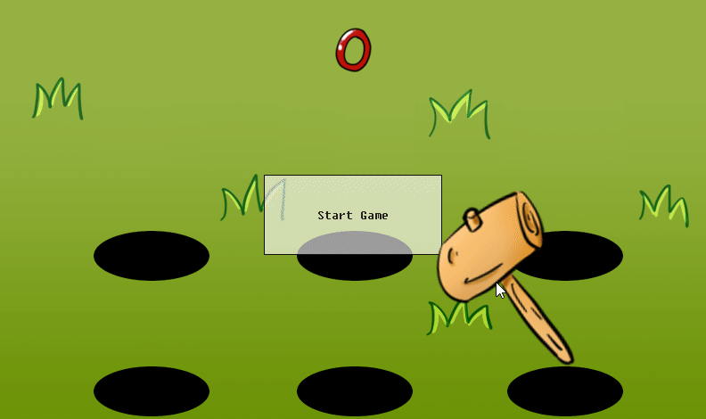

Try it online: [PainterEngine Online App – Whack-a-Mole](https://www.painterengine.com/main/app/documentgame/)

