# The Book Of PainterEngine 

## 导言 

欢迎开始我们的PainterEngine的第一课,但在此之前相信大家并不清楚PainterEngine到底是一个做什么的
,也许您已经在互联网上对它有些许印象,它或许是一个图形库,或者是游戏引擎,你可能已经看过了基于它的
关于声学、密码学、神经网络、数字信号处理、编译器、虚拟机等等相关内容，甚至还有一个基于FPGA的GPU
 IP核。所以你可能认为它是一个集合了各式各样程式库的大混合体。

以上都对，但总的来说，我更倾向于将PainterEngine认为是一个应用程序框架，它诞生之初的最终原因，
是为了解决程序开发过程中极其麻烦的三方库（甚至是标准库）依赖问题，最大程度简化程序的平台移植和
编译难度。

因此如你所见，PainterEngine的编译不会让你陷入各式各样的三方依赖中，目前它可以在几乎所有提供C
语言编译环境的平台上运行，它没有操作系统及文件系统依赖，可以运行在裸MCU环境中，甚至
PainterEngine的官网首页也是由PainterEngine开发的。

PainterEngine始终遵循着最简设计原则，而PainterEngine使用了C语言作为其主要开发语言，而其
内置的脚本引擎，同样最大程度的兼容C语言语法，并对C语言的类型做了少量的抽象及泛化，进一步减少它
的上手及使用门槛。C语言作为一门历史悠久的语言，如今几乎是各大工科类专业必学的一门课程，其在计算
机编程开发的发展中，始终保持着强大的竞争力及广泛认可，并成为了几乎所有硬件平台，所需要并提供支持
的事实标准。C语言在学习与开发成本维持着一个微秒的平衡，因此你可以在很短的时间学习并上手C语言，
配合PainterEngine，你就能将你的程序运行在全平台，并深刻感受编程艺术所带来的魅力。

PainterEngine同样经历了近乎十年的发展，但在很长的一段时间，其作为一个私用库较少在公开领域正式
推广，一个是在其迭代的过程中，很多的接口和函数仍然未稳定，我们必须在长期的实践中，保证接口设计
的合理性和易用性，区分哪些是“真正拥有且好用”的，哪些只是“灵光一闪看上去光鲜亮丽，其实没啥用的”
因此PainterEngine在很长一段时间，都没有详细且稳定的文档，而经过那么多年的迭代，我们最终可以将
那些稳定、好用、简单易学的设计公布出来，并最终给大家带来这篇文档。

最后，我并不希望将导言写的太长，是时候马上切入主题了，我们将从PainterEngine的环境搭建开始，
开始PainterEngine的第一课，如果你有相关问题或发现了bug，你可以在PainterEngine论坛中提问，
或者直接将问题发送到matrixcascade@gmail.com,我将在第一时间给你反馈。


## 1.一个最简单的PainterEngine程序

在搭建开发环境之前，让我们先编写一个最简单的PainterEngine程序，让我们新建一个"main.c"文件(文
件名可以任意取),然后在
其中输入以下代码

```c
#include "PainterEngine.h"
int main()
{
    PainterEngine_Initialize(800,480);
    return 1;
}
```

这是一个相当简单的PainterEngine程序,简单来说,在第一行我们使用include将PainterEngine的头文件
包含了进来,在main函数中,我们使用`PainterEngine_Initialize`对PainterEngine进行初始化操作,
`PainterEngine_Initialize`接受2个参数,分别是窗口(或者是屏幕)的宽度和高度,在程序运行后,你大概能
看到这样的结果。


当然,现在我们还没有使用PainterEngine在窗口上绘制任何东西,因此你看到的是一个空白的画面,需要注意的
是,在PainterEngine的框架中,main函数返回后,程序并不会立即结束,实际上在`PainterEngine.h`中,`main`
函数被替换成了`px_main`,真正的`main`函数,在`px_main.c`中实现,但用户目前可以用不着关心这个,只需要
记住`main`函数返回后,程序仍然是在正常运行的,如果你希望退出程序,你可以自行调用C语言的`exit`函数,但
在PainterEngine中的很多时候你并不需要这么做,因为像在嵌入式单片机、网页、驱动程序中，大部分是用不到
退出这个概念的，哪怕是在Android，iOS平台，绝大部分时候也不需要你在程序中设计退出功能。

## 2.编译PainterEngine程序

### 使用PainterEngine Make编译

如果你想要编译PainterEngine的项目文件，最简单的做法是使用PainterEngine Make，这是一款你能够在
PainterEngine.com中下载到的一款编译工具,你可以在主页下方找到它的下载按钮:


解压缩以后,直接运行PainterEngine make.exe,你就可以看到如下界面

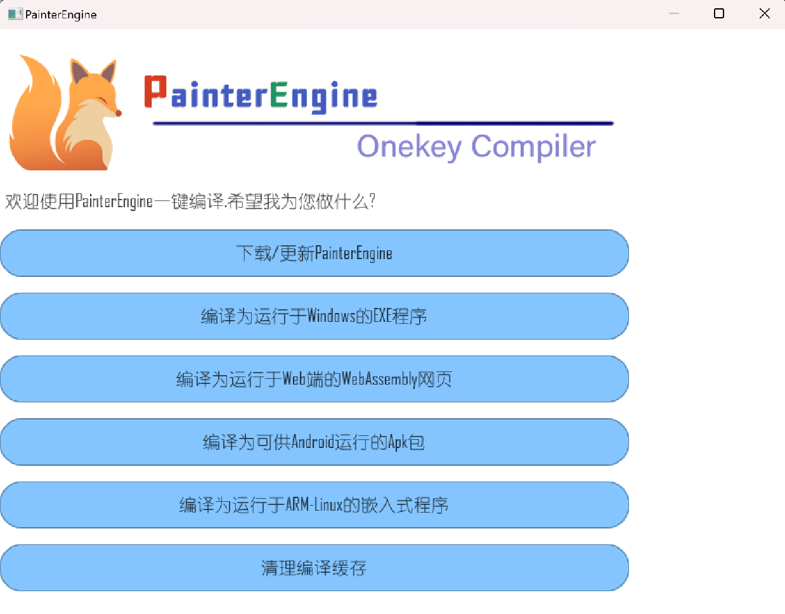

然后选择你需要编译的平台,然后选中我们之前创建的那个c语言代码文件


之后只需要等待编译完成就可以了


### 使用Visual Studio Code 编译

需要使用Visual Studio Code进行编译,你需要确保你已经安装好了Visual Studio Code的C语言开发环境,这块步骤我们略过,因为在互联网上已经有相当多这样的教程了。

然后请到PainterEngine中，下载PainterEngine的源码


将下载好的源码解压到计算机的某个目录下，然后你需要记录这个目录的位置，并在Windows的环境变量中新建一个名叫PainterEnginePath的变量,并将它赋值为PainterEngine库所在目录


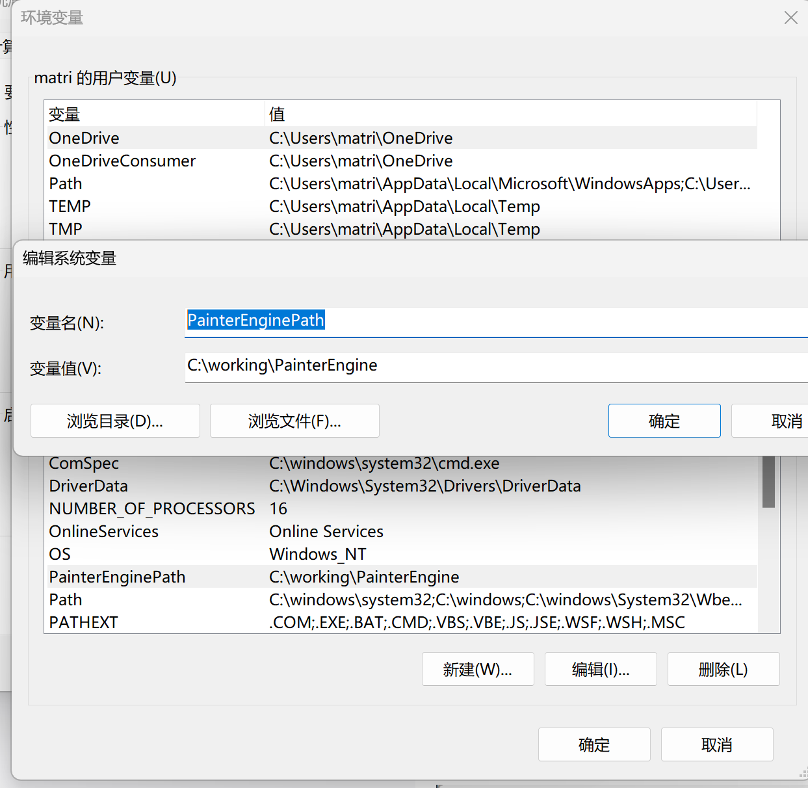

请将PainterEngine/Platform/.vscode目录,复制一份放到源码文件旁边


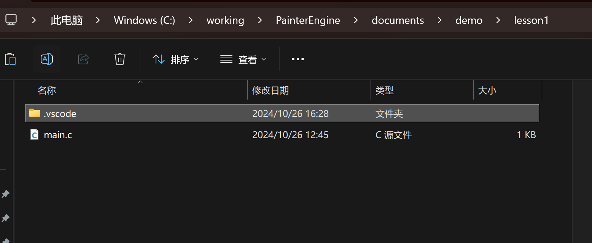

然后请用Visual Studio Code打开`main.c`文件,然后你就可以进行编译运行了

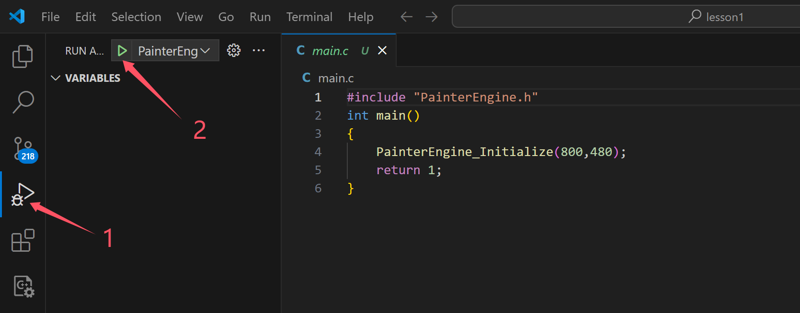

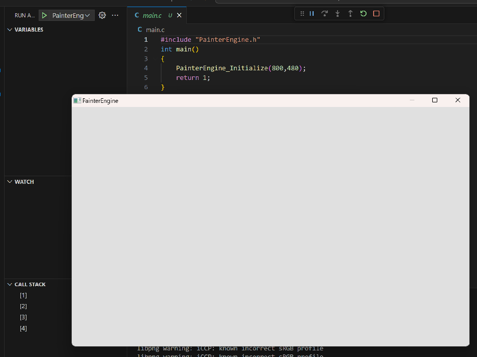

### 使用Visual Studio 编译

当然,如果你需要使用完整的IDE开发体验,那么仍然建议使用Visual Studio进行开发编译。要使用Visual Studio
开发PainterEngine，你需要打开Visual Studio创建一个空项目。

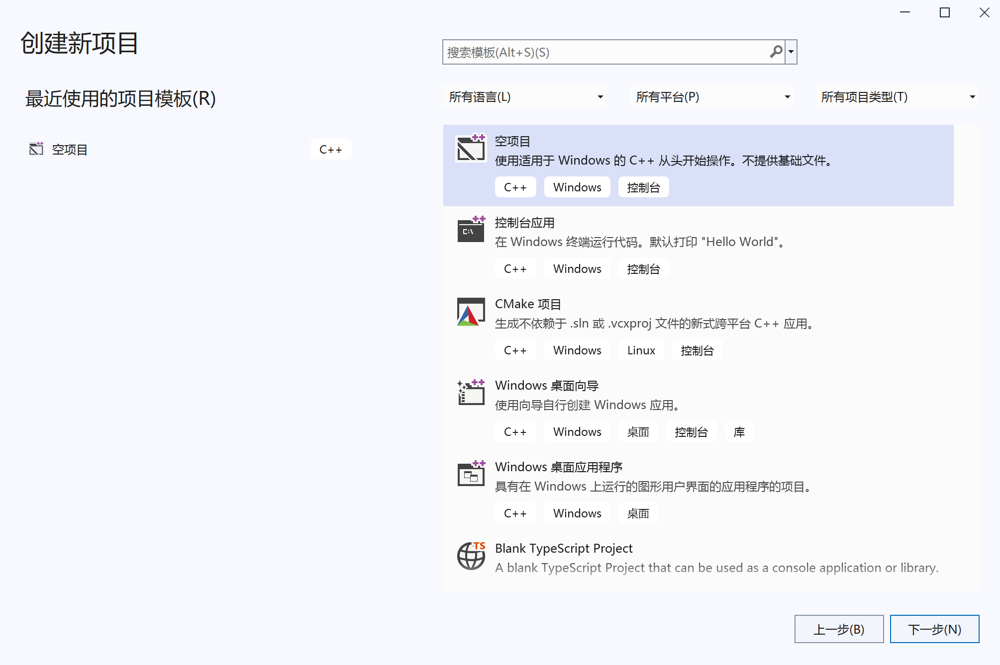


在创建项目好以后，我强烈建议你新建一个筛选器。


然后把PainterEngine目录下的`core` `kernel` `runtime` 与`platform/windows` 中的所有文件添加到这个
筛选器中


然后将我们之前写好的`main.c`文件也添加进项目中


打开`项目`-->`属性`-->`VC++目录`中,把PainterEngine的所在目录包含进来

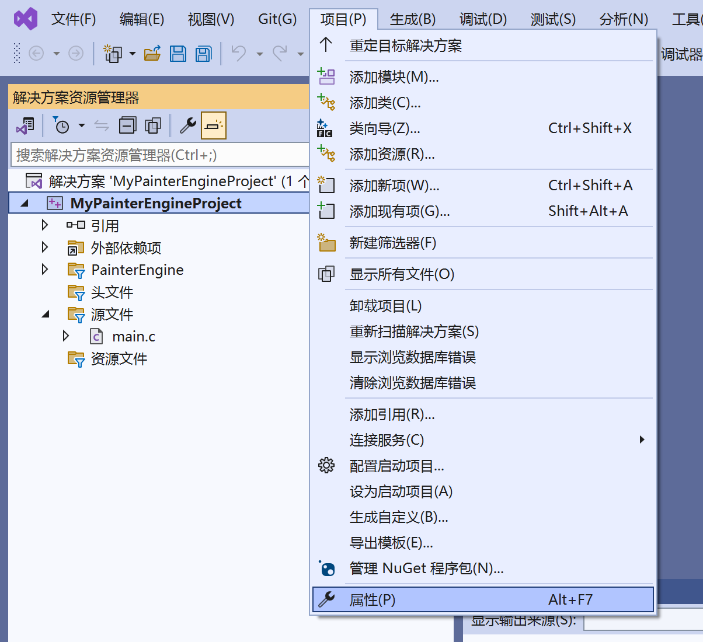

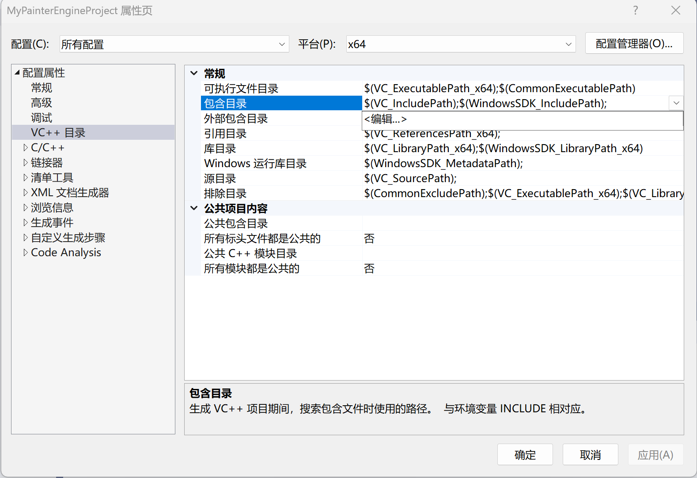


特别需要注意检查配置和Visual Stdio的当前配置是否是一致的,这是一个很容易出错的点


最后,你就可以编译运行调试了。

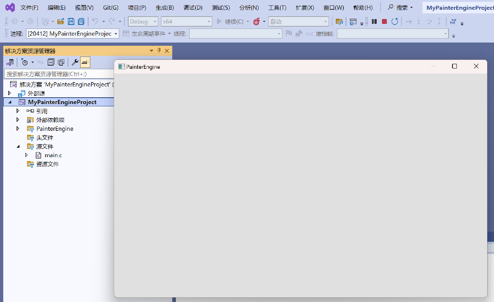

## 3.PainterEngine 第一课，输出文字“Hello PainterEngine”

正如你所见，PainterEngine是一个图形化应用程序框架,但依据传统,我们的第一课仍然是如何用PainterEngine
输出文字,但多数时候,与其说是输出文字不如说是绘制文字,使用PainterEngine绘制文字非常简单,查看如下代码

```c
#include "PainterEngine.h"
int main()
{
    PainterEngine_Initialize(800,480);
//PainterEngine_DrawText
//参数1：x坐标
//参数2：y坐标
//参数3：文本内容
//参数4：对齐方式
//参数5：颜色
    PainterEngine_DrawText(400, 240, "Hello PainterEngine", PX_ALIGN_CENTER, PX_COLOR(255, 255, 0, 0));
    return 1;
}
```
我们主要看`PainterEngine_DrawText`函数,这是一个文本绘制函数,它有5个参数,当你运行程序后,你将看到这个结果:

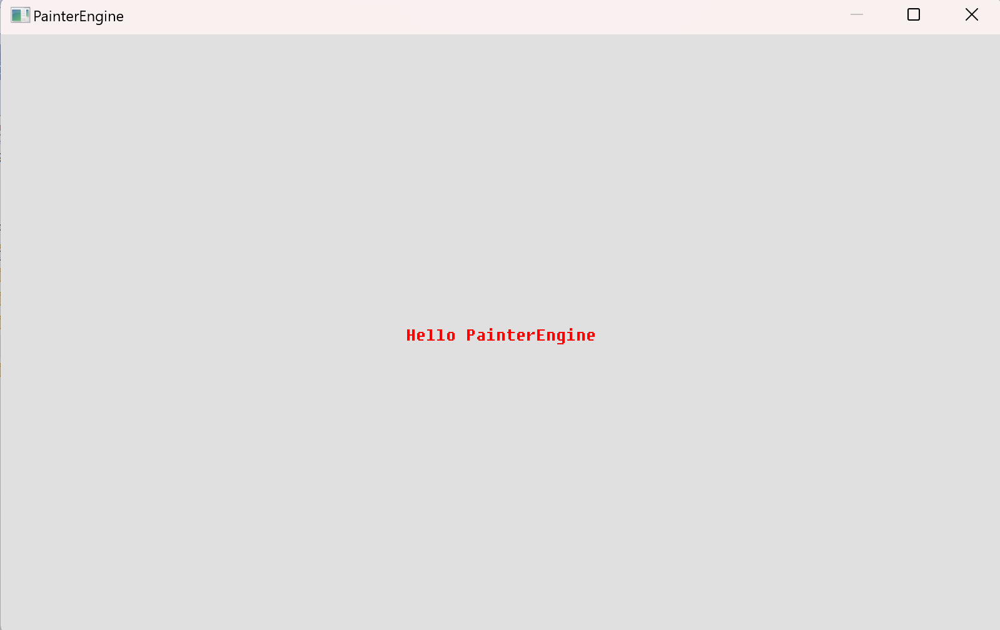

整个函数非常好理解,但这里我们详细解释一下`对齐方式`和`颜色`这两个参数的意义,因为在后续的教程中,这两个概念
会经常被提及:

其中,`对齐方式`就是对应内容绘制在屏幕上的对齐方式,PainterEngine中的对齐方式包含以下几种格式

```c
typedef enum
{
	PX_ALIGN_LEFTTOP = 7,//左上角对齐
	PX_ALIGN_MIDTOP = 8,//中上对齐
	PX_ALIGN_RIGHTTOP = 9,//右上角对齐
	PX_ALIGN_LEFTMID = 4,//左中对齐
	PX_ALIGN_CENTER = 5,//居中对齐
	PX_ALIGN_RIGHTMID = 6,//右中对齐
	PX_ALIGN_LEFTBOTTOM = 1,//左下角对齐
	PX_ALIGN_MIDBOTTOM = 2,//中底对齐
	PX_ALIGN_RIGHTBOTTOM = 3,//右下角对齐
}PX_ALIGN;
```

这个对齐方式的枚举类型是设计过的,你可以直接看看你数字小键盘,其对齐方式和数字小键盘的数值是对应关系。

而`颜色格式`则是一个被定义为`px_color`的结构体,这个结构体有4个字节,内部有4个成员变量,分别是a、r、g、b
分别代表颜色的透明度，红色通道，绿色通道和蓝色通道，每一个分量的取值范围都是0-255，例如红色，这个数值
越大，这个颜色就越红。

因此，你可以看到，在上面的示范代码中，我们绘制了一个红色的文本`Hello PainterEngine`,现在让我们试试中
文,修改上面的代码,改为下面这种格式

```c
#include "PainterEngine.h"
int main()
{
    PainterEngine_Initialize(800,480);
//PainterEngine_DrawText
//参数1：x坐标
//参数2：y坐标
//参数3：文本内容
//参数4：对齐方式
//参数5：颜色
    PainterEngine_DrawText(400, 240, "你好PainterEngine", PX_ALIGN_CENTER, PX_COLOR(255, 255, 0, 0));
    return 1;
}
```


但是,中文却不能正确显示,这是因为PainterEngine中,默认只有英文的字模,如果我们想要支持中文怎么办呢?
这仍然不困难,为此,我们需要先准备一个ttf字模文件,例如在这里,我准备了一个幼圆字体,那么,我只需要将这个字体
加载进来就可以了

```c
#include "PainterEngine.h"
int main()
{
    PainterEngine_Initialize(800,480);
    PainterEngine_LoadFontModule("assets/font.ttf", PX_FONTMODULE_CODEPAGE_GBK, 24);
    PainterEngine_DrawText(400, 240, "你好 PainterEngine", PX_ALIGN_CENTER, PX_COLOR(255, 255, 0, 0));
    return 1;
}
```

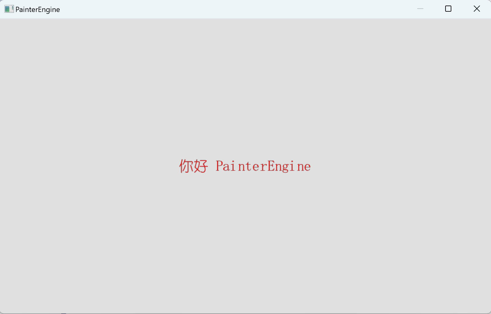

`PainterEngine_LoadFontModule`的函数的第一个参数,是TTF字体文件的路径,相对路径是以exe文件所在路径相对的
第二个参数是字符集,在默认情况下,Visual Stduio代码使用的时GBK字符集,如果你使用Visual Studio Code,那么默认
是UTF8编码,第二个参数应该换成`PX_FONTMODULE_CODEPAGE_GBK`,而最后一个参数是字体的大小。

## 4.使用PainterEngine绘制几何图形

除了绘制文本之外，PainterEngine还可以直接绘制以下几种几何图形

`px_void PainterEngine_DrawLine(px_int x1, px_int y1, px_int x2, px_int y2, px_int linewidth, px_color color);`
这个函数用于绘制一条线段。
* x1, y1: 线段的起点坐标。
* x2, y2: 线段的终点坐标。
* linewidth: 线段的宽度。
* color: 线段的颜色。
```c
#include "PainterEngine.h"
int main()
{
    PainterEngine_Initialize(800,480);
    // 设置起点和终点坐标
    px_int x1 = 50;
    px_int y1 = 50;
    px_int x2 = 200;
    px_int y2 = 200;

    // 设置线宽和颜色
    px_int linewidth = 5;
    px_color color = PX_COLOR(255, 0, 0, 255); // 红色

    // 绘制线段
    PainterEngine_DrawLine(x1, y1, x2, y2, linewidth, color);
    return 1;
}
```


`px_void PainterEngine_DrawRect(px_int x, px_int y, px_int width, px_int height, px_color color);`
这个函数用于绘制一个矩形。
* x, y: 矩形的左上角坐标。
* width: 矩形的宽度。
* height: 矩形的高度。
* color: 矩形的颜色。


```c
#include "PainterEngine.h"
int main()
{
    PainterEngine_Initialize(800,480);
    // 设置矩形的左上角坐标
    px_int x = 100;
    px_int y = 100;

    // 设置矩形的宽度和高度
    px_int width = 150;
    px_int height = 100;

    // 设置矩形的颜色
    px_color color = PX_COLOR(255, 0, 255,0 ); // 绿色

    // 绘制矩形
    PainterEngine_DrawRect(x, y, width, height, color);
    return 1;
}
```


`px_void PainterEngine_DrawCircle(px_int x, px_int y, px_int radius, px_int linewidth, px_color color);`
这个函数用于绘制一个圆环。
* x, y: 圆心的坐标。
* radius: 圆的半径。
* linewidth: 圆的线宽。
* color: 圆的颜色。

```c
#include "PainterEngine.h"
int main()
{
    PainterEngine_Initialize(800,480);
    // 设置圆心的坐标
    px_int x = 200;
    px_int y = 200;
    // 设置圆的半径
    px_int radius = 50;
    // 设置圆的线宽
    px_int linewidth = 5;
    // 设置圆的颜色
    px_color color = PX_COLOR(255, 0, 0, 255); // 蓝色
    // 绘制圆形
    PainterEngine_DrawCircle(x, y, radius, linewidth, color);
    return 1;
}
```

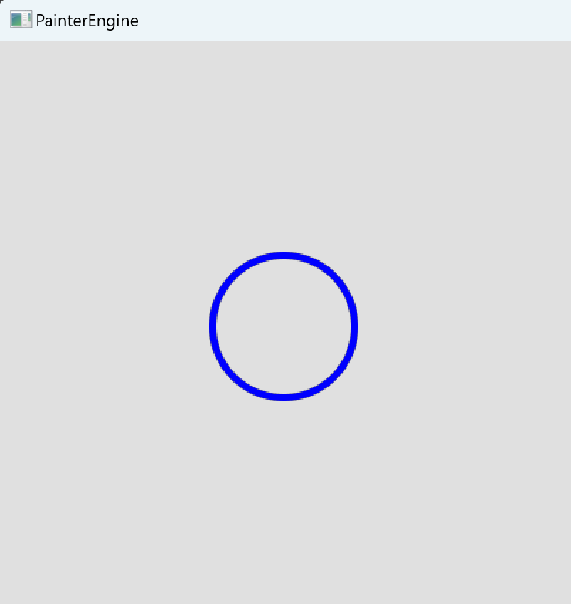

`px_void PainterEngine_DrawSolidCircle(px_int x, px_int y, px_int radius, px_color color);`
这个函数用于绘制一个实心圆。
* x, y: 圆心的坐标。
* radius: 圆的半径。
* color: 圆的颜色。

```c
#include "PainterEngine.h"
int main()
{
    PainterEngine_Initialize(800, 480);

    // 设置圆心的坐标
    px_int x = 100;
    px_int y = 100;

    // 设置圆的半径
    px_int radius = 50;

    // 设置圆的颜色
    px_color color = PX_COLOR(255, 255, 0, 255); 

    // 绘制实心圆
    PainterEngine_DrawSolidCircle(x, y, radius, color);
    return 1;
}
```

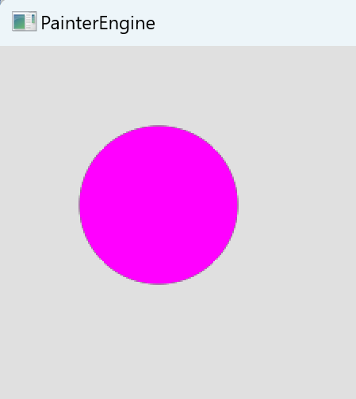

`px_void PainterEngine_DrawSector(px_int x, px_int y, px_int inside_radius,px_int outside_radius, px_int start_angle, px_int end_angle, px_color color);`
这个函数用于绘制一个扇形。
参数说明：
* x, y: 扇形的圆心坐标。
* inside_radius: 扇形的内半径。
* inside_radius: 扇形的外半径。
* start_angle: 扇形的起始角度（以度为单位,支持负角度）。
* end_angle: 扇形的结束角度（以度为单位,支持负角度）。
* color: 扇形的颜色。

```c
#include "PainterEngine.h"
int main()
{
    PainterEngine_Initialize(800, 480);
    // 设置扇形的圆心坐标
    px_int x = 100;
    px_int y = 100;
    // 设置扇形的半径
    px_int inside_radius = 50;
    px_int outside_radius = 100;
    // 设置扇形的起始角度和结束角度
    px_int start_angle = 0;
    px_int end_angle = 135;
    // 设置扇形的颜色
    px_color color = PX_COLOR(255, 255, 0, 0); // 红色
    // 绘制扇形
    PainterEngine_DrawSector(x, y, inside_radius, outside_radius, start_angle, end_angle, color);
    return 1;
}
```


`px_void PainterEngine_DrawPixel(px_int x, px_int y, px_color color);`
这个函数用于绘制一个像素点。
* x, y: 像素点的坐标。
* color: 像素点的颜色。

这只是绘制一个像素点,就不放示例图了。

## 5.使用PainterEngine 绘制图像

使用PainterEngine绘制图像仍然很简单,但在绘制图像之前,我们需要先加载图片。

PainterEngine可以直接从文件中加载图片，它原生支持PNG、JPG、BMP、TRAW四种静态图片格式的加载，为了
存储加载的图片，我们需要用到一个叫纹理的结构体。

在PainterEngine中，纹理用`px_texture`结构体进行，描述，因此为了加载纹理，我们需要`PX_LoadTextureFromFile`
函数,这个函数是一个三个参数的图片文件加载函数,第一个参数是内存池,在后面的章节,我将会更详细的讲解PainterEngine
内存池的内容,在默认情况下,PainterEngine提供2个默认内存池,一个是`mp`一个是`mp_static`,其中,前面的内存池一般
用于需要频繁分配释放的元素,后面的则用于静态资源的存储,在这里因为图片一般是静态资源,因此填写`mp_static`就可以了，

第二个参数，则是我们纹理结构体的指针，在图片成功加载后，将会初始化这个结构体，并用于保存图片数据。

最后一个参数，则是图片文件的所在路径。

在加载文件成功后，我们使用`PainterEngine_DrawTexture`函数绘制出来这是一个四参数的函数

* 第一个参数是我们之前的纹理结构体指针
* 第二第三是需要绘制到的x,y坐标
* 第四个则是之前我们说过的对齐方式

参考如下代码

```c
#include "PainterEngine.h"
px_texture mytexture;//纹理
int main()
{
    PainterEngine_Initialize(512, 512);
    if(!PX_LoadTextureFromFile(mp_static,&mytexture,"assets/demo.png"))
	{
        //加载纹理失败
		return 0;
	}
    PainterEngine_DrawTexture(&mytexture, 0, 0, PX_ALIGN_LEFTTOP);
    
    return 1;
}

```

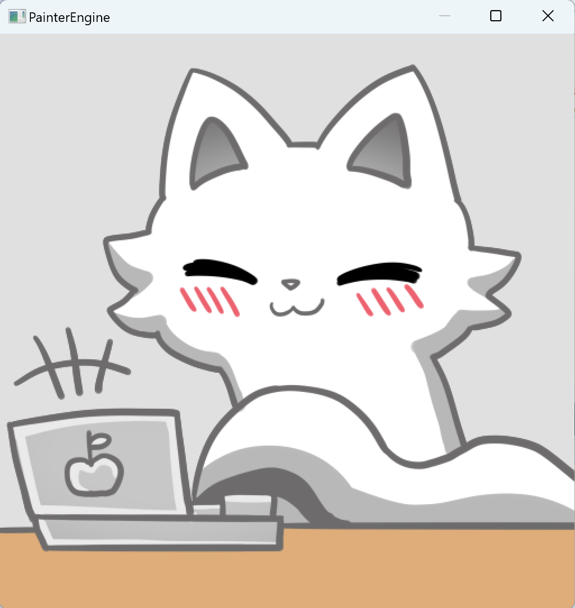

## 6.PainterEngine 内存池管理机制

因为PainterEngine需要无系统及标准库依赖,因此在PainterEngine中,必须独立于系统及标准库的内存管理机制,实现PainterEngine内部
的内存管理系统。因此PainterEngine使用了内存池作为动态的内存管理系统。

PainterEngine内存池实现方式同样很简洁，为了使用内存，你必须预先准备一段可用的内存空间，作为内存池管理的内存空间，例如在下面的
代码中，我们可以用C语言定义一个较大的全局数组，然后用这个数组空间作为内存池的分配空间。例如如下代码

```c
#include "PainterEngine.h"
unsigned char my_memory_cache[1024 * 1024];
int main()
{
    px_memorypool mp;
    px_void* myalloc;
    mp=PX_MemorypoolCreate(my_memory_cache, sizeof(my_memory_cache));//创建内存池
    myalloc=MP_Malloc(&mp, 1024);//在内存池中分配1024字节
    return 1;
}
```

需要注意的是,**_使用内存池分配的空间,会略小于分配给内存池的空间如果你分配的空间超出了内存池,将会导致一个停机错误。_**

```c
#include "PainterEngine.h"
unsigned char my_memory_cache[1024 * 1024];
int main()
{
    px_memorypool mp;
    px_void* myalloc;
    mp=PX_MemorypoolCreate(my_memory_cache, sizeof(my_memory_cache));//创建内存池
    myalloc=MP_Malloc(&mp, 1024*1024);//在内存池中分配1024*1024字节，但内存池实际容量小于分配给内存池容量,因此这里内存不足，这里将会进入中断
    return 1;
}
```

如果你不希望因为内存池不足导致停机错误,你可以使用以下两种方式:

1.你可以设置错误回调,自行处理内存池的错误

```c
#include "PainterEngine.h"
unsigned char my_memory_cache[1024 * 1024];

PX_MEMORYPOOL_ERROR_FUNCTION(my_memory_cache_error)
{
	switch (error)
	{
	case PX_MEMORYPOOL_ERROR_OUTOFMEMORY:
		printf("内存访问错误\n");
		break;
	case PX_MEMORYPOOL_ERROR_INVALID_ACCESS:
		printf("无法访问内存\n");
		break;
	case PX_MEMORYPOOL_ERROR_INVALID_ADDRESS:
		printf("无效的内存地址(UAF or double free)\n");
		break;
	default:
		break;
	}
}
int main()
{
    px_memorypool mp;
    px_void* myalloc;
    mp=PX_MemorypoolCreate(my_memory_cache, sizeof(my_memory_cache));//创建内存池
	MP_ErrorCatch(&mp, my_memory_cache_error,0);//设置错误回调
    myalloc=MP_Malloc(&mp, 1024*1024);//在内存池中分配1024*1024字节
    return 1;
}
```

2.或者你也可以直接关闭内存池的错误异常处理,那么当内存池无法正常分配足够内存时,将会直接返回NULL

```c
#include "PainterEngine.h"
unsigned char my_memory_cache[1024 * 1024];

int main()
{
    px_memorypool mp;
    px_void* myalloc;
    mp=PX_MemorypoolCreate(my_memory_cache, sizeof(my_memory_cache));//创建内存池
	MP_NoCatchError(&mp, PX_TRUE);//设置内存池不捕获错误
    myalloc=MP_Malloc(&mp, 1024*1024);//在内存池中分配1024*1024字节,但内存池不捕获错误，所以会直接返回NULL
    return 1;
}
```

在PainterEngine中,有2个系统默认的内存池,它们分别是`mp`和`mp_static`,你可以打开`PainterEngine_Application.h`文件,在当中找到这两个内存池的定义,但我们最需要关注的,还是下面的代码:

```c
#define PX_APPLICATION_NAME "PainterEngine"
#define PX_APPLICATION_MEMORYPOOL_STATIC_SIZE (1024*1024*64)
#define PX_APPLICATION_MEMORYPOOL_DYNAMIC_SIZE (1024*1024*32)
#define PX_APPLICATION_MEMORYPOOL_SPACE_SIZE (1024*1024*16)
```

这是这两个内存池的直接相关配置宏,其中`PX_APPLICATION_MEMORYPOOL_STATIC_SIZE`表示`mp_static`内存池的内存分配大小,而`PX_APPLICATION_MEMORYPOOL_DYNAMIC_SIZE`则是`mp`内存池的内存分配大小,`PX_APPLICATION_MEMORYPOOL_SPACE_SIZE`则是系统其它资源,PainterEngine程序运行开始,就至少会占用这三个宏累加起来的内存,之后的内存分配,都围绕在这几个内存池中进行,如果你发现PainterEngine运行的内存不够了,你可以自己手动拓展内存池的大小,当然,如果你希望节约点内存,你也可以手动将它们改小。


## 7.使用PainterEngine 创建GUI按钮

在本章节中,我们将第一次接触PainterEngine的组件,现在,我们将使用PainterEngine创建一个经典GUI组件----按钮

在PainterEngine中,所有的组件都是由`PX_Object`结构体进行描述的,创建组件返回的都是一个`PX_Object *`类型的指针

但在本章节中,我们并不需要考虑的那么复杂,我们只需要创建一个按钮出来即可,在PainterEngine中,最常用的按钮是`PX_Object_PushButton`
类型。

```c
#include "PainterEngine.h"
int main()
{
    PX_Object* myButtonObject;
    PainterEngine_Initialize(800, 480);
    PainterEngine_LoadFontModule("assets/font.ttf",PX_FONTMODULE_CODEPAGE_GBK,20);
    myButtonObject=PX_Object_PushButtonCreate(mp,root,300,200,200,80,"我是一个按钮", PainterEngine_GetFontModule());
    return 1;
}
```
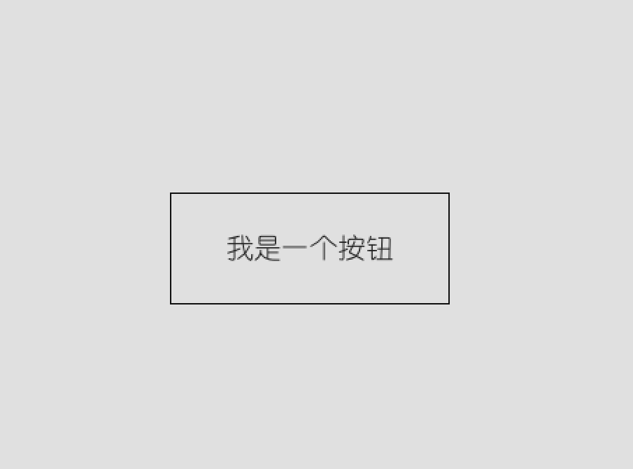

现在,我们来详细看看`PX_Object_PushButtonCreate`函数,其中,第一个参数是一个内存池,在之前我们说过
PainterEngine有2个系统默认的内存池，其实这里填`mp`或者`mp_static`都是没有问题的,但考虑到界面可能会变动设计对象分配与销毁,所以我们还是选择`mp`内存池。

第二个参数`root`是PainterEngine的根对象,PainterEngine对象管理机制我们将在之后讨论,在这里,你只需要理解为,这里填`root`的意思是**_创建一个按钮对象作为根对象的子对象_**这样按钮就能链接到系统对象树中,进行事件响应和渲染。

然后是按钮的x，y，width，height，也就是位置和宽度高度等信息。

最后一个是字模指针，也就是之前我们加载的ttf字模文件，如果没有它，我们的按钮就不能显示中文汉字了，当然你可以选择其他的字体，以实现不同的风格。


## 8.PainterEngine 对象传递机制

在上一个章节中，我们初略了解了根对象`root`,那么在本章节,我们将学习一下PainterEngine的对象管理机制。

正如我们之前所说的，在PainterEngine中,所有的组件都是由`PX_Object`结构体进行描述的,PainterEngine的对象是以树的形式存在的:

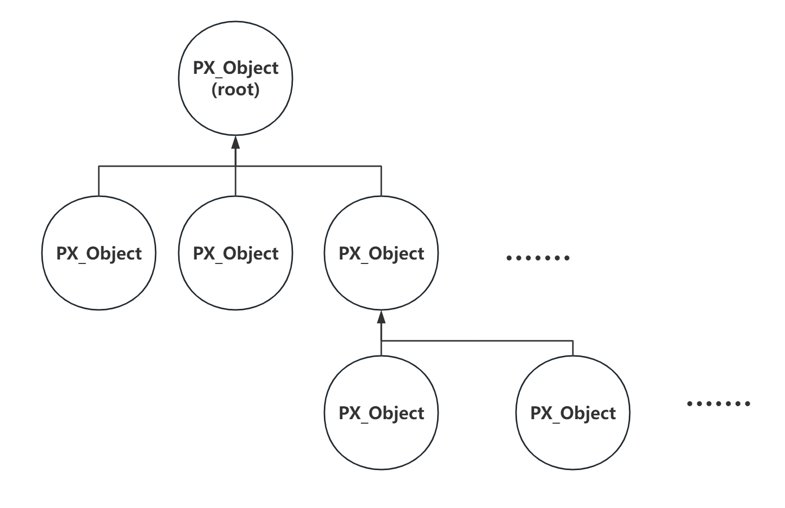

每一个`PX_Object`都是这个树中的一个节点,都可以有自己得子节点（可能多个），和自己得父节点（只能有一个）同时,每一个`PX_Object`都有以下四个基本功能函数。

`Create`：对象创建函数或者说是对象初始化函数,在PainterEngine中它一般是`PX_Object_xxxxxCreate`这种形式的,其中xxxxx就是这个对象的名称,比如上一章节的PushButton,Create函数一般是对象的一些初始化处理，并会将自己连接到对象树中。

`Update`：对象的物理信息更新工作基本在这个函数中完成，一般会处理对象的一些物理信息,比如位置大小速度等，常见于游戏设计中的物体，在GUI对象中则比较少见，其设计是与之后的`Render`也就是绘制函数进行区分,因为在例如游戏服务端中,对象并不需要进行绘制,且绘制是非常消耗性能的。

`Render`: 对象的绘制工作基本在这个函数中完成,用于`PX_Object`的绘制功能,将图像数据渲染到屏幕上,当然有些情况下物理信息也会在这个函数中做,是因为这个对象的物理信息并不会影响游戏的实际运行结果,例如一些特效和粒子效果,多数的GUI组件也几乎只用得到`Render`函数。

`Free`：对象的释放工作基本在这个函数中完成，例如在Create中加载了纹理，或者申请了内存，在这个函数中应该被释放。

以上`Update`、`Render`、`Free`函数具有传递的特性，也就是说。

* 例如如果某个对象节点执行了`Update`,那么它的所有子对象也会执行`Update`
* 例如如果某个对象节点执行了`Render`,那么它的所有子对象也会执行`Render`
* 例如如果某个对象节点执行了`Free`,那么它的所有子对象也会执行`Free`,父对象被删除了,它的子节点也会被删除,被一直迭代到以这个节点为根节点的所有子节点被删除。

因此，在上一章节我们创建了按钮，并将它连接到了`root`节点,那么我们是不需要自己再手动执行`Update`、`Render`、`Free`函数的(在`PX_Object_PushButton.c`中它们已经被写好了),因为根节点`root`是被自动更新渲染和释放的,我们只需要负责`Create`就可以了。

当然，如果你希望删除这个对象的话，你只需要调用`PX_ObjectDelayDelete`或者`PX_ObjectDelete`就可以了

```c
#include "PainterEngine.h"
int main()
{
    PX_Object* myButtonObject;
    PainterEngine_Initialize(800, 480);
    PainterEngine_LoadFontModule("assets/font.ttf",PX_FONTMODULE_CODEPAGE_GBK,20);
    myButtonObject=PX_Object_PushButtonCreate(mp,root,300,200,200,80,"我是一个按钮", PainterEngine_GetFontModule());
    PX_ObjectDelayDelete(myButtonObject);//删除对象
    return 1;
}
```

这两个函数的功能和参数都是一样的,但是`PX_ObjectDelayDelete`会在更新和渲染完成后才执行删除,`PX_ObjectDelete`则是立即删除，我建议使用`PX_ObjectDelayDelete`，这样你就可以避免在某些情况下因为对象被立即删除了，而其它对象仍然引用了这个对象的数据，这会导致其访问内存内存。

## 9.PainterEngine 消息机制

现在，虽然我们创建了一个按钮，但我们却没办法响应它，为了响应按钮事件，我们需要将按钮控件和消息进行绑定，请查看以下代码：

```c
#include "PainterEngine.h"

PX_OBJECT_EVENT_FUNCTION(OnButtonClick)
{
    PX_Object_PushButtonSetText(pObject,"我被点击了");
}

int main()
{
    PX_Object* myButtonObject;
    PainterEngine_Initialize(800, 480);
    PainterEngine_LoadFontModule("assets/font.ttf",PX_FONTMODULE_CODEPAGE_GBK,20);
    myButtonObject=PX_Object_PushButtonCreate(mp,root,300,200,200,80,"我是一个按钮", PainterEngine_GetFontModule());
    PX_ObjectRegisterEvent(myButtonObject,PX_OBJECT_EVENT_EXECUTE,OnButtonClick,0);
    
    return 1;
}
```


其中,`PX_OBJECT_EVENT_FUNCTION`是一个宏,因为事件响应函数是一个固定的格式,因此非常建议你使用宏的方式来申明它,它的定义原型如下:

```c
#define PX_OBJECT_EVENT_FUNCTION(name) px_void name(PX_Object *pObject,PX_Object_Event e,px_void * ptr)
```

可以看到,这个回调函数有3个参数,第一个是响应时间的对象的指针,因为是按钮点击被触发了,所以这个指针指向的就是这个按钮对象,第二个参数是事件类型e，它是触发的事件类型，最后一个参数则是用户传递来的指针，他在注册时间响应函数`PX_ObjectRegisterEvent`被调用时就被传递进来了。

事件类型有以下几种:

```c
#define PX_OBJECT_EVENT_ANY					0 //任意事件
#define PX_OBJECT_EVENT_CURSORMOVE			1 //鼠标移动
#define PX_OBJECT_EVENT_CURSORUP			2 //鼠标左键弹起或触摸屏弹起
#define PX_OBJECT_EVENT_CURSORRDOWN			3 //鼠标右键按下
#define PX_OBJECT_EVENT_CURSORDOWN			4 //鼠标左键按下或触摸屏按下
#define PX_OBJECT_EVENT_CURSORRUP			5 //鼠标右键弹起
#define PX_OBJECT_EVENT_CURSOROVER			6 //鼠标进入范围
#define PX_OBJECT_EVENT_CURSOROUT			7 //鼠标离开范围
#define PX_OBJECT_EVENT_CURSORWHEEL         8 //鼠标滚轮
#define PX_OBJECT_EVENT_CURSORCLICK			9 //鼠标左键点击
#define PX_OBJECT_EVENT_CURSORDRAG			10 //鼠标拖拽
#define PX_OBJECT_EVENT_STRING				11 //字符串事件(输入法输入)
#define PX_OBJECT_EVENT_EXECUTE				12 //执行事件,不同组件有不同的执行方式
#define PX_OBJECT_EVENT_VALUECHANGED		13 //值改变事件,例如滑动条的值改变,或者文本框的值改变,或者列表框的选中项改变
#define PX_OBJECT_EVENT_DRAGFILE			14 //拖拽文件
#define PX_OBJECT_EVENT_KEYDOWN				15 //键盘按下
#define PX_OBJECT_EVENT_KEYUP				16 //键盘弹起
#define PX_OBJECT_EVENT_IMPACT				17 //碰撞事件
#define PX_OBJECT_EVENT_SCALE               18 //缩放事件
#define PX_OBJECT_EVENT_WINDOWRESIZE        19 //窗口大小改变
#define PX_OBJECT_EVENT_ONFOCUS				20 //获得焦点
#define PX_OBJECT_EVENT_LOSTFOCUS           21 //失去焦点
#define PX_OBJECT_EVENT_CANCEL				22 //取消事件
#define PX_OBJECT_EVENT_CLOSE				23 //关闭事件
#define PX_OBJECT_EVENT_CURSORMUP			24 //鼠标中键弹起
#define PX_OBJECT_EVENT_CURSORMDOWN			25 //鼠标中键按下
#define PX_OBJECT_EVENT_REQUESTDATA			26 //请求数据
#define PX_OBJECT_EVENT_OPEN				27 //打开事件
#define PX_OBJECT_EVENT_SAVE				28 //保存事件
#define PX_OBJECT_EVENT_TIMEOUT				29 //超时事件
#define PX_OBJECT_EVENT_DAMAGE				30 //伤害事件
``` 
以上事件并非全部都是任何组件都会响应的,例如在上面例子中的`PX_OBJECT_EVENT_EXECUTE`,他是按钮被单击时会被触发的事件,或者是文本框中按下回车会触发的事件,但有些例如滚动条和进度条,并不会触发这个事件。也就是说有些事件是专属的。

但是类似于带有`CURSOR`或`KEY`的事件是所有连接在`root`节点的组件都会收到的事件(但不一定响应),需要注意的是,类似于鼠标或触摸屏的`CURSOR`事件,并非只有鼠标或触摸屏移动到组件所在位置与范围时才会触发,只要有这类事件投递到`root`节点,他就会逐层传递给它的所有子节点,如果你希望实现类似于按钮中的"仅在鼠标点击到按钮时"才触发,你必须自行实现范围判断。

你可以使用

```c
px_float PX_Object_Event_GetCursorX(PX_Object_Event e);//获取cursor事件的x坐标
px_float PX_Object_Event_GetCursorY(PX_Object_Event e);//获取cursor事件的y坐标
px_float PX_Object_Event_GetCursorZ(PX_Object_Event e);//获取cursor事件的z坐标,一般用于鼠标中键滚轮
```

来获取cursor事件中类似于"鼠标现在在哪里"的功能。

让我们回到源代码`OnButtonClick`中做的很简单,就是用`PX_Object_PushButtonSetText`改变了按钮文本的内容。

最后让我们来到`PX_ObjectRegisterEvent`函数，这个函数用于将事件与C语言函数绑定在了一起，第一个参数是我们之前创建好的按钮组件的指针，第二个函数是我们想要绑定的事件类型，这里的`PX_OBJECT_EVENT_EXECUTE`就是按钮被点击时触发的,第三个则是用户指针,他会被传递到回调函数中,如果你用不到,你可以直接填PX_NULL。

## 10.小例子，用PainterEngine实现一个电子相册

现在，让我们用一个小例子来开启PainterEngine组件化开发的第一步,在本例程中,我将使用按钮和图片框组件,开发一个电子相册功能,本文中的美术资源,你可以在documens/assets/logo中
找到。

```c
#include "PainterEngine.h"

PX_Object* Previous, * Next, * Image;
px_texture my_texture[10];//存放图片的数组
px_int index = 0;//当前图片的索引

PX_OBJECT_EVENT_FUNCTION(OnButtonPreClick)
{
    index--;
	if(index < 0)
	{
		index = 9;
	}
	PX_Object_ImageSetTexture(Image, &my_texture[index]);//设置图片
}

PX_OBJECT_EVENT_FUNCTION(OnButtonNextClick)
{
	index++;
	if(index > 9)
	{
		index = 0;
	}
	PX_Object_ImageSetTexture(Image, &my_texture[index]);
}

int main()
{
    px_int i;
    PainterEngine_Initialize(512, 560);//初始化
    for(i=0;i<10;i++)
	{
        px_char path[256];
        PX_sprintf1(path,256, "assets/%1.png", PX_STRINGFORMAT_INT(i+1));
		if(!PX_LoadTextureFromFile(mp_static, &my_texture[i],path))//加载图片
		{
            //加载失败
            printf("加载失败");
			return 0;
		}
	}
    PainterEngine_LoadFontModule("assets/font.ttf", PX_FONTMODULE_CODEPAGE_GBK, 20);//加载字体
    Image = PX_Object_ImageCreate(mp, root, 0, 0, 512, 512, 0);//创建图片对象
    Previous= PX_Object_PushButtonCreate(mp, root, 0, 512, 256, 48, "上一张",PainterEngine_GetFontModule());//创建按钮对象
    Next = PX_Object_PushButtonCreate(mp, root, 256, 512, 256, 48, "下一张", PainterEngine_GetFontModule());//创建按钮对象
	PX_ObjectRegisterEvent(Previous, PX_OBJECT_EVENT_EXECUTE, OnButtonPreClick, PX_NULL);//注册按钮事件
	PX_ObjectRegisterEvent(Next, PX_OBJECT_EVENT_EXECUTE, OnButtonNextClick, PX_NULL);//注册按钮事件
    return 1;
}
```

在上述代码中`OnButtonPreClick`和`OnButtonNextClick`分别是上一张和下一张按钮的回调函数,我们使用`PX_Object_ImageSetTexture`函数,对图片框进行切换。

而在`main`函数中,我们先加载了ttf字体,然后用`PX_Object_ImageCreate`创建了一个图片组件,之后我们创建了2个按钮,并用`PX_ObjectRegisterEvent`绑定了事件回调函数,最后,看看运行结果


## 11.更多常用的PainterEngine组件

  你可以在PainterEngine/kernel的文件中,找到PainterEngine的内置组件,在所有的组件名称,都是以PX_Object_XXXXX开头的,在这里,我为你列举一些常用的组件及示范代码

* 文本框:

```c
#include "PainterEngine.h"
PX_OBJECT_EVENT_FUNCTION(PX_Object_EditOnTextChanged)
{
	//文本改变后后这里会被执行
}

int main()
{
	PX_Object* pObject;
	PainterEngine_Initialize(600, 400);
	//创建文本框
	pObject=PX_Object_EditCreate(mp,root,200,180,200,40,0);
	//注册编辑框文本改变事件
	PX_ObjectRegisterEvent(pObject,PX_OBJECT_EVENT_VALUECHANGED, PX_Object_EditOnTextChanged,PX_NULL);
	return 0;
}
```


* 列表框

```c
#include "PainterEngine.h"

PX_OBJECT_RENDER_FUNCTION(PX_Object_OnMyListItemRender)
{
	px_float objx,objy,objWidth,objHeight;
	PX_Object_ListItem *pItem=PX_Object_GetListItem(pObject);
	PX_OBJECT_INHERIT_CODE(pObject,objx, objy, objWidth, objHeight);
	//绘制出其文本
	PX_FontModuleDrawText(psurface, 0, (px_int)objx + 3, (px_int)objy + 3, PX_ALIGN_LEFTTOP, (const px_char *)pItem->pdata, PX_COLOR_WHITE);
}


PX_OBJECT_LIST_ITEM_CREATE_FUNCTION(PX_Object_OnMyListItemCreate)
{
	//绑定ListItem的渲染函数
	ItemObject->Func_ObjectRender[0]=PX_Object_OnMyListItemRender;
	return PX_TRUE;
}

PX_OBJECT_EVENT_FUNCTION(PX_Object_ListOnSelectChanged)
{
	//当选中项改变时
	return;
}

int main()
{
	PX_Object* pObject;
	PainterEngine_Initialize(600, 400);

	//创建list
	pObject = PX_Object_ListCreate(mp,root,100,100,400,200,24,PX_Object_OnMyListItemCreate,0);
	PX_Object_ListAdd(pObject, "Item1");
	PX_Object_ListAdd(pObject, "Item2");
	PX_Object_ListAdd(pObject, "Item3");
	PX_Object_ListAdd(pObject, "Item4");
	PX_Object_ListAdd(pObject, "Item5");
	PX_ObjectRegisterEvent(pObject, PX_OBJECT_EVENT_VALUECHANGED, PX_Object_ListOnSelectChanged, 0);
	return 0;
}
``` 


* 滑动条

```c
#include "PainterEngine.h"

PX_OBJECT_EVENT_FUNCTION(SliderChanged)
{
	//垂直滑动条值改变后执行这里的代码
	return;
}

int main()
{
	PX_Object* pObject;
	PainterEngine_Initialize(600, 400);
	//水平滑动条
	PX_Object_SliderBarCreate(mp, root, 200, 50, 200,24,PX_OBJECT_SLIDERBAR_TYPE_HORIZONTAL,PX_OBJECT_SLIDERBAR_STYLE_BOX);
	//垂直滑动条
	pObject=PX_Object_SliderBarCreate(mp, root, 200, 100, 24, 200, PX_OBJECT_SLIDERBAR_TYPE_VERTICAL, PX_OBJECT_SLIDERBAR_STYLE_BOX);
	PX_ObjectRegisterEvent(pObject, PX_OBJECT_EVENT_VALUECHANGED, SliderChanged, 0);
	return 0;
}
```


* 下拉框

```c
#include "PainterEngine.h"

int main()
{
	PX_Object* pObject;
	PainterEngine_Initialize(600, 400);
	pObject = PX_Object_SelectBarCreate(mp, root, 200, 150, 200,24,0);
	PX_Object_SelectBarAddItem(pObject, "Item1");
	PX_Object_SelectBarAddItem(pObject, "Item2");
	PX_Object_SelectBarAddItem(pObject, "Item3");
	PX_Object_SelectBarAddItem(pObject, "Item4");
	PX_Object_SelectBarAddItem(pObject, "Item5");
	return 0;
}
```


* 示波器
```c
#include "PainterEngine.h"

//必须是生存域内有效可访问的数据,这里定义为全局变量
px_double data_x[100];
px_double data_y[100];

int main()
{
	PX_Object_OscilloscopeData data;
	PX_Object* pObject;

	px_int i;
	PainterEngine_Initialize(600, 600);
	
	//初始化一个测试数据
	for (i = 0; i < 100; i++)
	{
		data_x[i] = i;
		data_y[i] = i+PX_randRange(-10,10);
	}
	
	pObject = PX_Object_OscilloscopeCreate(mp, root, 0, 0, 600, 600, 0);

	//设置水平坐标最小值最大值
	PX_Object_OscilloscopeSetHorizontalMin(pObject, 0);
	PX_Object_OscilloscopeSetHorizontalMax(pObject, 100);

	//设置垂直坐标(左边)最小值最大值0-100
	PX_Object_OscilloscopeSetLeftVerticalMin(pObject, 0);
	PX_Object_OscilloscopeSetLeftVerticalMax(pObject, 100);

	//数据类型
	data.Color=PX_COLOR(255,192,255,128);//数据颜色
	data.ID = 0;
	data.linewidth = 3;//数据线宽
	data.Map = PX_OBJECT_OSCILLOSCOPE_OSCILLOSCOPEDATA_MAP_LEFT;//数据映射到左边垂直坐标
	data.MapHorizontalArray = data_x;//数据水平坐标
	data.MapVerticalArray = data_y;//数据垂直坐标
	data.Size = 100;//数据大小
	data.Visibled = PX_TRUE;//数据可见
	data.Normalization = 1;//数据归一化系数为1
	
	//添加数据
	PX_Object_OscilloscopeAddData(pObject, data);
	return 0;
}
```

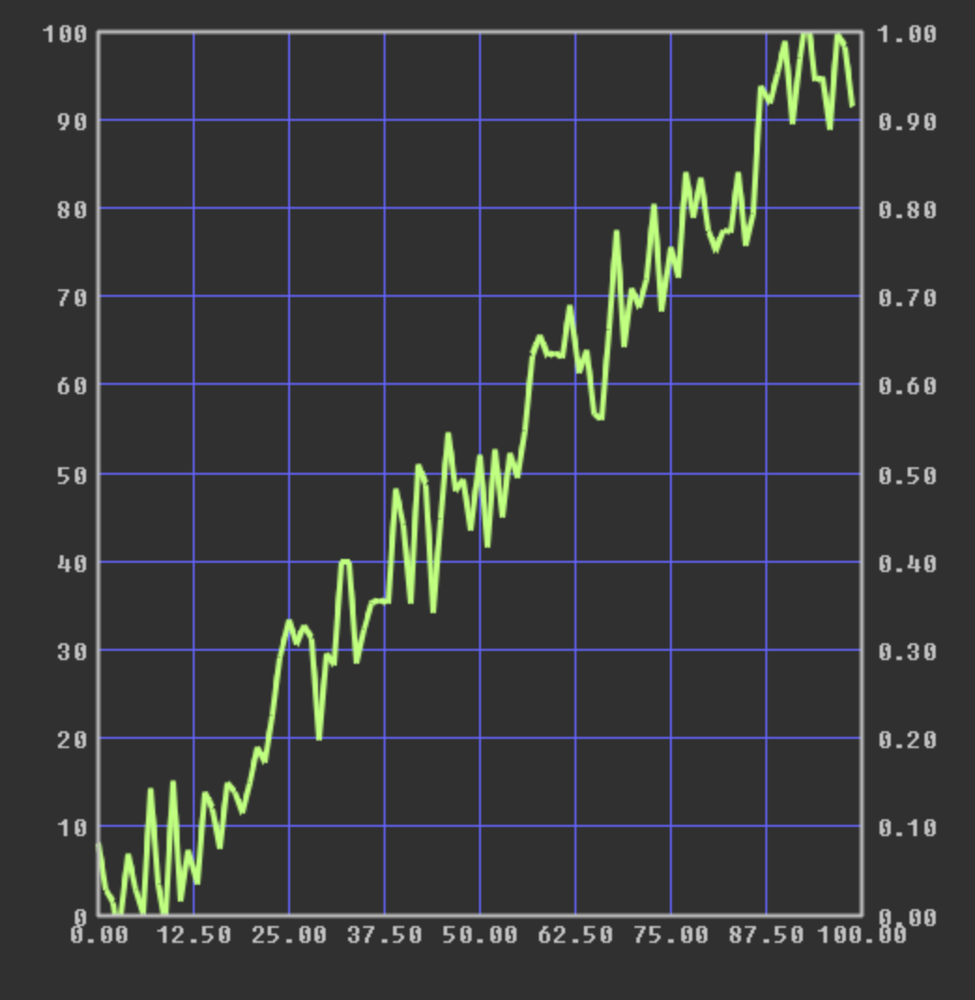

因为实在太多了,因此我无法为你列举所有的组件,如果你希望知道这个组件的具体用法和这个组件到底做什么的,你可以访问PainterEngine的
[组件市场](https://market.painterengine.com/),在那里你可以找到PainterEngine内置组件和三方组件的说明和示例代码。


## 12.实现自己的PainterEngine组件

 PainterEngine鼓励组件式的开发架构。也就是说，不论是游戏还是GUI交互程序，甚至是程序功能，我们都可以用组件的形式去开发它。

 组件式开发有点类似于C++中的Class，每一个组件，都要实现自己`Create` `Update` `Render` `Free`函数,关于上面四个函数,你可以使用
 参造[上面的对象传递机制这一章节](#8painterengine-对象传递机制)。

 为了演示这一点，让我们来实现一个“可控拖动旋转图片组件”，即我们可以用鼠标拖动图片在界面的位置，并用鼠标中键盘旋转它。

 为了实现这一个功能,让我们一步一步完成这个步骤,首先,为了创建一个组件,我们需要一个结构体来描述我们的组件,因为我们需要绘制图片,因此我们
 需要一个`px_texture`类型,同时,我们还需要旋转图片,因此它还有一个`rotation`用于描述旋转的角度

```c
#include "PainterEngine.h"
typedef struct
{
	px_texture image;
	px_int rotation;
}PX_Object_MyObject;

px_int main()
{
	PainterEngine_Initialize(800, 480);
	return PX_TRUE;
}
```

之后,我们需要定义我们的`Create` `Update` `Render` `Free`函数,其中`Update` `Render` `Free`我们有对应的格式,它们都有一个宏来简化我们的定义过程
```c
#define PX_OBJECT_RENDER_FUNCTION(name) px_void name(px_surface *psurface,PX_Object *pObject,px_int idesc,px_dword elapsed)
#define PX_OBJECT_UPDATE_FUNCTION(name) px_void name(PX_Object *pObject,px_int idesc,px_dword elapsed)
#define PX_OBJECT_FREE_FUNCTION(name) px_void name(PX_Object *pObject,px_int idesc)
``` 
那么,在主函数中,我们就可以这样定义我们的这几个函数

```c
#include "PainterEngine.h"
typedef struct
{
	px_texture image;
	px_int rotation;
}PX_Object_MyObject;

PX_OBJECT_UPDATE_FUNCTION(MyObjectUpdate)
{
}

PX_OBJECT_RENDER_FUNCTION(MyObjectRender)
{
	PX_Object_MyObject *pMyObject=PX_ObjectGetDesc(PX_Object_MyObject,pObject);
	PX_TextureRenderEx(psurface, &pMyObject->image, (px_int)pObject->x, (px_int)pObject->y, PX_ALIGN_CENTER,0,1, pMyObject->rotation);
}

PX_OBJECT_FREE_FUNCTION(MyObjectFree)
{
	PX_Object_MyObject *pMyObject=PX_ObjectGetDesc(PX_Object_MyObject,pObject);
	PX_TextureFree(&pMyObject->image);
}

px_int main()
{
	PainterEngine_Initialize(800, 480);
	return PX_TRUE;
}
```

* 其中,这个因为我们不需要更新一些物理信息,所以`MyObjectUpdate`函数中我们可以什么都不写,在`MyObjectRender`中我们只需要把图片绘制出来就可以了,这里我们先使用`PX_ObjectGetDesc`函数
获得我们定义好的结构体指针,它的第一个参数是结构体类型,第二个参数则是函数传递进来的`pObject`指针,然后我们只需要用`PX_TextureRenderEx`函数把图片绘制出来就可以了,
多提一句`PX_TextureRenderEx`函数用于在指定的表面上渲染纹理，并提供了对齐、混合、缩放和旋转等扩展选项。
其中
* psurface：指向要渲染纹理的表面的指针。
* resTexture：指向要渲染的纹理资源的指针。
* x：在表面上绘制纹理的x坐标。
* y：在表面上绘制纹理的y坐标。
* refPoint：对齐的参考点（例如，中心，左上角等）。
* blend：指向混合选项结构的指针（如果不需要混合，可以为NULL）。
* scale：纹理的缩放因子（1.0表示不缩放）。
* Angle：纹理的旋转角度，以度为单位。

最后,是时候编写创新对象的函数了,这里我们需要用到`PX_ObjectCreateEx`函数,`PX_ObjectCreateEx` 函数用于创建一个扩展对象，并初始化其属性和回调函数。它的参数说明如下:

* mp：指向内存池的指针，用于分配对象所需的内存。
* Parent：指向父对象的指针，如果没有父对象则为NULL。
* x：对象在x轴上的初始位置。
* y：对象在y轴上的初始位置。
* z：对象在z轴上的初始位置,z坐标会影响其渲染的先后顺序
* Width：对象的宽度。
* Height：对象的高度。
* Lenght：对象的长度,2D对象,一般可以是0
* type：对象的类型。
* Func_ObjectUpdate：指向对象更新函数的指针。
* Func_ObjectRender：指向对象渲染函数的指针。
* Func_ObjectFree：指向对象释放函数的指针。
* desc：指向对象描述数据的指针。你可以设置为0,创建时会把这个对象类型的数据填充为0,
* size：描述数据的大小,就是你定义的对象结构体类型的大小，创建对象函数会在内存池申请一段内存空间，并用于存储你的对象结构体。

在创建好一个空对象后,我们使用`PX_ObjectGetDescIndex`将对象中的对象结构体指针取出来,这是一个三参数的函数,第一个参数是对象结构体类型,第二个参数则是`PX_Object *`指针类型,因为一个`PX_Object`
可以将多个对象结构体组合在一起,这个组合结构体我们将在之后的教程中会进一步描述,但现在我们只需要知道,调用`PX_ObjectCreateEx`函数后,其第一个存储的对象结构体索引是0就可以了

取出结构体指针后,我们对其进行一系列初始化,比如加载图片和初始化旋转角度,最后在`main`函数中我们创建这个对象

```c
#include "PainterEngine.h"
typedef struct
{
	px_texture image;
	px_int rotation;
}PX_Object_MyObject;

PX_OBJECT_UPDATE_FUNCTION(MyObjectUpdate)
{
}

PX_OBJECT_RENDER_FUNCTION(MyObjectRender)
{
	PX_Object_MyObject *pMyObject=PX_ObjectGetDesc(PX_Object_MyObject,pObject);
	PX_TextureRenderEx(psurface, &pMyObject->image, (px_int)pObject->x, (px_int)pObject->y, PX_ALIGN_CENTER,0,1, pMyObject->rotation);//渲染图片
}

PX_OBJECT_FREE_FUNCTION(MyObjectFree)
{
	PX_Object_MyObject *pMyObject=PX_ObjectGetDesc(PX_Object_MyObject,pObject);
	PX_TextureFree(&pMyObject->image);//释放图片
}

PX_Object* PX_Object_MyObjectCreate(px_memorypool* mp, PX_Object* parent, px_float x, px_float y)
{
	PX_Object *pObject=PX_ObjectCreateEx(mp,parent,x,y,0,128,128,0,0, MyObjectUpdate, MyObjectRender, MyObjectFree,0,sizeof(PX_Object_MyObject));//创建一个空的自定义对象
	PX_Object_MyObject* pMyObject = PX_ObjectGetDescIndex(PX_Object_MyObject, pObject,0);//取得自定义对象数据
	pMyObject->rotation = 0;
	if(!PX_LoadTextureFromFile(mp,&pMyObject->image, "assets/test.png"))//加载图片
	{
		PX_ObjectDelete(pObject);//加载失败则删除对象
		return PX_NULL;
	}
	return pObject;
}

px_int main()
{
	PainterEngine_Initialize(800, 480);
	PX_Object_MyObjectCreate(mp,root,400,240);//创建一个自定义对象
	return PX_TRUE;
}
```

那么它的运行效果是这样的:


但现在还没有结束,我们怎么让我们的组件,响应鼠标中键盘实现旋转呢?还记得我们之前在[PushButton](#8painterengine-对象传递机制)中的对象传递机制么
现在,我们也要让我们的组件响应鼠标中键的信息,因此我们给它注册一个`PX_OBJECT_EVENT_CURSORWHEEL`事件的回调函数,代码如下:

```c
#include "PainterEngine.h"
typedef struct
{
	px_texture image;
	px_float rotation;
}PX_Object_MyObject;

PX_OBJECT_UPDATE_FUNCTION(MyObjectUpdate)
{
}

PX_OBJECT_RENDER_FUNCTION(MyObjectRender)
{
	PX_Object_MyObject *pMyObject=PX_ObjectGetDesc(PX_Object_MyObject,pObject);
	PX_TextureRenderEx(psurface, &pMyObject->image, (px_int)pObject->x, (px_int)pObject->y, PX_ALIGN_CENTER,0,1, pMyObject->rotation);//渲染图片
}

PX_OBJECT_FREE_FUNCTION(MyObjectFree)
{
	PX_Object_MyObject *pMyObject=PX_ObjectGetDesc(PX_Object_MyObject,pObject);
	PX_TextureFree(&pMyObject->image);//释放图片
}

PX_OBJECT_EVENT_FUNCTION(MyObjectOnCursorWheel)
{
	PX_Object_MyObject *pMyObject=PX_ObjectGetDescIndex(PX_Object_MyObject,pObject,0);
	if(PX_ObjectIsCursorInRegion(pObject,e))//Object是鼠标位置是否选中当前组件，e是事件
		pMyObject->rotation += (px_float)PX_Object_Event_GetCursorZ(e)/10;
}

PX_Object* PX_Object_MyObjectCreate(px_memorypool* mp, PX_Object* parent, px_float x, px_float y)
{
	PX_Object *pObject=PX_ObjectCreateEx(mp,parent,x,y,0,128,128,0,0, MyObjectUpdate, MyObjectRender, MyObjectFree,0,sizeof(PX_Object_MyObject));//创建一个空的自定义对象
	PX_Object_MyObject* pMyObject = PX_ObjectGetDescIndex(PX_Object_MyObject, pObject,0);//取得自定义对象数据
	pMyObject->rotation = 0;
	if(!PX_LoadTextureFromFile(mp,&pMyObject->image, "assets/test.png"))//加载图片
	{
		PX_ObjectDelete(pObject);//加载失败则删除对象
		return PX_NULL;
	}
	PX_ObjectRegisterEvent(pObject,PX_OBJECT_EVENT_CURSORWHEEL,MyObjectOnCursorWheel,0);//注册鼠标滚轮事件
	return pObject;
}

px_int main()
{
	PainterEngine_Initialize(800, 480);
	PX_Object_MyObjectCreate(mp,root,400,240);//创建一个自定义对象
	return PX_TRUE;
}
```

运行结果如下:


如果你觉得旋转图的质量不好,有很多锯齿,这是因为`PX_TextureRenderEx`旋转时是对原图直接采样的,如果你想要高质量的旋转图,你可以用`PX_TextureRenderRotation`函数来替换原函数:

```c
PX_OBJECT_RENDER_FUNCTION(MyObjectRender)
{
	PX_Object_MyObject *pMyObject=PX_ObjectGetDesc(PX_Object_MyObject,pObject);
	PX_TextureRenderRotation(psurface, &pMyObject->image, (px_int)pObject->x, (px_int)pObject->y, PX_ALIGN_CENTER,0, pMyObject->rotation);//渲染图片
}

```


那么,我们如何实现拖动效果呢,想要做到拖动效果,我们在对象结构体中,新增`float`类型的变量`x`,`y`,用来记录
当鼠标选中图片时的位置,同时我们加入了`bool`类型的变量`bselect`,表示当前的图标是否被选中,当鼠标点击我们的图标
以后,我们就可以监听`PX_OBJECT_EVENT_CURSORDRAG`事件,这是鼠标在屏幕上拖动时会产生的事件,我们通过坐标的偏移,
移动我们的组件,最后,不论鼠标非拖动时的移动或鼠标左键抬起,都会取消我们组件的选中状态,在对应处理函数中取消选中状态
即可。

```c
#include "PainterEngine.h"
typedef struct
{
	px_float last_cursorx, last_cursory;
	px_bool bselect;
	px_texture image;
	px_float rotation;
}PX_Object_MyObject;

PX_OBJECT_UPDATE_FUNCTION(MyObjectUpdate)
{
}

PX_OBJECT_RENDER_FUNCTION(MyObjectRender)
{
	PX_Object_MyObject *pMyObject=PX_ObjectGetDesc(PX_Object_MyObject,pObject);
	PX_TextureRenderRotation(psurface, &pMyObject->image, (px_int)pObject->x, (px_int)pObject->y, PX_ALIGN_CENTER,0, (px_int)pMyObject->rotation);//渲染图片
}

PX_OBJECT_FREE_FUNCTION(MyObjectFree)
{
	PX_Object_MyObject *pMyObject=PX_ObjectGetDesc(PX_Object_MyObject,pObject);
	PX_TextureFree(&pMyObject->image);//释放图片
}

PX_OBJECT_EVENT_FUNCTION(MyObjectOnCursorWheel)
{
	PX_Object_MyObject *pMyObject=PX_ObjectGetDescIndex(PX_Object_MyObject,pObject,0);
	if(PX_ObjectIsCursorInRegionAlign(pObject,e,PX_ALIGN_CENTER))//Object是鼠标位置是否选中当前组件，e是事件
		pMyObject->rotation += (px_float)PX_Object_Event_GetCursorZ(e)/10;
}

PX_OBJECT_EVENT_FUNCTION(MyObjectOnCursorDown)
{
	PX_Object_MyObject* pMyObject = PX_ObjectGetDescIndex(PX_Object_MyObject, pObject, 0);
	if (PX_ObjectIsCursorInRegionAlign(pObject, e, PX_ALIGN_CENTER))//Object是鼠标位置是否选中当前组件，e是事件
	{
		pMyObject->bselect = PX_TRUE;
		pMyObject->last_cursorx = PX_Object_Event_GetCursorX(e);
		pMyObject->last_cursory = PX_Object_Event_GetCursorY(e);
	}
}

PX_OBJECT_EVENT_FUNCTION(MyObjectOnCursorRelease)
{
	PX_Object_MyObject* pMyObject = PX_ObjectGetDescIndex(PX_Object_MyObject, pObject, 0);
	pMyObject->bselect = PX_FALSE;
}

PX_OBJECT_EVENT_FUNCTION(MyObjectOnCursorDrag)
{
	PX_Object_MyObject* pMyObject = PX_ObjectGetDescIndex(PX_Object_MyObject, pObject, 0);
	if (pMyObject->bselect)
	{
		pObject->x += PX_Object_Event_GetCursorX(e) - pMyObject->last_cursorx;
		pObject->y += PX_Object_Event_GetCursorY(e) - pMyObject->last_cursory;
	}
	pMyObject->last_cursorx = PX_Object_Event_GetCursorX(e);
	pMyObject->last_cursory = PX_Object_Event_GetCursorY(e);
}

PX_Object* PX_Object_MyObjectCreate(px_memorypool* mp, PX_Object* parent, px_float x, px_float y)
{
	PX_Object *pObject=PX_ObjectCreateEx(mp,parent,x,y,0,128,128,0,0, MyObjectUpdate, MyObjectRender, MyObjectFree,0,sizeof(PX_Object_MyObject));//创建一个空的自定义对象
	PX_Object_MyObject* pMyObject = PX_ObjectGetDescIndex(PX_Object_MyObject, pObject,0);//取得自定义对象数据
	pMyObject->rotation = 0;
	if(!PX_LoadTextureFromFile(mp,&pMyObject->image, "assets/test.png"))//加载图片
	{
		PX_ObjectDelete(pObject);//加载失败则删除对象
		return PX_NULL;
	}
	PX_ObjectRegisterEvent(pObject,PX_OBJECT_EVENT_CURSORWHEEL,MyObjectOnCursorWheel,0);//注册鼠标滚轮事件
	PX_ObjectRegisterEvent(pObject,PX_OBJECT_EVENT_CURSORDRAG,MyObjectOnCursorDrag,0);//注册鼠标拖拽事件
	PX_ObjectRegisterEvent(pObject,PX_OBJECT_EVENT_CURSORDOWN,MyObjectOnCursorDown,0);//注册鼠标按下事件
	PX_ObjectRegisterEvent(pObject,PX_OBJECT_EVENT_CURSORUP,MyObjectOnCursorRelease,0);//注册鼠标释放事件
	PX_ObjectRegisterEvent(pObject, PX_OBJECT_EVENT_CURSORMOVE, MyObjectOnCursorRelease, 0);//注册鼠标释放事件
	return pObject;
}

px_int main()
{
	PainterEngine_Initialize(800, 480);
	PX_Object_MyObjectCreate(mp,root,400,240);//创建一个自定义对象
	return PX_TRUE;
}
```


当然,你可以调用`PX_Object_MyObjectCreate`多次,创建多个组件对象,它们的功能都是一样的

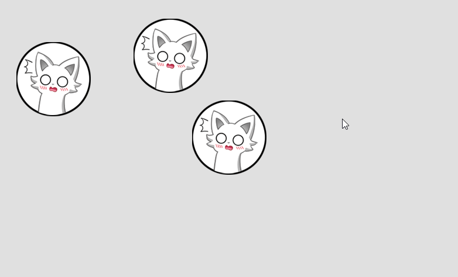

## 13.组合式组件设计

PainterEngine的组件,允许同时拥有多种组件类型,例如,当我们将一个图片框组件和一个按钮进行组合,我们就可以得到一个组合式组件图片按钮。

参考如下代码：

```c
#include "PainterEngine.h"
px_texture tex1, tex2;
PX_Object* image;

PX_OBJECT_EVENT_FUNCTION(ButtonEvent)
{
	PX_Object_Image *pImage=PX_Object_GetImage(pObject);//取得Image对象数据
	PX_Object_Button *pButton=PX_Object_GetButton(pObject);//取得Button对象数据
	if (pImage->pTexture==&tex1)
	{
		PX_Object_ImageSetTexture(pObject,&tex2);
	}
	else
	{
		PX_Object_ImageSetTexture(pObject,&tex1);
	}
}

px_int main()
{
	PainterEngine_Initialize(800, 480);
	if(!PX_LoadTextureFromFile(mp_static,&tex1,"assets/1.png")) return 0;//加载纹理1
	if(!PX_LoadTextureFromFile(mp_static,&tex2,"assets/2.png")) return 0;//加载纹理2
	image=PX_Object_ImageCreate(mp,root,300,140,200,200,&tex1);//创建Image对象
	PX_Object_ButtonAttachObject(image, 1, PX_COLOR(64, 255, 255, 255), PX_COLOR(96, 255, 255, 255));//将一个Button对象类型组合到Image对象上
	PX_ObjectRegisterEvent(image,PX_OBJECT_EVENT_EXECUTE,ButtonEvent,0);//这里实际上是注册Button对象的事件
	return 1;
}
```

我们创建了一个Image图像框类型,然后将一个Button对象类型组合上去,这样我们就获得了一个图片按钮

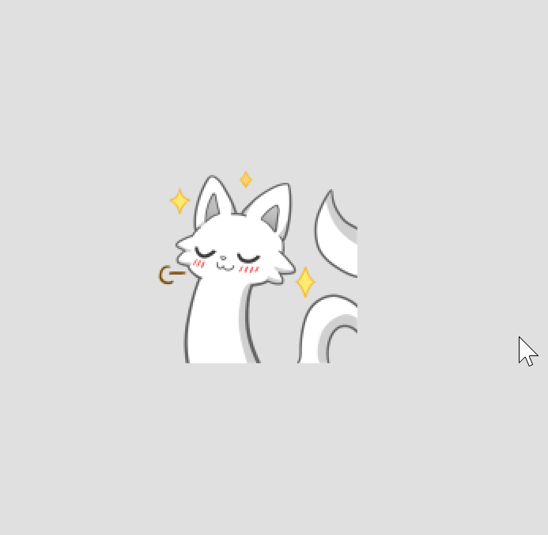

那么,我们如何设计我们自己的可组合对象呢,那么回到我们的第十二章节,现在,我们就将"可拖拽"这个功能,将它设计成一个组合式组件。

首先，仍然是定一个一个组件对象结构体，需要实现拖拽功能，我们需要鼠标按下时候的x,y坐标,同时需要一个bool类型记录是否是选中状态,
然后我们需要注册CURSOR事件,这些事件在上一章节我们已经写过了,最后,我们用`PX_ObjectCreateDesc`函数创建一个对象结构体并将它Attach
到我们的对象上。

`PX_ObjectCreateDesc`是一个对象结构体创建函数,它的定义原型如下
```c
px_void* PX_ObjectCreateDesc(PX_Object* pObject, px_int idesc, px_int type, Function_ObjectUpdate Func_ObjectUpdate, Function_ObjectRender Func_ObjectRender, Function_ObjectFree Func_ObjectFree, px_void* pDesc, px_int descSize)
```

第一个参数是需要Attach的对象,第二个参数是Attach到的对象索引,还记得我们之前提到的对象数据索引么,使用`PX_ObjectCreateEx`默认使用的是索引0,因此,如果我们要附加到一个对象
上,我们应该选1,当然如果1也被占用了,他就是2,以此类推,第三个参数是对象类型,我们使用`PX_ObjectGetDescByType`时,可以通过对象类型取出对应的指针,然后就是我们熟悉的`Update``Render``Free`三件套了,最后一个参数
给出其结构体描述和结构体大小,请参阅下面的代码:

```c
#include "PainterEngine.h"
typedef struct
{
	px_float last_cursorx, last_cursory;
	px_bool bselect;
}PX_Object_Drag;


PX_OBJECT_EVENT_FUNCTION(PX_Object_DragOnCursorDown)
{
	PX_Object_Drag* pPX_Object_Drag = PX_ObjectGetDescByType(pObject, PX_OBJECT_TYPE_DRAG);
	if (PX_ObjectIsCursorInRegionAlign(pObject, e, PX_ALIGN_LEFTTOP))
	{
		pPX_Object_Drag->bselect = PX_TRUE;
		pPX_Object_Drag->last_cursorx = PX_Object_Event_GetCursorX(e);
		pPX_Object_Drag->last_cursory = PX_Object_Event_GetCursorY(e);
	}
}

PX_OBJECT_EVENT_FUNCTION(PX_Object_DragOnCursorRelease)
{
	PX_Object_Drag* pPX_Object_Drag = PX_ObjectGetDescByType(pObject, PX_OBJECT_TYPE_DRAG);
	pPX_Object_Drag->bselect = PX_FALSE;
}

PX_OBJECT_EVENT_FUNCTION(PX_Object_DragOnCursorDrag)
{
	PX_Object_Drag* pPX_Object_Drag = PX_ObjectGetDescByType(pObject, PX_OBJECT_TYPE_DRAG);
	if (pPX_Object_Drag->bselect)
	{
		pObject->x += PX_Object_Event_GetCursorX(e) - pPX_Object_Drag->last_cursorx;
		pObject->y += PX_Object_Event_GetCursorY(e) - pPX_Object_Drag->last_cursory;
	}
	pPX_Object_Drag->last_cursorx = PX_Object_Event_GetCursorX(e);
	pPX_Object_Drag->last_cursory = PX_Object_Event_GetCursorY(e);
}


PX_Object* PX_Object_DragAttachObject(PX_Object* pObject, px_int attachIndex)
{
	PX_Object_Drag* pDesc;


	PX_ASSERTIF(pObject == PX_NULL);
	PX_ASSERTIF(attachIndex < 0 || attachIndex >= PX_COUNTOF(pObject->pObjectDesc));
	PX_ASSERTIF(pObject->pObjectDesc[attachIndex] != PX_NULL);
	pDesc = (PX_Object_Drag*)PX_ObjectCreateDesc(pObject, attachIndex, PX_OBJECT_TYPE_DRAG, 0, 0, 0, 0, sizeof(PX_Object_Drag));
	PX_ASSERTIF(pDesc == PX_NULL);
	PX_ObjectRegisterEvent(pObject, PX_OBJECT_EVENT_CURSORDRAG, PX_Object_DragOnCursorDrag, 0);
	PX_ObjectRegisterEvent(pObject, PX_OBJECT_EVENT_CURSORDOWN, PX_Object_DragOnCursorDown, 0);
	PX_ObjectRegisterEvent(pObject, PX_OBJECT_EVENT_CURSORUP, PX_Object_DragOnCursorRelease, 0);
	PX_ObjectRegisterEvent(pObject, PX_OBJECT_EVENT_CURSORMOVE, PX_Object_DragOnCursorRelease, 0);
	return pObject;
}

px_texture tex1;
PX_Object* image;

px_int main()
{
	PainterEngine_Initialize(800, 480);
	if(!PX_LoadTextureFromFile(mp_static,&tex1,"assets/1.png")) return 0;//加载纹理1
	image=PX_Object_ImageCreate(mp,root,300,140,200,200,&tex1);//创建Image对象
	PX_Object_DragAttachObject(image, 1);//将一个Drag对象类型组合到Image对象上
	return 1;
}
```

运行结果如下:


## 14.粒子系统

PainterEngine提供了一个粒子系统实现,下面是一个例子系统的示范程序

```c
#include "PainterEngine.h"

PX_OBJECT_EVENT_FUNCTION(MyClick)
{
	px_float x = PX_Object_Event_GetCursorX(e);
	px_float y = PX_Object_Event_GetCursorY(e);

	PX_Object_Explosion05Create(mp, root, x, y, 10, 20);
}

px_int main()
{
	PainterEngine_Initialize(800, 600);
	PX_ObjectRegisterEvent(root, PX_OBJECT_EVENT_CURSORDOWN, MyClick, PX_NULL);
	return 0;
}
```


这是一个用组件包装起来的粒子系统实现,另外一种是提供了更加详细的粒子系统参数配置:

```c
#include "PainterEngine.h"
px_texture texture;

int main()
{
	PX_Object* pObject;
	PX_ParticalLauncher_InitializeInfo ParticalInfo;
	PainterEngine_Initialize(600, 400);
	PX_LoadTextureFromFile(mp_static, &texture, "assets/star.traw");

	PX_ParticalLauncherInitializeDefaultInfo(&ParticalInfo);
	ParticalInfo.deviation_rangAngle = 360;
	ParticalInfo.deviation_velocity_max = 50;
	ParticalInfo.deviation_velocity_min = -50;
	ParticalInfo.direction = PX_POINT(0, -1, 0);
	ParticalInfo.generateDuration = 100;
	ParticalInfo.launchCount = -1;
	ParticalInfo.maxCount = 100;
	ParticalInfo.position = PX_POINT(0, 0, 0);
	ParticalInfo.tex = &texture;
	ParticalInfo.velocity = 100;
	ParticalInfo.alive = 5000;
	ParticalInfo.rotation = 180;
	ParticalInfo.deviation_rotation = 180;
	ParticalInfo.atomsize = 0.7f;
	ParticalInfo.deviation_atomsize_max = 0.7f;
	ParticalInfo.deviation_atomsize_min = -0.5f;
	ParticalInfo.alpha = 0.8f;
	ParticalInfo.deviation_alpha = 0.3f;
	ParticalInfo.deviation_hdrR = 0.5f;
	ParticalInfo.deviation_hdrG = 0.5f;
	ParticalInfo.deviation_hdrB = 0.5f;
	ParticalInfo.alphaincrease = -0.2f;

	pObject=PX_Object_ParticalCreate(mp,root,300,200,ParticalInfo);
	return 0;
}
```
以下是这段代码的主要功能和流程解释：

1. `#include "PainterEngine.h"`：引入PainterEngine的头文件，以便使用引擎的功能。

2. `px_texture texture;`：声明一个名为`texture`的变量，用于存储纹理信息。

3. `int main()`：主函数的入口点。

4. `PX_Object* pObject;`：声明一个名为`pObject`的指向`PX_Object`类型的指针，将用于创建粒子系统对象。

5. `PX_ParticalLauncher_InitializeInfo ParticalInfo;`：声明一个名为`ParticalInfo`的结构体变量，用于配置粒子发射器的初始化信息。

6. `PainterEngine_Initialize(600, 400);`：初始化PainterEngine，设置窗口的宽度为600像素，高度为400像素。

7. `PX_LoadTextureFromFile(mp_static, &texture, "assets/star.traw");`：从文件加载纹理，将纹理数据存储在`texture`变量中。纹理文件路径为"assets/star.traw"。

8. `PX_ParticalLauncherInitializeDefaultInfo(&ParticalInfo);`：初始化`ParticalInfo`结构体，设置了一些默认的粒子发射器属性。

9. 针对`ParticalInfo`的各个属性进行了具体的配置，包括粒子的位置、速度、寿命、大小、旋转等。这些属性决定了粒子的外观和行为。

10. `pObject=PX_Object_ParticalCreate(mp,root,300,200,ParticalInfo);`：使用配置好的`ParticalInfo`创建一个粒子系统对象，并将其存储在`pObject`中。这个粒子系统对象将会在窗口中的位置(300, 200)处发射粒子。


其中`PX_ParticalLauncher_InitializeInfo`，它用于配置粒子发射器的初始化信息，即在创建粒子系统时，可以通过填充这个结构体来指定粒子系统的各种属性和行为。以下是该结构体的各个成员的说明：

1. `px_void *userptr;`：一个指向任意类型数据的指针，可用于存储用户自定义的数据。

2. `px_texture *tex;`：指向纹理数据的指针，用于指定粒子的纹理图像。

3. `px_point position;`：一个包含x、y、z坐标的点，表示粒子系统的初始位置。

4. `px_float deviation_position_distanceRange;`：一个浮点数，用于指定粒子的位置偏移范围。

5. `px_point direction;`：一个包含x、y、z坐标的点，表示粒子的初始运动方向。

6. `px_float deviation_rangAngle;`：一个浮点数，用于指定粒子的初始运动方向偏移范围（角度）。

7. `px_float velocity;`：一个浮点数，表示粒子的初始速度。

8. `px_float deviation_velocity_max;`：一个浮点数，表示粒子速度的最大偏移值。

9. `px_float deviation_velocity_min;`：一个浮点数，表示粒子速度的最小偏移值。

10. `px_float atomsize;`：一个浮点数，表示粒子的初始大小。

11. `px_float deviation_atomsize_max;`：一个浮点数，表示粒子大小的最大偏移值。

12. `px_float deviation_atomsize_min;`：一个浮点数，表示粒子大小的最小偏移值。

13. `px_float rotation;`：一个浮点数，表示粒子的初始旋转角度。

14. `px_float deviation_rotation;`：一个浮点数，表示粒子旋转角度的偏移范围。

15. `px_float alpha;`：一个浮点数，表示粒子的初始透明度。

16. `px_float deviation_alpha;`：一个浮点数，表示粒子透明度的偏移范围。

17. `px_float hdrR;`：一个浮点数，表示粒子的初始红色通道值。

18. `px_float deviation_hdrR;`：一个浮点数，表示粒子红色通道值的偏移范围。

19. `px_float hdrG;`：一个浮点数，表示粒子的初始绿色通道值。

20. `px_float deviation_hdrG;`：一个浮点数，表示粒子绿色通道值的偏移范围。

21. `px_float hdrB;`：一个浮点数，表示粒子的初始蓝色通道值。

22. `px_float deviation_hdrB;`：一个浮点数，表示粒子蓝色通道值的偏移范围。

23. `px_float sizeincrease;`：一个浮点数，表示粒子大小的增加率。

24. `px_float alphaincrease;`：一个浮点数，表示粒子透明度的增加率。

25. `px_point a;`：一个包含x、y、z坐标的点，用于自定义属性。

26. `px_float ak;`：一个浮点数，用于自定义属性。

27. `px_int alive;`：一个整数，表示粒子的生存时间（毫秒）。

28. `px_int generateDuration;`：一个整数，表示粒子发射器的生成周期（毫秒）。

29. `px_int maxCount;`：一个整数，表示粒子系统中最大的粒子数量。

30. `px_int launchCount;`：一个整数，表示粒子系统的发射次数。

31. `PX_ParticalLauncher_CreateAtom Create_func;`：一个函数指针，用于指定自定义的粒子创建函数。

32. `PX_ParticalLauncher_UpdateAtom Update_func;`：一个函数指针，用于指定自定义的粒子更新函数。

这个结构体允许你灵活地配置粒子系统的各种属性，以满足不同场景和效果的需求。通过调整这些属性，你可以控制粒子的外观、运动轨迹、生命周期等方面的行为。

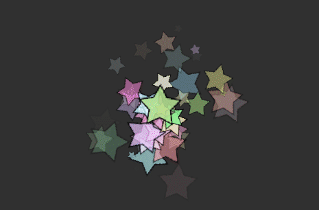

## 15.使用PainterEngine播放音乐

PainterEngine内置了对`wav`及`mp3`格式音乐的原生支持，使用PainterEngine播放音乐的代码十分简单

```c
#include "PainterEngine.h"

PX_SoundData sounddata;//定义音乐格式
int main()
{
	PX_Object* pObject;
	PainterEngine_Initialize(600, 400);
	PainterEngine_InitializeAudio();//初始化混音器及音乐设备
	if (!PX_LoadSoundFromFile(mp_static, &sounddata, "assets/bliss.wav"))return PX_FALSE;//加载音乐,支持wav及mp3格式
	PX_SoundPlayAdd(soundplay, PX_SoundCreate(&sounddata, PX_TRUE));//播放音乐
	pObject = PX_Object_SoundViewCreate(mp,root,0,0,600,400,soundplay);//音乐频谱可视化组件,可选
	return 0;
}
```

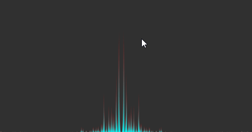

其中,`PX_LoadSoundFromFile`函数从文件中加载音乐,并解码成`sounddata`类型。
`PX_SoundCreate`可以用`sounddata`创建一个播放实例,第二个参数表示这个实例是否循环播放,最后使用`PX_SoundPlayAdd`将播放实例送入混音器中,即可完成音乐播放。


## 16.PainterEngine Live2D动画系统

PainterEngine内置了一个类live2D动画系统，可以加载live2d动画，参考代码如下：

```c
#include "PainterEngine.h"

PX_LiveFramework liveframework;
PX_Object* pObject;

PX_OBJECT_EVENT_FUNCTION(onClick)
{
	PX_Object_Live2DPlayAnimationRandom(pObject);
}

int main()
{
	
	PX_IO_Data iodata;
	PainterEngine_Initialize(600, 600);
	//加载模型数据
	iodata = PX_LoadFileToIOData("assets/release.live");
	if (iodata.size == 0)return PX_FALSE;
	PX_LiveFrameworkImport(mp_static, &liveframework, iodata.buffer, iodata.size);
	PX_FreeIOData(&iodata);
	//创建Live2D对象
	pObject = PX_Object_Live2DCreate(mp,root,300,300,&liveframework);
	PX_ObjectRegisterEvent(pObject, PX_OBJECT_EVENT_CURSORDOWN, onClick, PX_NULL);

	return 0;
}

```

以下是与Live2D模型预览器相关的函数的说明：

`PX_Object_Live2DCreate`

```c
PX_Object* PX_Object_Live2DCreate(px_memorypool* mp, PX_Object* Parent, px_int x, px_int y, PX_LiveFramework *pLiveFramework);
```

- **描述**: 创建一个Live2D模型预览器对象，用于在图形界面中显示和交互Live2D模型。
- **参数**:
  - `mp`: 内存池指针，用于分配内存。
  - `Parent`: 父对象，Live2D模型预览器对象将作为其子对象。
  - `x`, `y`: Live2D模型预览器对象的位置坐标。
  - `pLiveFramework`: Live2D模型框架的指针，包括模型数据、纹理等信息。
- **返回值**: 创建的Live2D模型预览器对象的指针。

`PX_Object_Live2DPlayAnimation`

```c
px_void PX_Object_Live2DPlayAnimation(PX_Object *pObject, px_char *name);
```

- **描述**: 播放指定名称的Live2D模型动画。
- **参数**:
  - `pObject`: Live2D模型预览器对象的指针。
  - `name`: 动画名称。
- **返回值**: 无。

`PX_Object_Live2DPlayAnimationRandom`

```c
px_void PX_Object_Live2DPlayAnimationRandom(PX_Object* pObject);
```

- **描述**: 随机播放Live2D模型的动画。
- **参数**:
  - `pObject`: Live2D模型预览器对象的指针。
- **返回值**: 无。

`PX_Object_Live2DPlayAnimationIndex`

```c
px_void PX_Object_Live2DPlayAnimationIndex(PX_Object* pObject, px_int index);
```

- **描述**: 播放Live2D模型的指定索引处的动画。
- **参数**:
  - `pObject`: Live2D模型预览器对象的指针。
  - `index`: 动画的索引。
- **返回值**: 无。

这些函数用于创建、配置和管理Live2D模型预览器对象，以在图形用户界面中显示和交互Live2D模型。可以使用这些函数播放Live2D模型的动画，包括指定名称、随机选择和指定索引处的动画。


## PainterEngine 脚本引擎

PainterEngine内置了一个平台无关的脚本引擎系统，集成了编译，运行，调试等功能，你可以很轻松的在脚本之上，实现并行调度功能，
PainterEngine Script的设计，最大程度和C语言保持一致性，并对一些类型进行的拓展和简化。

例如在脚本中，支持`int`,`float`,`string`,`memory`四种类型,`int`类型是一个32位的有符号整数,`float`是一个浮点数类型,这个和C语言的类型保持了一致。
`string`类型类似于C++的`string`,它允许直接用`+`法运算符进行字符串拼接,使用`strlen`来获取其字符串长度,而`memory`是一个二进制数据存储类型,同样支持`+`运算
进行拼接。

在脚本中如果需要调用C语言函数，应该使用`PX_VM_HOST_FUNCTION`宏进行定义声明,和组件回调函数一样,`PX_VM_HOST_FUNCTION`的定义如下:

```c
#define PX_VM_HOST_FUNCTION(name) px_bool name(PX_VM *Ins,px_void *userptr)
```
在下面的内容中,我将以一个简单的脚本实例作为范例,为你演示如何使用PainterEngine的脚本引擎。

```c
const px_char shellcode[] = "\
#name \"main\"\n\
host void print(string s);\n\
host void sleep(int ms);\n\
int main()\n\
{\n\
 int i,j;\n\
 for(i = 1; i <= 9; i++)\n\
 {\n\
  for(j = 1; j <= i; j++)\n\
   {\n\
     print(string(i) + \" * \" + string(j) + \" = \" + string(i * j));\n\
     sleep(1000);\n\
   }\n\
 }\n\
}";

PX_VM_HOST_FUNCTION(host_print)
{
	if (PX_VM_HOSTPARAM(Ins, 0).type == PX_VARIABLE_TYPE_STRING)
	{
		PainterEngine_Print(PX_VM_HOSTPARAM(Ins, 0)._string.buffer);
	}
	return PX_TRUE;
}

PX_VM_HOST_FUNCTION(host_sleep)
{
	if (PX_VM_HOSTPARAM(Ins, 0).type == PX_VARIABLE_TYPE_INT)
	{
		PX_VM_Sleep(Ins,PX_VM_HOSTPARAM(Ins, 0)._int);
	}
	return PX_TRUE;
}

```

首先,shellcode数组中存储着一个输出99乘法表的程序,其中需要调用两个host函数(脚本调用c语言函数称为host call,因此host函数实际就是专门提供给脚本调用的c语言函数),
一个是`print`函数,一个是`sleep`函数,因此在下面,我们定义了两个host函数,`PX_VM_HOSTPARAM`用于取得脚本传递过来的参数,在这里,我们需要判断传递过来的参数类型是否
符合我们的调用规则,像`host_print`函数,作用是在PainterEngine中输出字符串,而`sleep`函数,则是用来延迟一段时间。

现在，PainterEngine Script是一个编译型脚本,我们需要将上面的代码编译成二进制形式,然后将它送入虚拟机中运行,观察以下代码

```c
PX_VM vm;
PX_OBJECT_UPDATE_FUNCTION(VMUpdate)
{
	PX_VMRun(&vm, 0xffff, elapsed);//运行虚拟机
}

px_int main()
{
	PX_Compiler compiler;
	px_memory bin;
	PainterEngine_Initialize(800, 600);
	PainterEngine_SetBackgroundColor(PX_COLOR_BLACK);
	PX_CompilerInitialize(mp, &compiler);//初始化编译器
	PX_CompilerAddSource(&compiler, shellcode);//编译器中添加代码
	PX_MemoryInitialize(mp, &bin);//初始化内存/用于存储编译后的结果
	if (!PX_CompilerCompile(&compiler, &bin, 0, "main"))
	{
		//编译失败
		return 0;
	}
	PX_CompilerFree(&compiler);//释放编译器
	PX_VMInitialize(&vm,mp,bin.buffer,bin.usedsize);//初始化虚拟机
	PX_VMRegisterHostFunction(&vm, "print", host_print,0);//注册主机函数print
	PX_VMRegisterHostFunction(&vm, "sleep", host_sleep,0);//注册主机函数sleep
	PX_VMBeginThreadFunction(&vm, 0, "main", PX_NULL, 0);//开始运行虚拟机函数
	PX_ObjectSetUpdateFunction(root, VMUpdate, 0);//设置更新函数

	return 0;
}
```

首先我们用`PX_Compiler`编译我们的脚本,然后我们注册我们的host call,`PX_VMBeginThreadFunction`的功能是C语言调用脚本语言中函数,在这里
我们调用脚本中的`main`开始运行我们的脚本函数,最后我们将一个Update函数绑定到root节点,以循环更新虚拟机,来执行脚本。

最后，看看运行的结果。


如果我们想要对脚本进行调试，我们还可以再编译期间，创建一个符号映射表，这样我们就可以直接用`PX_Object_DebuggerMap`直接对脚本进行调试。

```c
px_int main()
{
	PX_Compiler compiler;
	px_memory bin;
	PainterEngine_Initialize(800, 480);
	PX_VMDebuggerMapInitialize(mp,&debugmap);
	PainterEngine_SetBackgroundColor(PX_COLOR_BLACK);
	PX_CompilerInitialize(mp, &compiler);//初始化编译器
	PX_CompilerAddSource(&compiler, shellcode);//编译器中添加代码
	PX_MemoryInitialize(mp, &bin);//初始化内存/用于存储编译后的结果
	if (!PX_CompilerCompile(&compiler, &bin, &debugmap, "main"))
	{
		//编译失败
		return 0;
	}
	PX_CompilerFree(&compiler);//释放编译器
	PX_VMInitialize(&vm,mp,bin.buffer,bin.usedsize);//初始化虚拟机
	PX_VMRegisterHostFunction(&vm, "print", host_print,0);//注册主机函数print
	PX_VMRegisterHostFunction(&vm, "sleep", host_sleep,0);//注册主机函数sleep
	PX_VMBeginThreadFunction(&vm, 0, "main", PX_NULL, 0);//开始运行虚拟机函数
	PX_Object *pDbgObject = PX_Object_AsmDebuggerCreate(mp, root, 0, 0, 800, 480, 0);
	pDbgObject->Visible = PX_TRUE;
	PX_Object_AsmDebuggerAttach(pDbgObject, &debugmap, &vm);
	return 0;
}
```


## 18.使用PainterEngine快速创作一个小游戏

为了更好的演示PainterEngine的使用,我将用PainterEngine创作一个简单的小游戏,你可以在document/game下找到有关这个游戏的所有
源码及原始素材,得益于PainterEngine的全平台可移植性你也可以在
[PainterEngine 在线应用APP--打地鼠](https://www.painterengine.com/main/app/documentgame/)中,直接玩到这个在线小游戏。

在这个小游戏中，我将充分为你展示，如何使用PainterEngine的组件化开发模式，快速创建一个App Game。

让我们先开始游戏创作的第一步，我们先准备好美术所需的资源及素材:


这是一个简单的游戏背景素材，然后我们就可以开始创建我们的`“main.c”`源代码文件,在PainterEngine中我们输入下面的代码

```c
px_int main()
{
	px_int i;
	PainterEngine_Initialize(800, 480);
	PX_FontModuleInitialize(mp_static,&score_fm);
	PX_FontModuleSetCodepage(&score_fm, PX_FONTMODULE_CODEPAGE_GBK);
	if (!PX_LoadTextureToResource(PainterEngine_GetResourceLibrary(), "assets/rasing.png", "fox_rasing")) return 0;
	if (!PX_LoadTextureToResource(PainterEngine_GetResourceLibrary(), "assets/taunt.png", "fox_taunt")) return 0;
	if (!PX_LoadTextureToResource(PainterEngine_GetResourceLibrary(), "assets/escape.png", "fox_escape")) return 0;
	if (!PX_LoadTextureToResource(PainterEngine_GetResourceLibrary(), "assets/beat.png", "fox_beat")) return 0;
	if (!PX_LoadTextureToResource(PainterEngine_GetResourceLibrary(), "assets/hurt.png", "fox_hurt")) return 0;
	if (!PX_LoadTextureToResource(PainterEngine_GetResourceLibrary(), "assets/mask.png", "fox_mask")) return 0;
	if (!PX_LoadTextureToResource(PainterEngine_GetResourceLibrary(), "assets/background.png", "background")) return 0;
	if (!PX_LoadAnimationToResource(PainterEngine_GetResourceLibrary(), "assets/song.2dx", "song"))return 0;
	PainterEngine_SetBackgroundTexture(PX_ResourceLibraryGetTexture(PainterEngine_GetResourceLibrary(), "background"));
	for (i = 0; i <= 9; i++)
	{
		px_texture tex;
		px_char path[64];
		PX_sprintf1(path,64, "assets/%1.png", PX_STRINGFORMAT_INT(i));
		if (PX_LoadTextureFromFile(mp,&tex,path))
		{
			PX_FontModuleAddNewTextureCharacter(&score_fm, '0' + i, &tex);
		}
		PX_TextureFree(&tex);
	}
}
```

在代码的开始阶段,我们初始化了一个800x480的窗口,然后我们初始化了字模,并用`PX_FontModuleSetCodepage`函数,设置了其为GBK字符集,再后面,我们就是把资源加载进PainterEngine的资源管理器中了;

### 加载资源及设置背景

PainterEngine内置了一个资源管理器，他在`PainterEngine_Initialize`中就被初始化了,使用的是`mp_static`内存池,资源管理器的作用是像数据库一样,将图片,音频,脚本.....素材加载到内存中,并将它映射为一个`key`,之后对资源的访问都是通过`key`进行的,资源管理器的映射做了专门的优化,因此你不必太担心映射查询带来的性能损耗问题。

`PX_LoadTextureToResource`函数用于将一个文件系统的资源加载到资源管理器中,第一个参数是这个资源管理器的实例指针,PainterEngine在初始化阶段会默认创建一个这样的管理器实例,因此你可以直接用`PainterEngine_GetResourceLibrary`获得它。第二个参数即需要加载文件的所在路径，第三个参数则是我们想映射的`key`了

在代码的下一步,我们使用`PX_LoadTextureToResource`加载了若干图片,`PX_LoadAnimationToResource`加载了一个2dx动画(请到应用市场查看2DX动画详细说明)最后，在游戏里我们并没有使用TTF字模文件，我们循环加载了`0.png`....`9.png`,并将这些纹理作为图片插入到字模中,这样这个字模绘制数字时,实际显示的就是我们的图片。

同时我们还调用了`PainterEngine_SetBackgroundTexture`设置PainterEngine界面的背景,请注意`PX_ResourceLibraryGetTexture`函数,它的作用是使用一个查询key,从资源管理器中取得这个图片的数据结构指针。以上完成后你将可以看到这样的界面。


### 设计游戏对象

我们先来设计第一个游戏对象，就是`开始游戏按钮`这一部分我们并不要写太多的代码,因为PainterEngine内置就有这种按钮的功能

```c
startgame = PX_Object_PushButtonCreate(mp, root, 300, 200, 200, 90, "Start Game", 0);
startgame->Visible = PX_TRUE;
PX_Object_PushButtonSetBackgroundColor(startgame, PX_COLOR(96, 255, 255, 255));
PX_Object_PushButtonSetPushColor(startgame, PX_COLOR(224, 255, 255, 255));
PX_Object_PushButtonSetCursorColor(startgame, PX_COLOR(168, 255, 255, 255));
```

我们使用了一系列函数,改变了按钮的背景颜色,鼠标悬停颜色和鼠标按下的颜色,因此你可以看到这样的情况

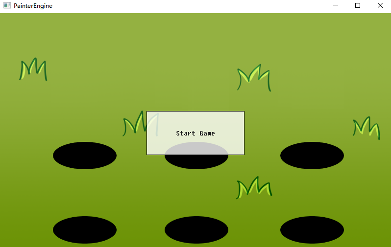

然后我们需要创建我们的游戏里的地鼠对象,这是游戏里最复杂的对象,我贴上详细代码,以逐步解释它们

```c
typedef enum
{
	PX_OBJECT_FOX_STATE_IDLE,//狐狸还在洞里
	PX_OBJECT_FOX_STATE_RASING,//狐狸正在升起
	PX_OBJECT_FOX_STATE_TAUNT,//狐狸在嘲讽
	PX_OBJECT_FOX_STATE_ESCAPE,//狐狸逃跑
	PX_OBJECT_FOX_STATE_BEAT,//狐狸被打
	PX_OBJECT_FOX_STATE_HURT,//狐狸受伤后逃跑
}PX_OBJECT_FOX_STATE;

typedef struct
{
	PX_OBJECT_FOX_STATE state;//狐狸状态
	px_dword elapsed;//状态持续时间
	px_float texture_render_offset;//纹理渲染偏移
	px_dword gen_rand_time;//生成随机时间
	px_float rasing_down_speed;//升起速度
	px_texture render_target;//渲染目标
	px_texture* pcurrent_display_texture;//当前显示的纹理
	px_texture* ptexture_mask;//遮罩
}PX_Object_Fox;

PX_OBJECT_UPDATE_FUNCTION(PX_Object_FoxOnUpdate)
{
	PX_Object_Fox* pfox=PX_ObjectGetDescByType(pObject,PX_OBJECT_TYPE_FOX);
	switch (pfox->state)
	{
		case PX_OBJECT_FOX_STATE_IDLE:
		{
			if (pfox->gen_rand_time ==0)
			{
				pfox->gen_rand_time = PX_rand() % 3000 + 1000;//狐狸在洞里的时间,时间到了就升起来
			}
			else
			{
				if (pfox->gen_rand_time <elapsed)//时间到了
				{
					//升起
					pfox->state = PX_OBJECT_FOX_STATE_RASING;
					pfox->elapsed = 0;
					pfox->gen_rand_time = 0;
					pfox->texture_render_offset = pObject->Height;
					//改变纹理
					pfox->pcurrent_display_texture= PX_ResourceLibraryGetTexture(PainterEngine_GetResourceLibrary(), "fox_rasing");
				}
				else
				{
					pfox->gen_rand_time -= elapsed;
				}
			}
		}
		break;
		case PX_OBJECT_FOX_STATE_RASING://狐狸升起
		{
			pfox->elapsed += elapsed;
			//升起纹理偏移量
			pfox->texture_render_offset -= pfox->rasing_down_speed * elapsed / 1000;
			if (pfox->texture_render_offset <= 0)
			{
				pfox->texture_render_offset = 0;
				pfox->state = PX_OBJECT_FOX_STATE_TAUNT;//升起后嘲讽
				pfox->elapsed = 0;
			}
		}
		break;
		case PX_OBJECT_FOX_STATE_TAUNT://狐狸嘲讽
		{
			pfox->elapsed += elapsed;
			if (pfox->elapsed>600&& pfox->elapsed <1500)//嘲讽时间
			{
				pfox->pcurrent_display_texture = PX_ResourceLibraryGetTexture(PainterEngine_GetResourceLibrary(), "fox_taunt");//嘲讽纹理
			}
			else if (pfox->elapsed>1500)//嘲讽结束
			{
				pfox->texture_render_offset = 0;
				pfox->state = PX_OBJECT_FOX_STATE_ESCAPE;//逃跑
				pfox->pcurrent_display_texture = PX_ResourceLibraryGetTexture(PainterEngine_GetResourceLibrary(), "fox_escape");//逃跑纹理
				pfox->elapsed = 0;
			}
		}
		break;
		case PX_OBJECT_FOX_STATE_BEAT://狐狸被打
		{
			pfox->elapsed += elapsed;
			if (pfox->elapsed>800)
			{
				pfox->pcurrent_display_texture = PX_ResourceLibraryGetTexture(PainterEngine_GetResourceLibrary(), "fox_hurt");//受伤纹理
				pfox->state = PX_OBJECT_FOX_STATE_ESCAPE;//逃跑
			}
		}
		break;
		case PX_OBJECT_FOX_STATE_ESCAPE:
		{
			pfox->elapsed += elapsed;
			pfox->texture_render_offset+=pfox->rasing_down_speed * elapsed / 1000;
			if (pfox->texture_render_offset >= pObject->Height)
			{
				pfox->texture_render_offset = pObject->Height;
				pfox->state = PX_OBJECT_FOX_STATE_IDLE;//逃跑结束
				pfox->elapsed = 0;//重置时间
				pfox->pcurrent_display_texture = PX_NULL;
			}
		}
		break;
	default:
		break;
	}
}

PX_OBJECT_RENDER_FUNCTION(PX_Object_FoxOnRender)
{
	PX_Object_Fox* pfox = PX_ObjectGetDescByType(pObject, PX_OBJECT_TYPE_FOX);
	px_float x,y,width,height;
	PX_OBJECT_INHERIT_CODE(pObject,x,y,width,height);
	PX_TextureClearAll(&pfox->render_target, PX_COLOR_NONE);//清空渲染目标
	if (pfox->pcurrent_display_texture)
	{
		PX_TextureRender(&pfox->render_target, pfox->pcurrent_display_texture, (px_int)pfox->render_target.width/2, (px_int)pfox->texture_render_offset, PX_ALIGN_MIDTOP, PX_NULL);//渲染狐狸
	}
	PX_TextureRenderMask(psurface, pfox->ptexture_mask, &pfox->render_target, (px_int)x, (px_int)y, PX_ALIGN_MIDBOTTOM, PX_NULL);//以遮罩形式绘制纹理
}


PX_OBJECT_FREE_FUNCTION(PX_Object_FoxFree)
{
	PX_Object_Fox* pfox = PX_ObjectGetDescByType(pObject, PX_OBJECT_TYPE_FOX);
	PX_TextureFree(&pfox->render_target);
}

PX_OBJECT_EVENT_FUNCTION(PX_Object_FoxOnClick)//狐狸被点击
{
	PX_Object_Fox* pfox = PX_ObjectGetDescByType(pObject, PX_OBJECT_TYPE_FOX);
	if (pfox->state == PX_OBJECT_FOX_STATE_TAUNT|| pfox->state == PX_OBJECT_FOX_STATE_RASING)//狐狸嘲讽或者升起时点击有效
	{
		if (PX_ObjectIsCursorInRegionAlign(pObject, e, PX_ALIGN_MIDBOTTOM))//点击有效区域
		{
			px_int x= (px_int)PX_Object_Event_GetCursorX(e);
			px_int y= (px_int)PX_Object_Event_GetCursorY(e);
			x=(px_int)(x-(pObject->x-pObject->Width/2));
			y= (px_int)(y-(pObject->y - pObject->Height));
			if (x>32&&y<128)
			{
				pfox->pcurrent_display_texture = PX_ResourceLibraryGetTexture(PainterEngine_GetResourceLibrary(), "fox_beat");
				pfox->state = PX_OBJECT_FOX_STATE_BEAT;
				pfox->elapsed = 0;
				PX_Object_ScorePanelAddScore(scorePanel, 100);
			}
			
		}
	}
}

PX_OBJECT_EVENT_FUNCTION(PX_Object_FoxOnReset)
{
	PX_Object_Fox* pfox = PX_ObjectGetDescByType(pObject, PX_OBJECT_TYPE_FOX);
	pfox->state = PX_OBJECT_FOX_STATE_IDLE;
	pfox->elapsed = 0;
	pfox->texture_render_offset = pObject->Height;
	pfox->gen_rand_time = 0;
	pfox->pcurrent_display_texture = PX_NULL;

}

PX_Object *PX_Object_FoxCreate(px_memorypool *mp,PX_Object *parent,px_float x,px_float y)
{
	PX_Object_Fox* pfox;
	px_texture *ptexture=PX_ResourceLibraryGetTexture(PainterEngine_GetResourceLibrary(),"fox_rasing");//从资源管理器中获取纹理
	PX_Object* pObject = PX_ObjectCreateEx(mp, parent, x, y, 0, ptexture->width*1.f, ptexture->height*1.f, 0, PX_OBJECT_TYPE_FOX, PX_Object_FoxOnUpdate, PX_Object_FoxOnRender, PX_Object_FoxFree, 0, sizeof(PX_Object_Fox));
	pfox=PX_ObjectGetDescByType(pObject,PX_OBJECT_TYPE_FOX);
	pfox->state= PX_OBJECT_FOX_STATE_IDLE;//狐狸状态
	pfox->rasing_down_speed = 512;//升起速度
	pfox->ptexture_mask = PX_ResourceLibraryGetTexture(PainterEngine_GetResourceLibrary(), "fox_mask");//遮罩
	if(!PX_TextureCreate(mp,&pfox->render_target,ptexture->width,ptexture->height))
	{
		PX_ObjectDelete(pObject);
		return 0;
	}
	PX_ObjectRegisterEvent(pObject,PX_OBJECT_EVENT_CURSORDOWN,PX_Object_FoxOnClick,0);//注册点击事件
	PX_ObjectRegisterEvent(pObject,PX_OBJECT_EVENT_RESET,PX_Object_FoxOnReset,0);//注册重置事件
	return pObject;
}

```

* 首先是`PX_Object_FoxOnUpdate`,这是对象三件套中的`update`函数,在这个函数中,我们判断当前这个`地鼠`的状态,到底是升起,嘲讽,还是缩回去,不同的
* 然后在`PX_Object_FoxOnRender`中,这是执行`render`的函数,我们通过偏移量把纹理绘制出来,当然在这里我们调用了`PX_TextureRenderMask`函数,这是一个带纹理遮罩的绘制函数。
* `PX_Object_FoxFree`函数中,主要是对临时渲染表面的释放处理,虽然在本项目中并用不到。
* `PX_Object_FoxOnClick`函数,表示当前的地鼠被击打了,其中是一些命中范围的判断,如果被击中了,应该把状态设置为受伤。
* `PX_Object_FoxOnReset`用于执行复位,即游戏结束后,所有地鼠都应该是重置状态,这是一个`PX_OBJECT_EVENT_RESET`的回调,你可以在`PX_Object_FoxCreate`中找到它
* 最后是`PX_Object_FoxCreate`函数,在这个函数中我们做了一些初始化工作,为`地鼠`注册了事件回调,最终完成这个组件的开发设计。


然后，我们需要创建一个`锤子`对象来改变我们鼠标的样式,锤子对象的设计很简单,它只有2个纹理,一个是鼠标没有按下时的状态一个是按下时的状态.不同的状态对应不同的纹理

```c
typedef struct
{
	px_texture ham01;//锤子纹理1,没有按下
	px_texture ham02;//锤子纹理2,按下
	px_bool bHit;//是否按下
}PX_Object_Hammer;

PX_OBJECT_RENDER_FUNCTION(PX_Object_HammerRender)//锤子渲染
{
	PX_Object_Hammer* phammer = PX_ObjectGetDescByType(pObject, PX_OBJECT_TYPE_HAMMER);
	px_float x, y, width, height;
	PX_OBJECT_INHERIT_CODE(pObject, x, y, width, height);
	if (phammer->bHit)
	{
		PX_TextureRender(psurface, &phammer->ham02, (px_int)x, (px_int)y, PX_ALIGN_CENTER, PX_NULL);//按下
	}
	else
	{
		PX_TextureRender(psurface, &phammer->ham01, (px_int)x, (px_int)y, PX_ALIGN_CENTER, PX_NULL);//未按下
	}
	
}

PX_OBJECT_FREE_FUNCTION(PX_Object_HammerFree)
{
	PX_Object_Hammer* phammer = PX_ObjectGetDescByType(pObject, PX_OBJECT_TYPE_HAMMER);
	PX_TextureFree(&phammer->ham01);
	PX_TextureFree(&phammer->ham02);
}

PX_OBJECT_EVENT_FUNCTION(PX_Object_HammerOnMove)
{
	pObject->x=PX_Object_Event_GetCursorX(e);//锤子跟随鼠标移动
	pObject->y=PX_Object_Event_GetCursorY(e);
}

PX_OBJECT_EVENT_FUNCTION(PX_Object_HammerOnCursorDown)
{
	PX_Object_Hammer* phammer = PX_ObjectGetDescByType(pObject, PX_OBJECT_TYPE_HAMMER);
	phammer->bHit = PX_TRUE;//按下
}

PX_OBJECT_EVENT_FUNCTION(PX_Object_HammerOnCursorUp)
{
	PX_Object_Hammer* phammer = PX_ObjectGetDescByType(pObject, PX_OBJECT_TYPE_HAMMER);
	phammer->bHit = PX_FALSE;//抬起
}

PX_Object* PX_Object_HammerCreate(px_memorypool* mp, PX_Object* parent)
{
	PX_Object_Hammer* phammer;
	PX_Object* pObject = PX_ObjectCreateEx(mp, parent, 0, 0, 0, 0, 0, 0, PX_OBJECT_TYPE_HAMMER, 0, PX_Object_HammerRender, PX_Object_HammerFree, 0, sizeof(PX_Object_Hammer));
	phammer = PX_ObjectGetDescByType(pObject, PX_OBJECT_TYPE_HAMMER);
	phammer->bHit = PX_FALSE;
	if (!PX_LoadTextureFromFile(mp_static,&phammer->ham01, "assets/ham1.png")) return PX_NULL;
	if (!PX_LoadTextureFromFile(mp_static,&phammer->ham02, "assets/ham2.png")) return PX_NULL;
	PX_ObjectRegisterEvent(pObject, PX_OBJECT_EVENT_CURSORMOVE, PX_Object_HammerOnMove, PX_NULL);//注册移动事件
	PX_ObjectRegisterEvent(pObject, PX_OBJECT_EVENT_CURSORDRAG, PX_Object_HammerOnMove, PX_NULL);//注册拖拽事件
	PX_ObjectRegisterEvent(pObject, PX_OBJECT_EVENT_CURSORDOWN, PX_Object_HammerOnCursorDown, PX_NULL);//注册按下事件
	PX_ObjectRegisterEvent(pObject, PX_OBJECT_EVENT_CURSORDOWN, PX_Object_HammerOnMove, PX_NULL);//注册按下事件
	PX_ObjectRegisterEvent(pObject, PX_OBJECT_EVENT_CURSORUP, PX_Object_HammerOnCursorUp, PX_NULL);//注册抬起事件

	return pObject;
}
```

最后则是一个倒计时框,它中间其实是一个2dx的动画对象(PainterEngine直接支持gif动画,其实gif也可以),外围是一个环,环形的弧度不断减少,以实现一个`倒计时`的现实效果

```c
typedef struct
{
	PX_Animation animation;//动画
	px_dword time;//倒计时时间
	px_dword elapsed;//倒计时开始后已经过去的时间
}PX_Object_Clock;


PX_OBJECT_UPDATE_FUNCTION(PX_Object_ClockUpdate)
{
	PX_Object_Clock* clock = PX_ObjectGetDescByType(pObject, PX_OBJECT_TYPE_CLOCK);
	clock->elapsed += elapsed;
	if (clock->elapsed >= clock->time)
	{
		clock->elapsed = 0;
		PX_ObjectPostEvent(game, PX_OBJECT_BUILD_EVENT(PX_OBJECT_EVENT_RESET));//重置狐狸状态,给game对象发送重置事件
		game->Visible = PX_FALSE;
		game->Enabled = PX_FALSE;
		startgame->Visible = PX_TRUE;
		pObject->Visible = PX_FALSE;
		pObject->Enabled = PX_FALSE;
	}

}

PX_OBJECT_RENDER_FUNCTION(PX_Object_ClockRender)
{
	PX_Object_Clock* clock = PX_ObjectGetDescByType(pObject, PX_OBJECT_TYPE_CLOCK);
	PX_AnimationUpdate(&clock->animation, elapsed);//更新动画
	PX_AnimationRender(psurface, &clock->animation, (px_int)pObject->x, (px_int)pObject->y, PX_ALIGN_CENTER, PX_NULL);//绘制动画
	//draw ring
	PX_GeoDrawCircle(psurface, (px_int)pObject->x, (px_int)pObject->y, 38, 8, PX_COLOR_BLACK);//绘制倒计时环边框
	PX_GeoDrawRing(psurface, (px_int)pObject->x, (px_int)pObject->y, 36, 6, PX_COLOR(128,192,255,32), -90, -90 + (px_int)(360 * (1 - clock->elapsed * 1.0f / clock->time)));//绘制倒计时环
}

PX_OBJECT_FREE_FUNCTION(PX_Object_ClockFree)
{
	PX_Object_Clock* clock = PX_ObjectGetDescByType(pObject, PX_OBJECT_TYPE_CLOCK);
	PX_AnimationFree(&clock->animation);
}

px_void PX_Object_ClockBegin(PX_Object* pClock, px_dword time)//开始倒计时
{
	PX_Object_Clock* clock = PX_ObjectGetDescByType(pClock, PX_OBJECT_TYPE_CLOCK);
	clock->time = time;
	pClock->Visible = PX_TRUE;
	pClock->Enabled = PX_TRUE;
}

PX_Object* PX_Object_ClockCreate(px_memorypool* mp, PX_Object* parent, px_float x, px_float y)
{
	PX_Object_Clock* clock;
	PX_Object* pObject = PX_ObjectCreateEx(mp, parent, x, y, 0, 0, 0, 0, PX_OBJECT_TYPE_CLOCK, PX_Object_ClockUpdate, PX_Object_ClockRender, PX_Object_ClockFree, 0, sizeof(PX_Object_Clock));
	clock = PX_ObjectGetDescByType(pObject, PX_OBJECT_TYPE_CLOCK);
	clock->time = 0;
	clock->elapsed = 0;
	if (!PX_AnimationCreate(&clock->animation, PX_ResourceLibraryGetAnimationLibrary(PainterEngine_GetResourceLibrary(), "song")))//从资源管理器中获取动画
	{
		PX_ObjectDelete(pObject);
		return PX_NULL;
	}
	pObject->Enabled = PX_FALSE;
	pObject->Visible = PX_FALSE;
	return pObject;
}
```

### 放置对象,完成游戏

在main函数中,我们将上述对象一一创建,并放置在游戏场景中,最终完成这个游戏

```c
//创建地鼠
game=PX_ObjectCreate(mp, root, 0, 0, 0, 0, 0, 0);
PX_Object_FoxCreate(mp, game, 173, 326);
PX_Object_FoxCreate(mp, game, 401, 326);
PX_Object_FoxCreate(mp, game, 636, 326);
PX_Object_FoxCreate(mp, game, 173, 476);
PX_Object_FoxCreate(mp, game, 401, 476);
PX_Object_FoxCreate(mp, game, 636, 476);
game->Visible=PX_FALSE;
game->Enabled=PX_FALSE;

//创建锤子
PX_Object_HammerCreate(mp, root);
scorePanel = PX_Object_ScorePanelCreate(mp, root, 400, 60, &score_fm, 100);
//创建倒计时框
gameclock=PX_Object_ClockCreate(mp,root,680,60);
```

在这里,我放上整个游戏的完整代码

```c
#include "PainterEngine.h"

#define PX_OBJECT_TYPE_FOX		24103001
#define PX_OBJECT_TYPE_HAMMER	24103002
#define PX_OBJECT_TYPE_CLOCK	24103003

PX_FontModule score_fm;
PX_Object* scorePanel;
PX_Object* game,*startgame,*gameclock;

typedef enum
{
	PX_OBJECT_FOX_STATE_IDLE,//狐狸还在洞里
	PX_OBJECT_FOX_STATE_RASING,//狐狸正在升起
	PX_OBJECT_FOX_STATE_TAUNT,//狐狸在嘲讽
	PX_OBJECT_FOX_STATE_ESCAPE,//狐狸逃跑
	PX_OBJECT_FOX_STATE_BEAT,//狐狸被打
	PX_OBJECT_FOX_STATE_HURT,//狐狸受伤后逃跑
}PX_OBJECT_FOX_STATE;

typedef struct
{
	PX_OBJECT_FOX_STATE state;//狐狸状态
	px_dword elapsed;//状态持续时间
	px_float texture_render_offset;//纹理渲染偏移
	px_dword gen_rand_time;//生成随机时间
	px_float rasing_down_speed;//升起速度
	px_texture render_target;//渲染目标
	px_texture* pcurrent_display_texture;//当前显示的纹理
	px_texture* ptexture_mask;//遮罩
}PX_Object_Fox;

typedef struct
{
	px_texture ham01;//锤子纹理1,没有按下
	px_texture ham02;//锤子纹理2,按下
	px_bool bHit;//是否按下
}PX_Object_Hammer;

typedef struct
{
	PX_Animation animation;//动画
	px_dword time;//倒计时时间
	px_dword elapsed;//倒计时开始后已经过去的时间
}PX_Object_Clock;


PX_OBJECT_UPDATE_FUNCTION(PX_Object_ClockUpdate)
{
	PX_Object_Clock* clock = PX_ObjectGetDescByType(pObject, PX_OBJECT_TYPE_CLOCK);
	clock->elapsed += elapsed;
	if (clock->elapsed >= clock->time)
	{
		clock->elapsed = 0;
		PX_ObjectPostEvent(game, PX_OBJECT_BUILD_EVENT(PX_OBJECT_EVENT_RESET));//重置狐狸状态,给game对象发送重置事件
		game->Visible = PX_FALSE;
		game->Enabled = PX_FALSE;
		startgame->Visible = PX_TRUE;
		pObject->Visible = PX_FALSE;
		pObject->Enabled = PX_FALSE;
	}

}

PX_OBJECT_RENDER_FUNCTION(PX_Object_ClockRender)
{
	PX_Object_Clock* clock = PX_ObjectGetDescByType(pObject, PX_OBJECT_TYPE_CLOCK);
	PX_AnimationUpdate(&clock->animation, elapsed);//更新动画
	PX_AnimationRender(psurface, &clock->animation, (px_int)pObject->x, (px_int)pObject->y, PX_ALIGN_CENTER, PX_NULL);//绘制动画
	//draw ring
	PX_GeoDrawCircle(psurface, (px_int)pObject->x, (px_int)pObject->y, 38, 8, PX_COLOR_BLACK);//绘制倒计时环边框
	PX_GeoDrawRing(psurface, (px_int)pObject->x, (px_int)pObject->y, 36, 6, PX_COLOR(128,192,255,32), -90, -90 + (px_int)(360 * (1 - clock->elapsed * 1.0f / clock->time)));//绘制倒计时环
}

PX_OBJECT_FREE_FUNCTION(PX_Object_ClockFree)
{
	PX_Object_Clock* clock = PX_ObjectGetDescByType(pObject, PX_OBJECT_TYPE_CLOCK);
	PX_AnimationFree(&clock->animation);
}

px_void PX_Object_ClockBegin(PX_Object* pClock, px_dword time)//开始倒计时
{
	PX_Object_Clock* clock = PX_ObjectGetDescByType(pClock, PX_OBJECT_TYPE_CLOCK);
	clock->time = time;
	pClock->Visible = PX_TRUE;
	pClock->Enabled = PX_TRUE;
}

PX_Object* PX_Object_ClockCreate(px_memorypool* mp, PX_Object* parent, px_float x, px_float y)
{
	PX_Object_Clock* clock;
	PX_Object* pObject = PX_ObjectCreateEx(mp, parent, x, y, 0, 0, 0, 0, PX_OBJECT_TYPE_CLOCK, PX_Object_ClockUpdate, PX_Object_ClockRender, PX_Object_ClockFree, 0, sizeof(PX_Object_Clock));
	clock = PX_ObjectGetDescByType(pObject, PX_OBJECT_TYPE_CLOCK);
	clock->time = 0;
	clock->elapsed = 0;
	if (!PX_AnimationCreate(&clock->animation, PX_ResourceLibraryGetAnimationLibrary(PainterEngine_GetResourceLibrary(), "song")))//从资源管理器中获取动画
	{
		PX_ObjectDelete(pObject);
		return PX_NULL;
	}
	pObject->Enabled = PX_FALSE;
	pObject->Visible = PX_FALSE;
	return pObject;
}

PX_OBJECT_UPDATE_FUNCTION(PX_Object_FoxOnUpdate)
{
	PX_Object_Fox* pfox=PX_ObjectGetDescByType(pObject,PX_OBJECT_TYPE_FOX);
	switch (pfox->state)
	{
		case PX_OBJECT_FOX_STATE_IDLE:
		{
			if (pfox->gen_rand_time ==0)
			{
				pfox->gen_rand_time = PX_rand() % 3000 + 1000;//狐狸在洞里的时间,时间到了就升起来
			}
			else
			{
				if (pfox->gen_rand_time <elapsed)//时间到了
				{
					//升起
					pfox->state = PX_OBJECT_FOX_STATE_RASING;
					pfox->elapsed = 0;
					pfox->gen_rand_time = 0;
					pfox->texture_render_offset = pObject->Height;
					//改变纹理
					pfox->pcurrent_display_texture= PX_ResourceLibraryGetTexture(PainterEngine_GetResourceLibrary(), "fox_rasing");
				}
				else
				{
					pfox->gen_rand_time -= elapsed;
				}
			}
		}
		break;
		case PX_OBJECT_FOX_STATE_RASING://狐狸升起
		{
			pfox->elapsed += elapsed;
			//升起纹理偏移量
			pfox->texture_render_offset -= pfox->rasing_down_speed * elapsed / 1000;
			if (pfox->texture_render_offset <= 0)
			{
				pfox->texture_render_offset = 0;
				pfox->state = PX_OBJECT_FOX_STATE_TAUNT;//升起后嘲讽
				pfox->elapsed = 0;
			}
		}
		break;
		case PX_OBJECT_FOX_STATE_TAUNT://狐狸嘲讽
		{
			pfox->elapsed += elapsed;
			if (pfox->elapsed>600&& pfox->elapsed <1500)//嘲讽时间
			{
				pfox->pcurrent_display_texture = PX_ResourceLibraryGetTexture(PainterEngine_GetResourceLibrary(), "fox_taunt");//嘲讽纹理
			}
			else if (pfox->elapsed>1500)//嘲讽结束
			{
				pfox->texture_render_offset = 0;
				pfox->state = PX_OBJECT_FOX_STATE_ESCAPE;//逃跑
				pfox->pcurrent_display_texture = PX_ResourceLibraryGetTexture(PainterEngine_GetResourceLibrary(), "fox_escape");//逃跑纹理
				pfox->elapsed = 0;
			}
		}
		break;
		case PX_OBJECT_FOX_STATE_BEAT://狐狸被打
		{
			pfox->elapsed += elapsed;
			if (pfox->elapsed>800)
			{
				pfox->pcurrent_display_texture = PX_ResourceLibraryGetTexture(PainterEngine_GetResourceLibrary(), "fox_hurt");//受伤纹理
				pfox->state = PX_OBJECT_FOX_STATE_ESCAPE;//逃跑
			}
		}
		break;
		case PX_OBJECT_FOX_STATE_ESCAPE:
		{
			pfox->elapsed += elapsed;
			pfox->texture_render_offset+=pfox->rasing_down_speed * elapsed / 1000;
			if (pfox->texture_render_offset >= pObject->Height)
			{
				pfox->texture_render_offset = pObject->Height;
				pfox->state = PX_OBJECT_FOX_STATE_IDLE;//逃跑结束
				pfox->elapsed = 0;//重置时间
				pfox->pcurrent_display_texture = PX_NULL;
			}
		}
		break;
	default:
		break;
	}
}

PX_OBJECT_RENDER_FUNCTION(PX_Object_FoxOnRender)
{
	PX_Object_Fox* pfox = PX_ObjectGetDescByType(pObject, PX_OBJECT_TYPE_FOX);
	px_float x,y,width,height;
	PX_OBJECT_INHERIT_CODE(pObject,x,y,width,height);
	PX_TextureClearAll(&pfox->render_target, PX_COLOR_NONE);//清空渲染目标
	if (pfox->pcurrent_display_texture)
	{
		PX_TextureRender(&pfox->render_target, pfox->pcurrent_display_texture, (px_int)pfox->render_target.width/2, (px_int)pfox->texture_render_offset, PX_ALIGN_MIDTOP, PX_NULL);//渲染狐狸
	}
	PX_TextureRenderMask(psurface, pfox->ptexture_mask, &pfox->render_target, (px_int)x, (px_int)y, PX_ALIGN_MIDBOTTOM, PX_NULL);//以遮罩形式绘制纹理
}

PX_OBJECT_FREE_FUNCTION(PX_Object_FoxFree)
{
	PX_Object_Fox* pfox = PX_ObjectGetDescByType(pObject, PX_OBJECT_TYPE_FOX);
	PX_TextureFree(&pfox->render_target);
}

PX_OBJECT_EVENT_FUNCTION(PX_Object_FoxOnClick)//狐狸被点击
{
	PX_Object_Fox* pfox = PX_ObjectGetDescByType(pObject, PX_OBJECT_TYPE_FOX);
	if (pfox->state == PX_OBJECT_FOX_STATE_TAUNT|| pfox->state == PX_OBJECT_FOX_STATE_RASING)//狐狸嘲讽或者升起时点击有效
	{
		if (PX_ObjectIsCursorInRegionAlign(pObject, e, PX_ALIGN_MIDBOTTOM))//点击有效区域
		{
			px_int x= (px_int)PX_Object_Event_GetCursorX(e);
			px_int y= (px_int)PX_Object_Event_GetCursorY(e);
			x=(px_int)(x-(pObject->x-pObject->Width/2));
			y= (px_int)(y-(pObject->y - pObject->Height));
			if (x>32&&y<128)
			{
				pfox->pcurrent_display_texture = PX_ResourceLibraryGetTexture(PainterEngine_GetResourceLibrary(), "fox_beat");
				pfox->state = PX_OBJECT_FOX_STATE_BEAT;
				pfox->elapsed = 0;
				PX_Object_ScorePanelAddScore(scorePanel, 100);
			}
			
		}
	}
}

PX_OBJECT_EVENT_FUNCTION(PX_Object_FoxOnReset)
{
	PX_Object_Fox* pfox = PX_ObjectGetDescByType(pObject, PX_OBJECT_TYPE_FOX);
	pfox->state = PX_OBJECT_FOX_STATE_IDLE;
	pfox->elapsed = 0;
	pfox->texture_render_offset = pObject->Height;
	pfox->gen_rand_time = 0;
	pfox->pcurrent_display_texture = PX_NULL;

}

PX_Object *PX_Object_FoxCreate(px_memorypool *mp,PX_Object *parent,px_float x,px_float y)
{
	PX_Object_Fox* pfox;
	px_texture *ptexture=PX_ResourceLibraryGetTexture(PainterEngine_GetResourceLibrary(),"fox_rasing");//从资源管理器中获取纹理
	PX_Object* pObject = PX_ObjectCreateEx(mp, parent, x, y, 0, ptexture->width*1.f, ptexture->height*1.f, 0, PX_OBJECT_TYPE_FOX, PX_Object_FoxOnUpdate, PX_Object_FoxOnRender, PX_Object_FoxFree, 0, sizeof(PX_Object_Fox));
	pfox=PX_ObjectGetDescByType(pObject,PX_OBJECT_TYPE_FOX);
	pfox->state= PX_OBJECT_FOX_STATE_IDLE;//狐狸状态
	pfox->rasing_down_speed = 512;//升起速度
	pfox->ptexture_mask = PX_ResourceLibraryGetTexture(PainterEngine_GetResourceLibrary(), "fox_mask");//遮罩
	if(!PX_TextureCreate(mp,&pfox->render_target,ptexture->width,ptexture->height))
	{
		PX_ObjectDelete(pObject);
		return 0;
	}
	PX_ObjectRegisterEvent(pObject,PX_OBJECT_EVENT_CURSORDOWN,PX_Object_FoxOnClick,0);//注册点击事件
	PX_ObjectRegisterEvent(pObject,PX_OBJECT_EVENT_RESET,PX_Object_FoxOnReset,0);//注册重置事件
	return pObject;
}

PX_OBJECT_RENDER_FUNCTION(PX_Object_HammerRender)//锤子渲染
{
	PX_Object_Hammer* phammer = PX_ObjectGetDescByType(pObject, PX_OBJECT_TYPE_HAMMER);
	px_float x, y, width, height;
	PX_OBJECT_INHERIT_CODE(pObject, x, y, width, height);
	if (phammer->bHit)
	{
		PX_TextureRender(psurface, &phammer->ham02, (px_int)x, (px_int)y, PX_ALIGN_CENTER, PX_NULL);//按下
	}
	else
	{
		PX_TextureRender(psurface, &phammer->ham01, (px_int)x, (px_int)y, PX_ALIGN_CENTER, PX_NULL);//未按下
	}
	
}

PX_OBJECT_FREE_FUNCTION(PX_Object_HammerFree)
{
	PX_Object_Hammer* phammer = PX_ObjectGetDescByType(pObject, PX_OBJECT_TYPE_HAMMER);
	PX_TextureFree(&phammer->ham01);
	PX_TextureFree(&phammer->ham02);
}

PX_OBJECT_EVENT_FUNCTION(PX_Object_HammerOnMove)
{
	pObject->x=PX_Object_Event_GetCursorX(e);//锤子跟随鼠标移动
	pObject->y=PX_Object_Event_GetCursorY(e);
}

PX_OBJECT_EVENT_FUNCTION(PX_Object_HammerOnCursorDown)
{
	PX_Object_Hammer* phammer = PX_ObjectGetDescByType(pObject, PX_OBJECT_TYPE_HAMMER);
	phammer->bHit = PX_TRUE;//按下
}

PX_OBJECT_EVENT_FUNCTION(PX_Object_HammerOnCursorUp)
{
	PX_Object_Hammer* phammer = PX_ObjectGetDescByType(pObject, PX_OBJECT_TYPE_HAMMER);
	phammer->bHit = PX_FALSE;//抬起
}

PX_Object* PX_Object_HammerCreate(px_memorypool* mp, PX_Object* parent)
{
	PX_Object_Hammer* phammer;
	PX_Object* pObject = PX_ObjectCreateEx(mp, parent, 0, 0, 0, 0, 0, 0, PX_OBJECT_TYPE_HAMMER, 0, PX_Object_HammerRender, PX_Object_HammerFree, 0, sizeof(PX_Object_Hammer));
	phammer = PX_ObjectGetDescByType(pObject, PX_OBJECT_TYPE_HAMMER);
	phammer->bHit = PX_FALSE;
	if (!PX_LoadTextureFromFile(mp_static,&phammer->ham01, "assets/ham1.png")) return PX_NULL;
	if (!PX_LoadTextureFromFile(mp_static,&phammer->ham02, "assets/ham2.png")) return PX_NULL;
	PX_ObjectRegisterEvent(pObject, PX_OBJECT_EVENT_CURSORMOVE, PX_Object_HammerOnMove, PX_NULL);//注册移动事件
	PX_ObjectRegisterEvent(pObject, PX_OBJECT_EVENT_CURSORDRAG, PX_Object_HammerOnMove, PX_NULL);//注册拖拽事件
	PX_ObjectRegisterEvent(pObject, PX_OBJECT_EVENT_CURSORDOWN, PX_Object_HammerOnCursorDown, PX_NULL);//注册按下事件
	PX_ObjectRegisterEvent(pObject, PX_OBJECT_EVENT_CURSORDOWN, PX_Object_HammerOnMove, PX_NULL);//注册按下事件
	PX_ObjectRegisterEvent(pObject, PX_OBJECT_EVENT_CURSORUP, PX_Object_HammerOnCursorUp, PX_NULL);//注册抬起事件

	return pObject;
}

PX_OBJECT_EVENT_FUNCTION(PX_Object_StartGameOnClick)
{
	game->Visible = PX_TRUE;
	startgame->Visible = PX_FALSE;
	game->Enabled = PX_TRUE;
	PX_Object_ScorePanelSetScore(scorePanel, 0);
	PX_Object_ClockBegin(gameclock, 30000);//开始游戏,游戏时间30秒
}


px_int main()
{
	px_int i;
	PainterEngine_Initialize(800, 480);
	PX_FontModuleInitialize(mp_static,&score_fm);
	PX_FontModuleSetCodepage(&score_fm, PX_FONTMODULE_CODEPAGE_GBK);
	if (!PX_LoadTextureToResource(PainterEngine_GetResourceLibrary(), "assets/rasing.png", "fox_rasing")) return 0;
	if (!PX_LoadTextureToResource(PainterEngine_GetResourceLibrary(), "assets/taunt.png", "fox_taunt")) return 0;
	if (!PX_LoadTextureToResource(PainterEngine_GetResourceLibrary(), "assets/escape.png", "fox_escape")) return 0;
	if (!PX_LoadTextureToResource(PainterEngine_GetResourceLibrary(), "assets/beat.png", "fox_beat")) return 0;
	if (!PX_LoadTextureToResource(PainterEngine_GetResourceLibrary(), "assets/hurt.png", "fox_hurt")) return 0;
	if (!PX_LoadTextureToResource(PainterEngine_GetResourceLibrary(), "assets/mask.png", "fox_mask")) return 0;
	if (!PX_LoadTextureToResource(PainterEngine_GetResourceLibrary(), "assets/background.png", "background")) return 0;
	if (!PX_LoadAnimationToResource(PainterEngine_GetResourceLibrary(), "assets/song.2dx", "song"))return 0;
	PainterEngine_SetBackgroundTexture(PX_ResourceLibraryGetTexture(PainterEngine_GetResourceLibrary(), "background"));
	for (i = 0; i <= 9; i++)
	{
		px_texture tex;
		px_char path[64];
		PX_sprintf1(path,64, "assets/%1.png", PX_STRINGFORMAT_INT(i));
		if (PX_LoadTextureFromFile(mp,&tex,path))
		{
			PX_FontModuleAddNewTextureCharacter(&score_fm, '0' + i, &tex);
		}
		PX_TextureFree(&tex);
	}
	
	startgame = PX_Object_PushButtonCreate(mp, root, 300, 200, 200, 90, "Start Game", 0);
	startgame->Visible = PX_TRUE;
	PX_Object_PushButtonSetBackgroundColor(startgame, PX_COLOR(96, 255, 255, 255));
	PX_Object_PushButtonSetPushColor(startgame, PX_COLOR(224, 255, 255, 255));
	PX_Object_PushButtonSetCursorColor(startgame, PX_COLOR(168, 255, 255, 255));
	PX_ObjectRegisterEvent(startgame, PX_OBJECT_EVENT_EXECUTE, PX_Object_StartGameOnClick, 0);

	
	
	game=PX_ObjectCreate(mp, root, 0, 0, 0, 0, 0, 0);
	PX_Object_FoxCreate(mp, game, 173, 326);
	PX_Object_FoxCreate(mp, game, 401, 326);
	PX_Object_FoxCreate(mp, game, 636, 326);
	PX_Object_FoxCreate(mp, game, 173, 476);
	PX_Object_FoxCreate(mp, game, 401, 476);
	PX_Object_FoxCreate(mp, game, 636, 476);
	game->Visible=PX_FALSE;
	game->Enabled=PX_FALSE;

	
	PX_Object_HammerCreate(mp, root);
	scorePanel = PX_Object_ScorePanelCreate(mp, root, 400, 60, &score_fm, 100);

	gameclock=PX_Object_ClockCreate(mp,root,680,60);
	
	return PX_TRUE;
}
```

你可以在documen/game中找到这个游戏的完整资源,并用PainterEngine直接编译


在线试玩:[PainterEngine 在线应用APP--打地鼠](https://www.painterengine.com/main/app/documentgame/)


